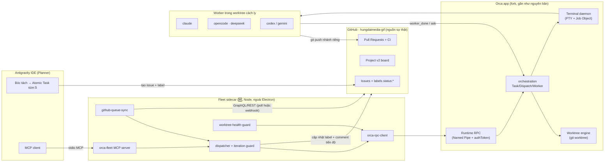
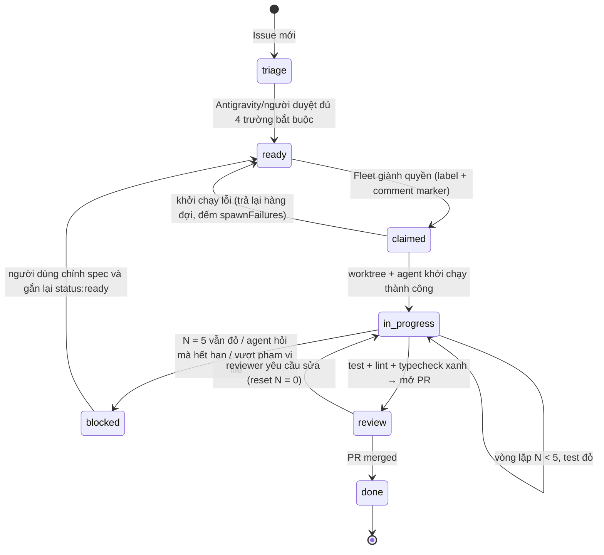

# ORCA ENHANCED BLUEPRINT — Orca fork thành hệ điều phối đa agent (Custom ADE)

> **Phạm vi:** fork `hungdaimedia-gif/orca` (từ `stablyai/orca`), chạy trên Windows 11 / PowerShell.
> **Mô hình kiềng 3 chân:** GitHub = nguồn sự thật · Antigravity = Planner/Team Lead · Orca = hạ tầng thực thi.
> **Nguyên tắc số 1 của bản này:** *Không viết lại những gì Orca gốc đã có.* Mọi khẳng định "đã có"
> bên dưới đều kèm đường dẫn file trong repo để kiểm chứng lại.

Ký hiệu dùng trong tài liệu:

- ✅ **Có sẵn** trong Orca gốc — chỉ cần dùng đúng cách.
- 🟡 **Có một phần** — cần cấu hình hoặc bổ sung mỏng.
- 🆕 **Cần xây** trong fork.

---

## PHẦN 0 — PHÁT HIỆN QUAN TRỌNG NHẤT TRƯỚC KHI BẮT TAY VÀO LÀM

Khi khảo sát mã nguồn, phần lớn năng lực mà đề bài yêu cầu **đã tồn tại** trong Orca gốc, chỉ chưa
được nối vào quy trình GitHub-label của bạn. Nếu bỏ qua điều này, fork sẽ đẻ ra một hệ thống song song
và vỡ mỗi lần kéo bản cập nhật từ upstream (upstream thay đổi rất nhanh: riêng thư mục
`src/main/runtime/rpc/methods/` đã có ~280 file).

| Năng lực đề bài cần | Tình trạng | Bằng chứng trong repo |
|---|---|---|
| Kênh điều khiển cục bộ không qua subprocess | ✅ JSON-RPC qua **Named Pipe** (Windows) / Unix socket, có `authToken` | `src/cli/runtime/transport.ts`, `src/shared/runtime-bootstrap.ts` |
| Kênh WebSocket cho client từ xa | ✅ | `src/cli/runtime/websocket-transport.ts`, `docs/reference/orcad-operations.md` |
| Tạo worktree + khởi chạy agent + gửi prompt trong 1 lệnh | ✅ `orca worktree create --agent <id> --prompt ... --issue <n>` | `src/cli/specs/core.ts:93` |
| Điều phối Task / Dispatch / Worker, chờ `worker_done`, DAG phụ thuộc | ✅ `orca orchestration worker-start / check --wait / task-create --deps` | `skill-guides/orchestration.md`, `src/main/runtime/rpc/methods/orchestration*.ts` |
| Đọc/ghi GitHub Issue, Project v2, PR checks, comment | ✅ `github.issue`, `github.updateIssue`, `github.addIssueComment`, `github.project.*`, `github.prChecks` | `src/main/runtime/rpc/methods/github-*.ts` |
| Hẹn giờ chạy agent định kỳ (cron) | ✅ `orca automations create --trigger "<cron>"` | `src/cli/specs/automations.ts` |
| Xoá worktree chống khoá file Windows | ✅ retry EBUSY/ENOTEMPTY/EPERM, long-path `\\?\`, phục hồi đăng ký worktree mồ côi | `src/main/host-tree-removal.ts`, `src/shared/windows-transient-lock-removal.ts`, `src/main/local-worktree-removal-recovery.ts` |
| Diệt cây tiến trình con khi đóng terminal | ✅ Job Object per-PTY + bảng tiến trình native, không fork PowerShell | `src/main/pty-descendant-termination.ts`, `src/main/windows/windows-process-table.ts`, `docs/reference/windows-msys-job-breakaway.md` |
| Chọn shell PowerShell/pwsh đúng cách | ✅ `--shell` (allowlist) tách biệt `--command` | `docs/reference/windows-terminal-shell-selection.md`, `src/main/pwsh.ts` |
| Chống PowerShell 5.1 nuốt dấu `"` trong JSON argv | 🟡 Chỉ **phát hiện**, không tự sửa | `src/cli/quote-stripped-json-flag.ts` |
| Hook khi tạo/lưu trữ worktree, lệnh mặc định cho issue | ✅ `orca.yaml`: `scripts.setup`, `scripts.archive`, `issueCommand`, `worktree.sharedDirectories` | `src/shared/orca-yaml-hook-types.ts` |
| Agent hỗ trợ | ✅ `claude`, `codex`, `gemini`, `antigravity`, `cursor`, `opencode`, `grok`, `kimi`... DeepSeek chạy **qua `opencode`** (`opencode/deepseek-*`) | `src/shared/commit-message-agent-specs-primary.ts:180` |
| Máy trạng thái label `status:*` ↔ worktree | 🆕 | — |
| Bộ đếm vòng lặp (max 5) + chuyển `status:blocked` | 🆕 | — |
| Báo cáo "ai đang giữ khoá file" trước khi xoá worktree | 🆕 | — |
| MCP server cho Antigravity gọi Orca | 🆕 (mỏng, bọc RPC có sẵn) | — |

**Hệ quả kiến trúc:** fork chỉ cần **một tiến trình sidecar ("Fleet")** nằm *ngoài* app Electron,
nói chuyện với Orca qua Named Pipe có sẵn, cộng vài bản vá nhỏ có thể gửi ngược upstream. Không mở
cổng TCP mới, không nhét logic GitHub-label vào `src/main/`.

> Ghi chú: file `scripts/orca-bridge.mjs` mà đề bài nhắc **không tồn tại** trong `hungdaimedia-gif/orca`
> lẫn `hungdaimedia-gif/hungdaitool` (đã kiểm tra nhánh hiện tại). Có lẽ nó chỉ nằm trên máy local.
> Phân tích ở §1.3 dựa trên mô tả "gọi CLI qua `execSync`".

---

## PHẦN 1 — HIỆN TRẠNG & ĐIỂM YẾU TRÊN WINDOWS

### 1.1 Git Worktree bị khoá file trên Windows

**Cơ chế gây lỗi.** Windows không cho xoá/đổi tên một thư mục khi còn bất kỳ handle nào mở vào file
bên trong (khác POSIX, nơi `unlink` vẫn thành công). Các nguồn giữ handle điển hình trong môi trường của bạn:

| Nguồn giữ handle | Đặc điểm | Orca tự xử lý được? |
|---|---|---|
| Tiến trình con của agent (`node`, `pnpm test --watch`, `vite`, `esbuild`) | Sống lâu, CWD nằm trong worktree | ✅ Có — Job Object per-PTY diệt cả cây khi đóng terminal |
| Windows Defender / Search Indexer | Giữ vài ms → vài giây sau khi file được ghi | ✅ Có — retry `[250, 500, 1000, 2000]ms` + `maxRetries: 8` |
| Antigravity / VS Code mở cùng thư mục (file watcher, TS server, indexer) | Giữ **vô thời hạn** | ❌ Không — tiến trình ngoài cây của Orca |
| Terminal ngoài (Windows Terminal) có `cd` vào worktree | CWD handle | ❌ Không |
| Đường dẫn > 260 ký tự (`node_modules` lồng sâu) | Lỗi giả dạng "không xoá được" | ✅ Có — chuyển sang namespace `\\?\` (`toHostRemovalPath`) |

**Điểm yếu còn lại của Orca gốc:** khi nguồn giữ khoá nằm *ngoài* cây tiến trình của Orca, sau 4 lần
retry Orca chỉ báo lỗi chung chung, không nói **tiến trình nào** đang giữ. Người dùng phải đoán.

**Giải pháp đề xuất — "Điều tra trước, không phá":**

1. **Trước khi xoá**: hỏi Windows **Restart Manager API** (`RmStartSession` → `RmRegisterResources` →
   `RmGetList`) danh sách tiến trình đang giữ file trong worktree. Đây là API chính thống mà
   Windows Installer dùng, trả về PID + tên app, **không cần** `handle.exe` (Sysinternals) và không
   fork PowerShell — phù hợp `docs/reference/windows-edr-posture.md`.
   - Cài đặt: thêm vào native addon sẵn có `native/windows-registry` (đã là workspace package) một
     hàm `listLockingProcesses(paths: string[])`, hoặc tạo addon riêng `native/windows-restart-manager`.
   - Không quét toàn bộ cây file: chỉ đăng ký thư mục gốc + các file hay bị giữ
     (`.git`, `node_modules/.vite`, `*.node`, `.next`, `dist`) để tránh chậm.
2. **Phân loại kết quả:**
   - PID thuộc cây tiến trình của Orca → Orca tự diệt (đã có sẵn).
   - PID ngoài (Antigravity, Code, explorer) → **không diệt**. Trả về lỗi có cấu trúc:
     `{ code: 'worktree_locked_by_external', holders: [{pid, appName, kind}] }` để UI/Fleet hiển thị
     "Đóng cửa sổ Antigravity đang mở worktree X rồi thử lại".
3. **Khi vẫn thất bại**: không lặp vô hạn. Đánh dấu `git worktree lock --reason "orca: pending-removal <ISO>"`
   và đưa vào hàng đợi "chờ dọn" để **người dùng bấm xác nhận** lần sau. Orca đã có sẵn
   `assertWorktreeUnlockedForRemoval` (`src/shared/worktree/removal.ts`) nên worktree bị lock sẽ không
   bị Orca khác vô tình xoá.
4. **Phòng ngừa (việc người dùng tự làm 1 lần):** thêm thư mục gốc chứa worktree vào danh sách loại
   trừ của Defender, và cấu hình Antigravity **không** tự mở worktree của worker.

> ⚠️ **Tương thích với ĐIỀU 0 trong `hungdaitool/CLAUDE.md`** ("chỉ người dùng mới có quyền xoá"):
> Fleet và mọi agent **không bao giờ** tự gọi `worktree rm`, `git worktree prune`, `git branch -D`.
> Fleet chỉ *đề xuất* danh sách worktree nên dọn; người dùng xác nhận trong UI Orca. Đây là ràng buộc
> thiết kế, không phải tuỳ chọn.

### 1.2 Terminal PowerShell / pwsh và escape tham số

**Hiện trạng tốt hơn đề bài giả định.** Orca đã:

- Phân biệt `--shell` (terminal *là* pwsh) với `--command` (gõ lệnh vào shell mặc định) —
  `docs/reference/windows-terminal-shell-selection.md`. Allowlist ở `isSupportedWindowsShellOverride`.
- Mã hoá tham số cho `CommandLineToArgvW` và `cmd.exe` qua `src/shared/child-process/windows-command-line.ts`;
  cấm `shell: true`; tự phân giải shim `.cmd` của npm/pnpm (`windows-cmd-shim-resolution.ts`).
- Probe `pwsh` có cache, bootstrap OSC 133 cho PowerShell để biết khi nào prompt sẵn sàng
  (`src/main/powershell-osc133-bootstrap.ts`), kể cả chế độ Constrained Language Mode.

**Điểm vỡ thực sự nằm ở phía *bên gọi* (script của bạn / Antigravity), không phải trong Orca:**

| Bẫy | Ví dụ hỏng | Nguyên nhân |
|---|---|---|
| PowerShell 5.1 nuốt `"` khi gọi exe native | `orca x --payload '{"a":"b"}'` → exe nhận `{a:b}` | Bug PS < 7.3 (`$PSNativeCommandArgumentPassing`). Orca chỉ *phát hiện* (`looksQuoteStripped`) |
| `execSync("orca ... " + prompt)` | Prompt chứa `&`, `|`, `%`, `^`, xuống dòng | Chuỗi lệnh đi qua `cmd.exe /d /s /c` |
| Backslash + dấu nháy cuối | `--path "C:\repo\"` → `\"` bị hiểu là nháy thoát | Quy tắc `CommandLineToArgvW` |
| Mã hoá | Prompt tiếng Việt thành `?` | Console codepage 437/1258 thay vì UTF-8 |

**Quy tắc bắt buộc cho mọi công cụ gọi Orca trong hệ thống này:**

1. **Không bao giờ truyền JSON hay prompt dài qua argv.** Dùng RPC trực tiếp (Phần 3.1) — JSON đi
   nguyên vẹn qua pipe, không qua shell nào.
2. Nếu *buộc phải* gọi CLI (Phase 1): dùng `execFile`/`spawn` với **mảng argv**, `shell: false`,
   `windowsHide: true`. Không dùng `execSync(string)`.
3. Prompt dài → ghi ra file tạm UTF-8 trong worktree rồi truyền đường dẫn (`--prompt "Đọc TASK.md và làm theo"`).
4. Dùng `pwsh` 7.4+ thay Windows PowerShell 5.1 làm shell mặc định của worker:
   `orca terminal create --shell pwsh ...`, và đặt `$OutputEncoding = [Text.UTF8Encoding]::new()` trong profile.
5. Mọi đường dẫn truyền cho Orca dùng selector (`path:C:/repos/x`, `id:<repoId>`) với `/` — Orca chuẩn
   hoá bằng `path` của Node.

🆕 **Bản vá nhỏ, gửi được upstream:** thêm cờ `--prompt-file <path>` cho `worktree create` và
`orchestration worker-start` (đọc UTF-8, giới hạn kích thước) — giải quyết triệt để bẫy #1 cho người
buộc phải dùng CLI từ PowerShell 5.1.

### 1.3 Giao thức điều khiển bên ngoài: từ `execSync` sang IPC có sẵn

**Chi phí thực tế của "mỗi lệnh = một subprocess CLI" trên Windows:**

- Khởi động Node + nạp bundle CLI: ~200–500 ms mỗi lệnh; điều phối 10 agent × poll mỗi 5 s là hàng
  trăm tiến trình/phút.
- `execSync` **chặn event loop** của tiến trình gọi — Dispatcher đứng hình trong lúc chờ.
- Mỗi lần spawn đi qua bẫy quoting ở §1.2.
- EDR/Defender chấm điểm hành vi "spawn tiến trình tần suất cao" (xem `windows-edr-posture.md`).
- Không có streaming: muốn chờ `worker_done` phải poll.

**Orca gốc đã có sẵn đúng thứ cần thay thế:**

```
%APPDATA%\orca\orca-runtime.json          ← metadata do app Electron ghi khi khởi động
{
  "runtimeId": "…", "pid": 12345, "startedAt": 1790000000000,
  "authToken": "<bí mật ngẫu nhiên>",
  "transports": [
    { "kind": "named-pipe", "endpoint": "\\\\.\\pipe\\orca-…" },
    { "kind": "websocket",  "endpoint": "ws://127.0.0.1:…" }      // khi bật orca serve / pairing
  ]
}
```

Giao thức (xem `src/cli/runtime/transport.ts`): **NDJSON** — mỗi request/response là một dòng JSON.

```jsonc
// Client → Orca (1 dòng)
{"id":"8c1…","authToken":"<token>","method":"worktree.create","params":{"repo":"path:C:/repos/hungdaitool","name":"gh-142-fix-lightbox","linkedIssue":142}}
// Orca → Client: có thể xen các khung giữ kết nối trong long-poll
{"_keepalive":true}
// Khung kết thúc
{"id":"8c1…","ok":true,"result":{ … }}
```

**Kết luận:** *không cần* xây `orca-ipc-server` mới. Việc cần làm là một **thư viện client** dùng lại
đúng transport này + một **MCP server** mỏng để Antigravity gọi (Phần 3.1). Named Pipe chỉ truy cập
được trong phiên người dùng hiện tại và còn được chặn bằng `authToken` — an toàn hơn mở cổng localhost.

**Lưu ý hợp đồng API:** tên method RPC (`worktree.create`, `orchestration.workerStart`…) là **nội bộ**,
không cam kết ổn định. Đầu ra `orca … --json` ổn định hơn. Vì vậy thư viện client phải:
(a) gọi `status.get` lúc kết nối và ghi lại phiên bản runtime; (b) có bộ contract test chạy mỗi khi merge
upstream; (c) chỉ dùng tập method tối thiểu liệt kê ở §3.1.

---

## PHẦN 2 — KIẾN TRÚC TỔNG THỂ & DÒNG DỮ LIỆU

### 2.1 Sơ đồ thành phần



### 2.2 Máy trạng thái của một Task (label `status:*`)



Chỉ **một** label `status:*` tồn tại tại một thời điểm; Fleet là tác nhân duy nhất được đổi
`claimed ↔ in_progress ↔ review ↔ blocked`. Con người được đổi `triage → ready`, `blocked → ready`,
và đóng issue.

### 2.3 Luồng chi tiết (sequence)

```mermaid
sequenceDiagram
  autonumber
  participant AG as Antigravity (Planner)
  participant GH as GitHub
  participant FL as Fleet sidecar
  participant OR as Orca Runtime (pipe)
  participant WK as Worker agent (worktree)

  AG->>GH: Tạo issue từ template agent-task, gắn size:S, area:*, agent:*
  AG->>GH: Gắn status:ready
  loop mỗi 60s hoặc webhook
    FL->>GH: Tìm issue status:ready (GraphQL, theo Project)
  end
  FL->>GH: Claim: bỏ ready, gắn status:claimed + comment <!-- orca-fleet:claim run=… -->
  FL->>GH: Đọc lại issue — nếu comment claim đầu tiên không phải của mình thì rút lui
  FL->>OR: orchestration.runCreate (1 lần / phiên Fleet)
  FL->>OR: orchestration.workerStart {spec, worktree:new-top-level, agent, repo, name:"gh-142-…", baseBranch}
  OR-->>FL: {taskId, dispatchId, worktree, terminalHandle}
  FL->>GH: status:in-progress + comment tiến độ (1 comment, sửa dần)
  OR->>WK: Tiêm preamble (Task/Dispatch ID) + spec
  loop Worker loop (tối đa 5 vòng)
    WK->>WK: Sửa code trong phạm vi cho phép
    WK->>WK: Chạy cổng kiểm tra (npm test && npm run typecheck && npm run build)
    WK->>OR: orchestration send (heartbeat / iteration=N, gate=red|green)
    OR-->>FL: check --wait nhận message
    FL->>GH: Cập nhật comment tiến độ
  end
  alt Xanh trong ≤ 5 vòng
    WK->>GH: git push nhánh + gh pr create (Closes #142)
    WK->>OR: worker_done --outcome succeeded
    FL->>GH: status:review, liên kết PR vào Project
  else Hết 5 vòng vẫn đỏ
    WK->>OR: worker_done --outcome failed (hoặc Fleet đếm hộ)
    FL->>GH: status:blocked + comment log lỗi cuối
  end
  FL->>OR: worker-release (giữ worktree; KHÔNG xoá)
```

### 2.4 Giải thích từng pha

1. **Lập kế hoạch & phân rã (Antigravity).** Antigravity không cần biết Orca tồn tại để làm pha này:
   nó chỉ viết issue theo template ở Phần 4 và gắn `status:ready`. Điều này giữ GitHub là nguồn sự
   thật duy nhất — mất Fleet hay Orca thì backlog vẫn nguyên.
2. **Dispatch & khởi tạo (Orca Core).** Fleet dùng `orchestration.workerStart` thay vì
   `worktree.create` + `terminal.create` rời rạc, vì `worker-start` gộp *placement → worktree →
   terminal sẵn sàng → tiêm prompt → quyền sở hữu có giám sát* thành một thao tác có receipt; lỗi giữa
   chừng trả `failedStage` + `residualResources` (xem `skill-guides/orchestration.md`). Tên worktree
   theo quy ước `gh-<số issue>-<slug>`, `displayName` = tiêu đề issue.
   Chọn agent theo label: `agent:claude` → `--agent claude`; `agent:deepseek` → `--agent opencode --model opencode/deepseek-…`;
   `agent:codex` / `agent:gemini` tương tự.
3. **Thực thi & tự kiểm thử.** Worker chạy cổng kiểm tra của *repo đích* (với hungdaitool là
   `npm test && npm run typecheck && npm run build`; với orca là `pnpm tc && pnpm test <path> && oxlint`).
   Sau mỗi lần chạy cổng, worker gửi một message có cấu trúc (§3.2) để Fleet đếm vòng.
4. **Hội tụ & đóng gói.** Bộ đếm vòng lặp nằm ở **Fleet**, không tin vào lời tự khai của agent: Fleet
   đếm số message `gate` nhận được *và* đối chiếu với số lần lệnh test xuất hiện trong
   `orchestration.workerRead` (transcript). Vượt 5 → Fleet gửi `orchestration send` yêu cầu dừng,
   chờ `worker_done`, đổi label `status:blocked`. PR do worker tạo từ trong worktree (nó có `gh`/token);
   Fleet chỉ gắn nhãn và cập nhật Project.

---

## PHẦN 3 — CÁC MODULE CẦN CODE VÀO FORK

### 3.0 Bố cục thư mục đề xuất

Nguyên tắc: **cô lập mọi thứ riêng của fork vào `fleet/`** để `git merge upstream/main` gần như không
bao giờ xung đột. Chỉ các bản vá có giá trị chung mới chạm `src/`, và nên gửi PR ngược upstream.

```
orca/                              (fork)
├── fleet/                         🆕 sidecar độc lập, package riêng, không import từ src/main
│   ├── package.json               (type: module, bin: orca-fleet)
│   ├── fleet.config.example.yaml
│   ├── src/
│   │   ├── orca-rpc-client/       § 3.1  kết nối Named Pipe, retry, contract version
│   │   │   ├── runtime-metadata.ts
│   │   │   ├── pipe-transport.ts
│   │   │   └── orca-methods.ts    (tập method tối thiểu, có kiểu)
│   │   ├── mcp-server/            § 3.1  MCP stdio cho Antigravity
│   │   ├── github-queue-sync/     § 3.3
│   │   │   ├── issue-claim.ts
│   │   │   ├── label-state-machine.ts
│   │   │   └── progress-comment.ts
│   │   ├── dispatcher/
│   │   │   ├── agent-routing.ts   (label agent:* → agent id + model)
│   │   │   └── iteration-guard.ts § 3.2
│   │   └── worktree-health-guard/ § 3.2
│   └── test/                      (contract test chạy với Orca thật ở chế độ ORCA_BACKGROUND_LAUNCH=1)
├── native/windows-restart-manager/ 🆕 (hoặc thêm hàm vào native/windows-registry) § 1.1
├── src/cli/specs/core.ts          🟡 thêm --prompt-file (bản vá upstream được)
├── skills/hungdai-worker/         🆕 skill cho worker, § 3.4
└── docs/fork/                     🆕 tài liệu riêng của fork (file này nên chuyển vào đây sau)
```

Tên thư mục tuân theo `AGENTS.md` của Orca: không dùng `utils`/`helpers`/`common`.

### 3.1 Module `orca-rpc-client` + `mcp-server` (thay cho "orca-ipc-server")

**Vì sao không làm server mới:** Orca đã là server. Làm thêm một server trong Electron là thêm bề mặt
tấn công, thêm một cổng, và phải tự làm lại auth + long-poll + keepalive mà `runtime-rpc.ts` đã có.

**Client (≈150 dòng) — bám đúng framing của `src/cli/runtime/transport.ts`:**

```ts
// fleet/src/orca-rpc-client/pipe-transport.ts
import { createConnection } from 'node:net'
import { randomUUID } from 'node:crypto'
import { readFileSync } from 'node:fs'
import { join } from 'node:path'

type Transport = { kind: 'unix' | 'named-pipe' | 'websocket'; endpoint: string }
type RuntimeMetadata = { pid: number; authToken: string | null; transports: Transport[] }

export function readRuntimeMetadata(): RuntimeMetadata {
  const base = process.env.ORCA_USER_DATA_PATH ?? join(process.env.APPDATA ?? '', 'orca')
  return JSON.parse(readFileSync(join(base, 'orca-runtime.json'), 'utf8'))
}

export function callOrca<T>(method: string, params: unknown, timeoutMs = 60_000): Promise<T> {
  const meta = readRuntimeMetadata() // đọc lại mỗi lần: Orca restart sẽ đổi pipe + token
  const t = meta.transports.find((x) => x.kind === 'named-pipe' || x.kind === 'unix')
  if (!t || !meta.authToken) throw new Error('Orca chưa chạy hoặc metadata thiếu')
  const id = randomUUID()
  return new Promise((resolve, reject) => {
    const sock = createConnection(t.endpoint)
    let buf = ''
    let timer = setTimeout(() => { sock.destroy(); reject(new Error(`timeout ${method}`)) }, timeoutMs)
    sock.setEncoding('utf8')
    sock.on('connect', () =>
      sock.write(JSON.stringify({ id, authToken: meta.authToken, method, params }) + '\n'))
    sock.on('data', (chunk: string) => {
      buf += chunk
      let nl: number
      while ((nl = buf.indexOf('\n')) >= 0) {
        const line = buf.slice(0, nl).trim(); buf = buf.slice(nl + 1)
        if (!line) continue
        const frame = JSON.parse(line)
        if (frame._keepalive) { timer.refresh(); continue } // long-poll: gia hạn
        clearTimeout(timer); sock.end()
        return frame.ok ? resolve(frame.result as T) : reject(Object.assign(new Error(frame.error?.message), frame.error))
      }
    })
    sock.once('error', (e) => { clearTimeout(timer); reject(e) })
    sock.once('close', () => { clearTimeout(timer); reject(new Error('Orca đóng kết nối trước khi trả lời')) })
  })
}
```

> Trước khi code: đọc `src/cli/runtime/envelope-schema.ts` để khớp chính xác hình dạng khung lỗi, và
> `src/main/runtime/rpc/methods/orchestration*.ts` để lấy schema params. Không đoán.

**Tập method tối thiểu Fleet được phép dùng** (đóng băng trong `orca-methods.ts`, contract test bắt
khi upstream đổi):

| Mục đích | Method RPC | CLI tương đương (dùng cho Phase 1) |
|---|---|---|
| Kiểm tra runtime | `status.get` | `orca status --json` |
| Mở phiên điều phối | `orchestration.runCreate` | `orca orchestration run-create --objective … --json` |
| Khởi chạy worker | `orchestration.workerStart` | `orca orchestration worker-start --spec … --worktree new-top-level --agent … --json` |
| Chờ sự kiện | `orchestration.check` (wait) | `orca orchestration check --wait --types worker_done,escalation,question --json` |
| Trả lời câu hỏi agent | `orchestration.reply` | `orca orchestration reply --id … --body …` |
| Gửi chỉ thị (dừng vòng lặp) | `orchestration.send` | `orca orchestration send …` |
| Liệt kê / đọc worker | `orchestration.workerList`, `orchestration.workerRead` | `worker-list --json`, `worker-read` |
| Nhả worker (giữ worktree) | `orchestration.workerRelease` | `worker-release --dispatch …` |
| Gắn issue vào worktree | `worktree.set` (`linkedIssue`, `displayName`) | `orca worktree set --worktree … --issue 142` |
| Liệt kê worktree | `worktree.list`, `worktree.ps` | `orca worktree list --json` |

**MCP server cho Antigravity** (`fleet/src/mcp-server/`), stdio, chỉ lộ công cụ *cấp cao*:

| Tool MCP | Hành vi | Ghi chú an toàn |
|---|---|---|
| `fleet_status` | Worker đang chạy, vòng lặp hiện tại, label | chỉ đọc |
| `fleet_dispatch_issue` | `{repo, issueNumber}` → claim + workerStart | kiểm tra issue có đủ 4 trường, size:S |
| `fleet_reply` | trả lời câu hỏi đang chờ của worker | |
| `fleet_stop_worker` | yêu cầu worker dừng, chuyển `status:blocked` | không xoá worktree |
| `fleet_cleanup_candidates` | liệt kê worktree đã merge có thể dọn | **chỉ liệt kê**, xoá do người dùng bấm |

Cấu hình trong Antigravity (`mcp_config.json` hoặc tương đương):

```json
{
  "mcpServers": {
    "orca-fleet": {
      "command": "node",
      "args": ["C:/repos/orca/fleet/dist/mcp-server/main.js"],
      "env": { "FLEET_CONFIG": "C:/repos/orca/fleet/fleet.config.yaml" }
    }
  }
}
```

### 3.2 Module `worktree-health-guard` + `iteration-guard`

Ba trách nhiệm, **không** trùng với cái Orca đã có:

**(a) Iteration guard — giới hạn 5 vòng.** Worker báo mỗi lần chạy cổng kiểm tra bằng message có cấu trúc:

```text
ORCA orchestration send --to run:<run_id> --subject "fleet gate 3 red" --type status \
  --task-id <task_id> --dispatch-id <dispatch_id> \
  --payload '{"fleet":"gate","iteration":3,"result":"red","failing":"npm test: test-shared.mjs#batch-bridge"}'
```

(Cờ theo `orca orchestration send` trong `src/cli/specs/`. Trên PowerShell 5.1, `--payload` JSON sẽ
bị nuốt dấu `"` — worker nên chạy trong `pwsh` 7.4+ (§1.2), hoặc Fleet tự đọc transcript bằng
`orchestration.workerRead` làm nguồn đếm dự phòng.)

```ts
// fleet/src/dispatcher/iteration-guard.ts
export const MAX_ITERATIONS = 5
export type GateReport = { iteration: number; result: 'green' | 'red'; failing?: string }

export function nextAction(history: GateReport[]): 'continue' | 'open-pr' | 'block' {
  const last = history.at(-1)
  if (last?.result === 'green') return 'open-pr'
  // Đếm theo số báo cáo thực nhận, không tin số `iteration` agent tự khai
  return history.length >= MAX_ITERATIONS ? 'block' : 'continue'
}
```

Thêm hai lưới an toàn độc lập với lời agent: **timeout tổng** (mặc định 45 phút cho size:S) và
**im lặng quá lâu** (không heartbeat/không output 10 phút — lấy từ `projection.liveness` của
`worker-list`). Cả hai đều dẫn tới `status:blocked`, không kill ngay: theo hợp đồng orchestration,
chỉ `exited` mới là bằng chứng tiến trình chết; `unverifiable` chỉ là *vắng tin*.

**(b) Watchdog khi đóng worker.** Khi Fleet `worker-release` hoặc người dùng đóng worktree:
1. Gọi `orchestration.workerStop` → Orca dùng Job Object diệt cây tiến trình (đã có).
2. Hỏi Restart Manager (§1.1) xem còn ai giữ file trong worktree.
3. Còn holder ngoài cây Orca → ghi vào `fleet/state/lock-report.json` + comment lên issue
   "Worktree `gh-142-…` đang bị `Antigravity.exe (pid 8812)` giữ". **Không kill** tiến trình ngoài.

**(c) Đề xuất dọn dẹp (không tự xoá).** Hàng ngày, liệt kê worktree có PR đã merged/closed > 3 ngày,
không có terminal sống, không có thay đổi chưa commit (`git status --porcelain` rỗng) → xuất danh sách
đường dẫn đầy đủ. Người dùng bấm xoá trong UI Orca, nơi `worktree rm` đã có sẵn cơ chế phục hồi Windows.

### 3.3 Module `github-queue-sync`

**Nguồn dữ liệu:** GraphQL Project v2 (lọc theo Project + label), REST cho label/comment.
Có thể dùng các method `github.project.*` của Orca (dùng chung token người dùng đã đăng nhập trong Orca
và bộ ngắt rate-limit `src/main/git/gh-rate-limit-breaker.ts`) — **khuyến nghị** cách này để không phải
quản lý thêm một PAT. Nếu Fleet cần chạy khi Orca tắt thì mới dùng Octokit với fine-grained PAT
(quyền: Issues RW, Pull requests RW, Projects RW, Contents R).

**Claim chống tranh chấp** (hai Fleet / hai máy cùng bốc 1 issue). GitHub không có khoá, nên dùng
"comment đầu tiên thắng":

```ts
// fleet/src/github-queue-sync/issue-claim.ts
const MARK = (runId: string) => `<!-- orca-fleet:claim run=${runId} -->`

export async function tryClaim(gh: Gh, issue: number, runId: string): Promise<boolean> {
  await gh.replaceStatusLabel(issue, 'status:ready', 'status:claimed')
  await gh.comment(issue, `${MARK(runId)}\n🤖 Fleet nhận task lúc ${new Date().toISOString()}`)
  const claims = (await gh.listComments(issue)).filter((c) => c.body.includes('orca-fleet:claim'))
  const winner = claims.sort((a, b) => a.id - b.id)[0]
  if (!winner.body.includes(MARK(runId))) return false // thua → không đụng gì thêm
  return true
}
```

**Ánh xạ Issue ↔ Worktree** (lưu ở cả hai phía, để khôi phục khi Fleet restart):

| Phía | Trường | Giá trị |
|---|---|---|
| Orca | `worktree.name` | `gh-142-fix-lightbox-thumb` |
| Orca | `linkedIssue` / `displayName` | `142` / tiêu đề issue |
| Orca | `comment` | `fleet run=<runId> dispatch=<dispatchId>` |
| GitHub | comment marker | `<!-- orca-fleet:state {"dispatch":"…","iteration":3,"worktree":"gh-142-…"} -->` |

Khi Fleet khởi động lại: đọc mọi issue `status:claimed|in-progress`, tìm marker, gọi
`orchestration.workerList` → khớp lại. Issue có marker nhưng không có worker sống → `status:blocked`
kèm lý do "mất worker sau khi Fleet restart", **không** tự chạy lại (tránh 2 agent sửa cùng file).

**Comment tiến độ live:** đúng **một** comment mỗi issue, được *sửa* tại chỗ (tìm theo marker
`orca-fleet:progress`), không đăng comment mới mỗi vòng — tránh spam và tiết kiệm rate limit:

```markdown
<!-- orca-fleet:progress -->
### 🤖 Tiến độ Fleet — `gh-142-fix-lightbox-thumb` (agent: claude)
| Vòng | Cổng kiểm tra | Ghi chú |
|---|---|---|
| 1 | 🔴 | `npm test`: test-shared.mjs › lightbox |
| 2 | 🔴 | typecheck: MediaLightbox props |
| 3 | 🟢 | mở PR #151 |
_Cập nhật: 2026-09-25 10:42 (UTC+7)_
```

**Kích hoạt:** Phase 1–2 poll 60 s (đơn giản, chạy sau NAT). Phase 3 có thể thêm webhook qua
`smee.io`/Cloudflare Tunnel, xác thực HMAC `X-Hub-Signature-256`.

### 3.4 Hệ thống Skills cho worker

**Có sẵn:** thư mục `skills/` + RPC `skills.install`/`skills.discover` + `skill-guides/` (xem
`docs/reference/agent-skill-provider-paths.md`, `sharing-agent-skills.md`). Và điểm quan trọng nhất:
**worktree là một bản checkout của repo**, nên `CLAUDE.md`, `AGENTS.md`, `.claude/skills/` của repo đích
**tự động có mặt** trong worktree — Claude Code/Codex tự nạp. Không cần cơ chế copy rule.

Việc cần làm:

1. 🆕 `skills/hungdai-worker/SKILL.md` — hợp đồng hành vi chung cho mọi worker của Fleet:
   - Đọc issue qua `gh issue view <n>`; chỉ sửa file trong mục "Phạm vi file cho phép".
   - Sau mỗi lần chạy cổng kiểm tra phải gửi message `{"fleet":"gate",…}`.
   - Không chạy lệnh xoá (ĐIỀU 0), không `push --force`, không sửa `.github/`, không đổi label.
   - Tạo PR với `Closes #<n>` và điền checklist DoD từ issue.
2. 🟡 `orca.yaml` trong **mỗi repo đích** để chuẩn bị worktree. Ví dụ cho `hungdaitool`:

```yaml
# hungdaitool/orca.yaml
scripts:
  setup: |
    npm ci --prefer-offline
worktree:
  sharedDirectories: []          # hungdaitool build bằng Vite: không share node_modules để tránh khoá chéo trên Windows
setupAgentStartupPolicy: wait-for-setup   # agent chỉ bắt đầu khi npm ci xong
issueCommand: >-
  Đọc CLAUDE.md, RULES.md, PROJECT_RULES.md mục 5. Làm issue #{{issue}} theo skill hungdai-worker.
  Cổng: npm test && npm run typecheck && npm run build.
```

> `{{issue}}` là placeholder minh hoạ, **chưa xác minh** Orca có thay thế nó. Kiểm tra cách Orca dựng
> lệnh từ `issueCommand` (`src/main/issue-command-file.ts` và nơi gọi) trước khi dùng. Người dùng có
> thể ghi đè cục bộ ở `<repo>/.orca/issue-command` (không commit).

3. Các file quy tắc đề bài nhắc (`PROJECT_RULES.md`, `CLAUDE_ARCHITECTURE_GUIDE.md`) nên nằm **trong repo
   đích** và được `CLAUDE.md` trỏ tới (như hungdaitool đang làm), không nằm trong Orca.

---

## PHẦN 4 — QUY CHUẨN TASK TRÊN GITHUB

### 4.1 Bộ nhãn (Label Taxonomy)

| Nhóm | Label | Màu | Ai được gắn | Ý nghĩa |
|---|---|---|---|---|
| Trạng thái | `status:triage` | `#d4c5f9` | Người/Antigravity | Mới, chưa đủ spec |
| | `status:ready` | `#0e8a16` | Người/Antigravity | Đủ 4 trường, Fleet được bốc |
| | `status:claimed` | `#fbca04` | Fleet | Đã giành quyền, đang khởi tạo worktree |
| | `status:in-progress` | `#1d76db` | Fleet | Worker đang chạy |
| | `status:review` | `#5319e7` | Fleet | PR đã mở, chờ người review |
| | `status:blocked` | `#b60205` | Fleet/Người | Quá 5 vòng, hết giờ, hoặc cần quyết định |
| Độ lớn | `size:S` | `#c2e0c6` | Planner | ≤ 5 file, ≤ ~200 dòng diff, 1 cổng kiểm tra. **Fleet chỉ bốc size:S** |
| | `size:M` | `#fef2c0` | Planner | Phải tách thành nhiều S trước khi ready |
| | `size:L` | `#f9d0c4` | Planner | Epic, dùng sub-issue |
| Lĩnh vực | `area:extension` | `#bfdadc` | Planner | hungdaitool — Chrome Extension |
| | `area:gen` / `area:workflow` | `#bfdadc` | Planner | Tab Gen (ổn định) / Workflow (đang làm) |
| | `area:video-pipeline` | `#bfdadc` | Planner | Remotion, render |
| | `area:novel` | `#bfdadc` | Planner | Web novel, State/Lore |
| | `area:orca-fork` | `#bfdadc` | Planner | Chính fork này |
| Agent | `agent:claude` | `#ededed` | Planner | Logic phức tạp, đụng vùng dùng chung |
| | `agent:deepseek` | `#ededed` | Planner | Việc lặp, chạy qua `opencode` |
| | `agent:codex` / `agent:gemini` | `#ededed` | Planner | Tuỳ chọn |
| | `agent:antigravity` | `#ededed` | Planner | Để Antigravity tự làm, Fleet bỏ qua |
| | `agent:human` | `#ededed` | Planner | Fleet bỏ qua |

Tạo nhãn một lần (PowerShell, cần `gh` đã đăng nhập):

```powershell
$repo = 'hungdaimedia-gif/hungdaitool'
$labels = @(
  @('status:triage','d4c5f9'), @('status:ready','0e8a16'), @('status:claimed','fbca04'),
  @('status:in-progress','1d76db'), @('status:review','5319e7'), @('status:blocked','b60205'),
  @('size:S','c2e0c6'), @('size:M','fef2c0'), @('size:L','f9d0c4'),
  @('area:extension','bfdadc'), @('area:gen','bfdadc'), @('area:workflow','bfdadc'),
  @('area:video-pipeline','bfdadc'), @('area:novel','bfdadc'), @('area:orca-fork','bfdadc'),
  @('agent:claude','ededed'), @('agent:deepseek','ededed'), @('agent:codex','ededed'),
  @('agent:gemini','ededed'), @('agent:antigravity','ededed'), @('agent:human','ededed')
)
foreach ($l in $labels) { gh label create $l[0] --color $l[1] --repo $repo --force }
```

(`--force` ở đây chỉ *cập nhật màu* nếu nhãn đã tồn tại, không xoá gì.)

### 4.2 Template Task cho Code / Extension

Dùng **Issue Form** (YAML) thay vì Markdown tự do: GitHub bắt buộc điền đủ trường, và Fleet parse được
theo `id` ổn định.

```yaml
# .github/ISSUE_TEMPLATE/agent-task.yml
name: "🤖 Agent Task (size:S)"
description: Task nguyên tử để Orca Fleet giao cho một agent trong một worktree
title: "[area] Động từ + đối tượng cụ thể"
labels: ["status:triage", "size:S"]
body:
  - type: textarea
    id: objective
    attributes:
      label: "1. Mục tiêu đo được"
      description: Một câu kết quả + cách đo. Không viết 'cải thiện', 'tối ưu' chung chung.
      placeholder: |
        Khi bấm "Tải lại" trong MediaLightbox của tab Gen, ảnh thumbnail hiển thị lại trong ≤ 1s
        và `npm test` có thêm 1 case bao phủ hành vi này.
    validations: { required: true }
  - type: textarea
    id: allowed_files
    attributes:
      label: "2. Phạm vi file cho phép sửa"
      description: Mỗi dòng một đường dẫn hoặc glob. Agent sửa file ngoài danh sách = task thất bại.
      placeholder: |
        src/components/MediaLightbox.tsx
        scripts/test-shared.mjs
      render: text
    validations: { required: true }
  - type: textarea
    id: dod
    attributes:
      label: "3. Definition of Done"
      description: Checklist, mỗi dòng kiểm chứng được bằng lệnh hoặc quan sát.
      placeholder: |
        - [ ] `npm test && npm run typecheck && npm run build` pass, 0 lỗi
        - [ ] Đã `grep -rl "MediaLightbox" src/` và kiểm tra mọi nơi gọi (Gen + Workflow)
        - [ ] PR có `Closes #<số issue>` và mô tả trước/sau
    validations: { required: true }
  - type: textarea
    id: negative_constraints
    attributes:
      label: "4. Ranh giới cấm (Negative Constraints)"
      description: Những gì agent TUYỆT ĐỐI không được làm trong task này.
      placeholder: |
        - Không đổi tên/kiểu field trong FormInputData, QueueJob (chỉ thêm field optional)
        - Không sửa src/tabs/workflow/**
        - Không chạy lệnh xoá (ĐIỀU 0), không push --force, không sửa .github/
        - Không thêm dependency mới
    validations: { required: true }
  - type: dropdown
    id: agent
    attributes:
      label: Agent đề xuất
      options: [claude, deepseek, codex, gemini, antigravity, human]
    validations: { required: true }
  - type: input
    id: base_branch
    attributes:
      label: Nhánh gốc
      value: main
  - type: textarea
    id: context
    attributes:
      label: Ngữ cảnh / liên kết (tuỳ chọn)
      description: Issue cha, file tài liệu, log lỗi. Không dán secret.
```

**Luật kiểm tra của Fleet trước khi bốc** (issue thiếu → trả về `status:triage` kèm comment lý do):

- Có đủ 4 section, không section nào rỗng hoặc còn nguyên placeholder.
- Có `size:S` và đúng một label `agent:*` (không phải `antigravity`/`human`).
- "Phạm vi file" ≤ 8 dòng và không chứa `**` ở gốc repo (chặn "sửa gì cũng được").
- DoD chứa ít nhất một lệnh chạy được (có dấu backtick).

**Cưỡng chế phạm vi file khi xong:** trước khi đổi sang `status:review`, Fleet chạy
`git diff --name-only <base>...HEAD` trong worktree và so với glob cho phép. Có file ngoài phạm vi →
`status:blocked` + comment liệt kê file vi phạm. (Đây là phiên bản tự động của lệnh `git diff --stat`
kiểm tra ranh giới Gen/Workflow trong `hungdaitool/CLAUDE.md`.)

---

## PHẦN 5 — LỘ TRÌNH THỰC THI

Mỗi hạng mục dưới đây tự nó là một issue `size:S` — dùng chính quy trình của Blueprint để làm Blueprint.

### Phase 1 — Quick Win (2 ngày): chạy tay, không sửa mã Orca

| # | Việc | Definition of Done |
|---|---|---|
| 1.1 | Tạo bộ nhãn (§4.1) cho `hungdaitool` và `orca` | `gh label list` hiện đủ 21 nhãn |
| 1.2 | Thêm `.github/ISSUE_TEMPLATE/agent-task.yml` (§4.2) vào `hungdaitool` | Tạo thử 1 issue, form bắt buộc đủ 4 trường |
| 1.3 | Thêm `orca.yaml` cho `hungdaitool` (§3.4) | Tạo worktree trong Orca, setup chạy xong, agent chỉ khởi động sau setup |
| 1.4 | Viết lại cầu nối tạm dùng `execFile` + mảng argv, `shell:false`, prompt qua file | Prompt tiếng Việt có `"`, `&`, xuống dòng đến agent nguyên vẹn trên PowerShell 5.1 và pwsh 7 |
| 1.5 | Chạy tay quy trình 1 worktree = 1 agent = 1 task cho 3 issue thật | Mỗi issue: `orca orchestration worker-start --spec … --worktree new-top-level --agent claude --json` → PR có `Closes #n`; ghi lại thời gian và điểm nghẽn |
| 1.6 | Thêm `skills/hungdai-worker/SKILL.md` bản đầu | Worker trong 1.5 gửi đúng message `gate` |

Lệnh mẫu Phase 1 (PowerShell 7):

```powershell
orca orchestration run-create --objective "Fleet Phase 1 thử nghiệm" --json
orca orchestration worker-start `
  --spec "Làm GitHub issue hungdaimedia-gif/hungdaitool#142 theo skill hungdai-worker. Đọc issue bằng: gh issue view 142" `
  --worktree new-top-level --repo "path:C:/repos/hungdaitool" `
  --name gh-142-fix-lightbox --display-name "#142 Fix lightbox thumb" `
  --agent claude --json
orca orchestration check --wait --types "worker_done,escalation,question" --timeout-ms 900000 --json
```

### Phase 2 — Deep Integration (1 tuần): Fleet sidecar + vá Windows

| # | Việc | Definition of Done |
|---|---|---|
| 2.1 | `fleet/src/orca-rpc-client` (§3.1) + contract test với Orca chạy `ORCA_BACKGROUND_LAUNCH=1` | Test gọi `status.get`, `worktree.list`, `orchestration.runCreate` xanh trên Windows |
| 2.2 | `iteration-guard` + đọc message `gate` | Test đơn vị: 5 lần đỏ → `block`; xanh ở lần 3 → `open-pr` |
| 2.3 | `github-queue-sync`: claim, label state machine, progress comment | Hai tiến trình Fleet cùng bốc 1 issue → chỉ 1 thắng (test với repo sandbox) |
| 2.4 | Cưỡng chế phạm vi file (§4.2) | Diff đụng file ngoài danh sách → `status:blocked` |
| 2.5 | Native `listLockingProcesses` (Restart Manager) | Mở file trong worktree bằng Notepad → hàm trả về `notepad.exe` + PID |
| 2.6 | Tích hợp 2.5 vào thông báo lỗi `worktree rm` (bản vá có thể gửi upstream) | Lỗi hiển thị tên tiến trình giữ khoá thay vì EBUSY chung chung |
| 2.7 | Cờ `--prompt-file` cho CLI (bản vá upstream) | `pnpm tc && pnpm test src/cli` xanh; test PowerShell 5.1 |
| 2.8 | MCP server `orca-fleet` (§3.1) | Antigravity gọi `fleet_status` và `fleet_dispatch_issue` thành công |

Cổng cho mọi thay đổi trong `src/` của Orca (theo `AGENTS.md`): `pnpm tc`, `pnpm test <file>`,
`pnpm run check:code-quality:changed`. Code trong `fleet/` có `tsconfig` và test riêng.

### Phase 3 — Scale Fleet (2 tuần): 5–10 agent song song

| # | Việc | Definition of Done |
|---|---|---|
| 3.1 | Dispatcher tự bốc theo Project board, giới hạn đồng thời theo agent (`claude: 3, deepseek: 5`) và theo repo | 10 issue ready → tối đa N worker chạy, phần còn lại xếp hàng |
| 3.2 | Chống xung đột file giữa các task song song: từ chối dispatch hai task có "Phạm vi file" giao nhau | Task B chờ tới khi task A sang `review` |
| 3.3 | Dùng `task-create --deps` của Orca cho task có phụ thuộc (issue cha/con) | Task con chỉ bắt đầu khi task cha merged |
| 3.4 | Giới hạn tài nguyên máy: không dispatch khi RAM trống < 4 GB hoặc CPU > 85% trong 2 phút | Có log lý do hoãn |
| 3.5 | Bảng theo dõi: `fleet_status` + GitHub Project view "Fleet" | Nhìn một chỗ thấy mọi worker, vòng lặp, label |
| 3.6 | Báo cáo dọn dẹp hằng ngày (§3.2c) qua `orca automations create --trigger "0 8 * * *"` | Danh sách worktree có thể xoá được gửi vào 1 issue ghim; không có lệnh xoá tự động nào |
| 3.7 | (Tuỳ chọn) Webhook thay poll | Độ trễ ready → claimed < 10 s |

**Ước lượng giới hạn thực tế trên 1 máy Windows:** mỗi worktree Node/Vite cần ~1–2 GB đĩa
(`node_modules` không share) và `npm ci` ~1–3 phút; mỗi agent CLI + test watcher ~0.5–1.5 GB RAM.
Với 32 GB RAM, 5–6 worker đồng thời là ngưỡng an toàn; 10 cần máy thứ hai (Orca hỗ trợ SSH/remote
host sẵn — `docs/reference/ssh-execution-boundary.md`).

---

## PHẦN 6 — RỦI RO & QUYẾT ĐỊNH CẦN NGƯỜI DÙNG CHỐT

| Rủi ro | Mức | Giảm thiểu |
|---|---|---|
| Upstream đổi tên/params method RPC | Cao | Tập method tối thiểu + contract test chạy sau mỗi lần merge upstream; fallback sang CLI `--json` |
| Agent tự khai sai số vòng / nói "test pass" khi chưa chạy | Cao | Fleet tự chạy lại cổng kiểm tra trong worktree trước khi gắn `status:review` |
| Hai agent sửa cùng file ở hai worktree → conflict khi merge | Trung bình | §3.2 từ chối dispatch khi phạm vi file giao nhau |
| Lộ token: `authToken` trong `orca-runtime.json`, PAT GitHub | Trung bình | Không log metadata; PAT fine-grained, chỉ repo cần thiết; không truyền token vào prompt agent |
| Agent chạy lệnh phá huỷ trong worktree | Trung bình | Skill `hungdai-worker` + `git-guardrails` hook của Claude Code; worktree cách ly nên hỏng tối đa 1 nhánh |
| Fleet chết giữa chừng | Thấp | Marker trên GitHub + `workerList` → khôi phục; không tự chạy lại |

**Cần bạn quyết định:**

1. Fleet dùng token GitHub của Orca (qua `github.*` RPC, không cần PAT mới) hay PAT riêng (chạy được khi Orca tắt)? Đề xuất: **token của Orca** cho Phase 2.
2. PR do **worker** tạo (cần `gh` trong worktree) hay do **Fleet** tạo sau khi tự chạy lại cổng kiểm tra? Đề xuất: **Fleet tạo**, để PR chỉ xuất hiện khi Fleet đã xác minh xanh.
3. Có gửi các bản vá Windows (§2.6, §2.7) ngược về `stablyai/orca` không? Đề xuất: **có** — giảm diện tích fork phải tự bảo trì.
