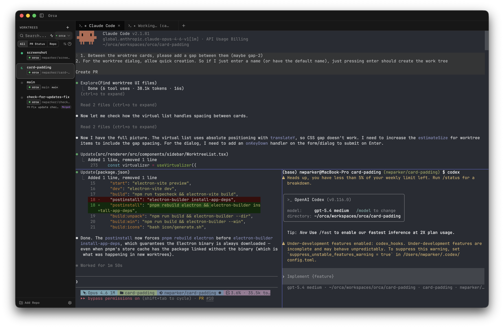

# Orca



Orca is an AI Orchestrator for nerds.
It lets users seamlessly manage multiple worktrees and open multiple terminals running anything (usually Claude Code, Codex, OpenCode, etc).
It has built in status tracking across worktrees, notifications, and unread markers. It makes coding multiple features across multiple repos a breeze

## Project Setup

### Install

```bash
$ pnpm install
```

### Development

```bash
$ pnpm dev
```

### Build

```bash
# For windows
$ pnpm build:win

# For macOS
$ pnpm build:mac

# For Linux
$ pnpm build:linux
```
