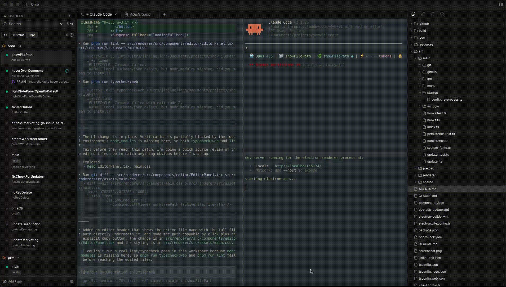

<p align="center">
  <a href="https://onOrca.dev"></a>
</p>

<h1 align="center">Orca</h1>

<p align="center">
  <a href="https://github.com/stablyai/orca/stargazers"></a>
  
  <a href="https://x.com/orca_build"></a>
</p>

<p align="center">
  <strong>The cross-platform AI Orchestrator for 100x builders.</strong><br/>
  Available for <strong>macOS, Windows, and Linux</strong>.<br/>
  Seamlessly manage multiple worktrees, run multiple AI agents concurrently, and track their progress.<br/>
  Whether it's Claude Code, Codex, or OpenCode, Orca makes coordinating multiple features across multiple repos effortless.
</p>

<p align="center">
  <a href="https://onOrca.dev"><strong>Download at onOrca.dev</strong></a>
</p>

<p align="center">
  
</p>

## Introducing the Orca CLI

**Agent orchestration from your terminal.**

Let your AI agent control your IDE. Use AI to add repos to your IDE, spin up worktrees, and update the current worktree's comment with meaningful progress checkpoints directly from the terminal. Ships with the Orca IDE (install under Settings).

```bash
npx skills add https://github.com/stablyai/orca --skill orca-cli
```

---

## Features that Supercharge your Workflow

- **Worktree Management**: Spin up, manage, and switch between multiple Git worktrees instantly. Keep your context clean.
- **Agent-Ready Terminals**: Robust support for multiple terminals, tabs, and panes. Run Claude Code, Codex, OpenCode, or your own agents side-by-side.
- **Smart Notifications & Status Tracking**: See exactly which worktrees have active agents. Get worktree notifications and manually mark threads as unread (like Gmail ⭐).
- **Deep GitHub Integration**: Automatically track PRs, link GitHub issues (via the `gh` CLI), and view GitHub Actions checks right from your workspace.
- **Integrated Dev Tools**: Built-in file editor, lightning-fast search, and a comprehensive source control tab to review diffs, make quick edits, and commit effortlessly.
- **CLI to Control the IDE**: Give your agent first-class control over Orca from the terminal.

---

## Install

Get started today:

- **[Download from onOrca.dev](https://onOrca.dev)**
- Or download the latest binaries via the **[GitHub Releases page](https://github.com/stablyai/orca/releases)**.

---

## Community & Support

- **Twitter / X:** Follow [**@orca_build**](https://x.com/orca_build) for updates and announcements.
- **Feedback & Ideas:** We ship fast. Missing something? [Request a new feature](https://github.com/stablyai/orca/issues).
- **Show Support:** Star this repo to follow along with our daily ships.

---

## Developing

Want to contribute or run locally? See our [CONTRIBUTING.md](CONTRIBUTING.md) guide.
