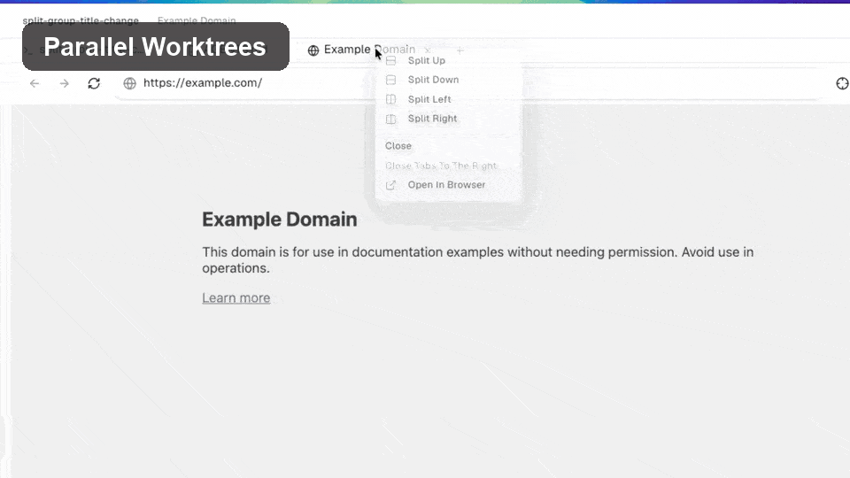

<h1 align="center">
  <a href="https://onOrca.dev"></a> Orca
</h1>

<p align="center">
  <a href="https://github.com/stablyai/orca/stargazers"></a>
  <a href="https://github.com/stablyai/orca/releases"></a>
  
  
  
</p>

<p align="center">
  <a href="README.md">English</a> · <a href="docs/readme/README.es.md">Español</a> · <a href="docs/readme/README.zh-CN.md">中文</a> · <a href="docs/readme/README.ja.md">日本語</a> · <a href="docs/readme/README.ko.md">한국어</a>
</p>

<p align="center">
  <strong>The AI Orchestrator for 100x builders.</strong><br/>
  Run Claude Code, OpenClaude, Codex, Grok, Antigravity, or OpenCode side-by-side across repos — each in its own worktree, tracked in one place.<br/>
  Available for <strong>macOS, Windows, and Linux</strong>.
</p>

<p align="center">
  <a href="https://onOrca.dev"><strong>Download Orca</strong></a> &nbsp;·&nbsp; <a href="https://apps.apple.com/us/app/orca-ide/id6766130217">iOS</a> &nbsp;·&nbsp; <a href="https://github.com/stablyai/orca/releases/download/mobile-v0.0.12/app-release.apk">Android</a> &nbsp;·&nbsp; <a href="https://www.onorca.dev/docs">Docs</a> &nbsp;·&nbsp; <a href="https://discord.gg/fzjDKHxv8Q">Discord</a> &nbsp;·&nbsp; <a href="https://github.com/stablyai/orca/releases">Changelog</a>
</p>

<p align="center">
  
</p>

## Why Orca

Traditional IDEs weren't built for agents, and parallel-agent wrappers stop at a terminal. Orca is the whole environment: worktree-isolated agents, Ghostty-class terminals, an embedded browser with Design Mode, GitHub and Linear built in, remote worktrees over SSH, and a mobile companion app — using the agent subscriptions you already pay for, with no Orca login. Free and open source (MIT), shipping new features daily.

---

## Features

<table>
<tr>
<td width="38%" valign="middle">

### Mobile Companion

Monitor and steer your agents from your phone. Get notified when an agent finishes, review output, and send follow-ups from anywhere.

[iOS App Store](https://apps.apple.com/us/app/orca-ide/id6766130217) · [Android APK](https://github.com/stablyai/orca/releases/download/mobile-v0.0.12/app-release.apk) · [Docs →](https://www.onorca.dev/docs/mobile)

</td>
<td width="62%">
  <a href="https://www.onorca.dev/docs/mobile"><picture><source srcset="docs/assets/feature-wall/mobile-companion-app-showcase.gif" type="image/gif"></picture></a>
</td>
</tr>
<tr>
<td width="38%" valign="middle">

### Parallel Worktrees

Every task runs in its own isolated git worktree — no stashing, no branch juggling. Fan one prompt across five agents, compare the results, and merge the winner.

[Docs →](https://www.onorca.dev/docs/model/worktrees)

</td>
<td width="62%">
  <a href="https://www.onorca.dev/docs/model/worktrees"><picture><source srcset="docs/assets/feature-wall/parallel-worktrees.gif" type="image/gif"></picture></a>
</td>
</tr>
<tr>
<td width="38%" valign="middle">

### Terminal Splits

Ghostty-class terminals with WebGL rendering, infinite splits, scrollback restored on restart, and full scrollback search. See active, waiting, and finished agent sessions at a glance.

[Docs →](https://www.onorca.dev/docs/terminal)

</td>
<td width="62%">
  <a href="https://www.onorca.dev/docs/terminal"><picture><source srcset="docs/assets/feature-wall/terminal-splits.gif" type="image/gif"></picture></a>
</td>
</tr>
<tr>
<td width="38%" valign="middle">

### Design Mode

A real Chromium window per worktree. Click any UI element to send its HTML, CSS, and a cropped screenshot straight into your agent's prompt.

[Docs →](https://www.onorca.dev/docs/browser/design-mode)

</td>
<td width="62%">
  <a href="https://www.onorca.dev/docs/browser/design-mode"><picture><source srcset="docs/assets/feature-wall/design-mode.gif" type="image/gif"></picture></a>
</td>
</tr>
<tr>
<td width="38%" valign="middle">

### GitHub &amp; Linear, Native

Browse PRs, issues, and project boards in-app. Open a worktree from any task, review and approve PRs, inspect CI checks, and create issues — no context switch.

[Docs →](https://www.onorca.dev/docs/review/linear)

</td>
<td width="62%">
  <a href="https://www.onorca.dev/docs/review/linear"><picture><source srcset="docs/assets/feature-wall/github-linear.gif" type="image/gif"></picture></a>
</td>
</tr>
<tr>
<td width="38%" valign="middle">

### SSH Worktrees

Run agents on a beefy remote box with full file editing, git, and terminals. Auto-reconnect, port forwarding, and passphrase caching included.

[Docs →](https://www.onorca.dev/docs/ssh)

</td>
<td width="62%">
  <a href="https://www.onorca.dev/docs/ssh"><picture><source srcset="docs/assets/feature-wall/ssh-worktrees.gif" type="image/gif"></picture></a>
</td>
</tr>
<tr>
<td width="38%" valign="middle">

### Annotate AI Diffs

Drop markdown comments on any diff line, batch them, and ship them back to the agent. Review AI-generated changes, make quick edits, and commit without leaving Orca.

[Docs →](https://www.onorca.dev/docs/review/annotate-ai-diff)

</td>
<td width="62%">
  <a href="https://www.onorca.dev/docs/review/annotate-ai-diff"><picture><source srcset="docs/assets/feature-wall/annotate-diff.gif" type="image/gif"></picture></a>
</td>
</tr>
<tr>
<td width="38%" valign="middle">

### Drag Files to Agents

VS Code's editor with autosave everywhere, quick-open, and drag-and-drop of files or images straight into an agent prompt.

[Docs →](https://www.onorca.dev/docs/editing/file-explorer)

</td>
<td width="62%">
  <a href="https://www.onorca.dev/docs/editing/file-explorer"><picture><source srcset="docs/assets/feature-wall/file-drag.gif" type="image/gif"></picture></a>
</td>
</tr>
<tr>
<td width="38%" valign="middle">

### Orca CLI

Agents drive Orca too: `orca worktree create`, `snapshot`, `click`, `fill`. Script every workflow from the terminal.

[Docs →](https://www.onorca.dev/docs/cli/overview)

</td>
<td width="62%">
  <a href="https://www.onorca.dev/docs/cli/overview"><picture><source srcset="docs/assets/feature-wall/orca-cli.gif" type="image/gif"></picture></a>
</td>
</tr>
</table>

**Also in the box:**

- **[Split anything](https://www.onorca.dev/docs/model/tabs-panes-splits)** — Arrange agents, terminals, browsers, diffs, and files into panes that match the shape of the task.
- **[Native search](https://www.onorca.dev/docs/settings)** — Search across worktrees, files, agents, commands, and repo context without leaving your flow.
- **[Account switcher &amp; usage tracking](https://www.onorca.dev/docs/agents/usage-tracking)** — See Claude and Codex usage and rate-limit resets, and hot-swap accounts without re-logging in.
- **[Rich repo previews](https://www.onorca.dev/docs/editing/markdown)** — Preview Markdown, images, PDFs, and repo docs in the workspace.
- **Computer Use** — Let agents operate desktop apps and visible UI when a workflow needs real interaction.
- **Notifications and unread state** — Know when an agent finishes or needs attention, then mark threads unread to come back later.

---

## Supported Agents

Works with **any CLI agent** — if it runs in a terminal, it runs in Orca.

<p>
  <a href="https://docs.anthropic.com/claude/docs/claude-code"><kbd> Claude Code</kbd></a> &nbsp;
  <a href="https://github.com/openai/codex"><kbd> Codex</kbd></a> &nbsp;
  <a href="https://x.ai/cli"><kbd> Grok</kbd></a> &nbsp;
  <a href="https://github.com/google-gemini/gemini-cli"><kbd> Gemini</kbd></a> &nbsp;
  <a href="https://cursor.com/cli"><kbd> Cursor</kbd></a> &nbsp;
  <a href="https://docs.github.com/en/copilot/how-tos/set-up/install-copilot-cli"><kbd> GitHub Copilot</kbd></a> &nbsp;
  <a href="https://opencode.ai/docs/cli/"><kbd> OpenCode</kbd></a> &nbsp;
  <a href="https://ampcode.com/manual#install"><kbd> Amp</kbd></a> &nbsp;
  <kbd>+ any CLI agent</kbd>
</p>

<details>
<summary><strong>See all built-in agents</strong></summary>
<br/>

<p>
  <a href="https://openclaude.gitlawb.com/"><kbd> OpenClaude</kbd></a> &nbsp;
  <a href="https://antigravity.google/docs/cli-overview"><kbd> Antigravity</kbd></a> &nbsp;
  <a href="https://pi.dev"><kbd> Pi</kbd></a> &nbsp;
  <a href="https://omp.sh"><kbd> oh-my-pi</kbd></a> &nbsp;
  <a href="https://hermes-agent.nousresearch.com/docs/"><kbd> Hermes Agent</kbd></a> &nbsp;
  <a href="https://block.github.io/goose/docs/quickstart/"><kbd> Goose</kbd></a> &nbsp;
  <a href="https://docs.augmentcode.com/cli/overview"><kbd> Auggie</kbd></a> &nbsp;
  <a href="https://github.com/autohandai/code-cli"><kbd> Autohand Code</kbd></a> &nbsp;
  <a href="https://github.com/charmbracelet/crush"><kbd> Charm</kbd></a> &nbsp;
  <a href="https://docs.cline.bot/cline-cli/overview"><kbd> Cline</kbd></a> &nbsp;
  <a href="https://www.codebuff.com/docs/help/quick-start"><kbd> Codebuff</kbd></a> &nbsp;
  <a href="https://commandcode.ai/docs/quickstart"><kbd> Command Code</kbd></a> &nbsp;
  <a href="https://docs.continue.dev/guides/cli"><kbd> Continue</kbd></a> &nbsp;
  <a href="https://docs.factory.ai/cli/getting-started/quickstart"><kbd> Droid</kbd></a> &nbsp;
  <a href="https://kilo.ai/docs/cli"><kbd> Kilocode</kbd></a> &nbsp;
  <a href="https://www.kimi.com/code/docs/en/kimi-code-cli/getting-started.html"><kbd> Kimi</kbd></a> &nbsp;
  <a href="https://kiro.dev/docs/cli/"><kbd> Kiro</kbd></a> &nbsp;
  <a href="https://github.com/mistralai/mistral-vibe"><kbd> Mistral Vibe</kbd></a> &nbsp;
  <a href="https://github.com/QwenLM/qwen-code"><kbd> Qwen Code</kbd></a> &nbsp;
  <a href="https://support.atlassian.com/rovo/docs/install-and-run-rovo-dev-cli-on-your-device/"><kbd> Rovo Dev</kbd></a>
</p>

See the [full list and setup details](https://www.onorca.dev/docs/agents/supported) in the docs.

</details>

---

## Install

| Platform | Download |
|:---------|:---------|
| **macOS** | [Apple Silicon (.dmg)](https://github.com/stablyai/orca/releases/latest/download/orca-macos-arm64.dmg) · [Intel (.dmg)](https://github.com/stablyai/orca/releases/latest/download/orca-macos-x64.dmg) |
| **Windows** | [Installer (.exe)](https://github.com/stablyai/orca/releases/latest/download/orca-windows-setup.exe) |
| **Linux** | [AppImage](https://github.com/stablyai/orca/releases/latest/download/orca-linux.AppImage) · [.deb and all builds](https://github.com/stablyai/orca/releases/latest) |

Download once — Orca auto-updates on the stable channel. Also available at **[onOrca.dev](https://onOrca.dev)** or via a package manager:

### macOS (Homebrew)

```bash
brew install --cask stablyai/orca/orca
```

### Arch Linux (AUR)

```bash
# Precompiled binary
yay -S stably-orca-bin

# Build from GitHub source
yay -S stably-orca-git
```

---

## Your Code, Your Keys

- **No Orca account** — Bring your existing Claude Code, OpenClaude, Codex, Grok, Antigravity, OpenCode, or other agent subscriptions.
- **Runs on your machines** — Agents execute locally, or on your own servers over SSH.
- **Open source** — MIT licensed, with the full source in this repo.
- **Transparent telemetry** — Anonymous usage data only, documented and opt-out. See the [privacy &amp; telemetry docs](https://www.onorca.dev/docs/telemetry).

---

## Community &amp; Support

- **Discord:** Join the community on **[Discord](https://discord.gg/fzjDKHxv8Q)**.
- **Twitter / X:** Follow **[@orca_build](https://x.com/orca_build)** for updates and announcements.
- **Feedback &amp; Ideas:** We ship fast. Missing something? [Request a new feature](https://github.com/stablyai/orca/issues).
- **Show Support:** Star this repo to follow along with our daily ships.

---

## Star History

<a href="https://star-history.com/#stablyai/orca&Date">
  <picture>
    <source media="(prefers-color-scheme: dark)" srcset="https://api.star-history.com/svg?repos=stablyai/orca&type=Date&theme=dark" />
    <source media="(prefers-color-scheme: light)" srcset="https://api.star-history.com/svg?repos=stablyai/orca&type=Date" />
    
  </picture>
</a>

---

## Developing

Want to contribute or run locally? See our [CONTRIBUTING.md](.github/CONTRIBUTING.md) guide.

<a href="https://github.com/stablyai/orca/graphs/contributors">
  
</a>

## License

Orca is free and open source under the [MIT License](LICENSE).
