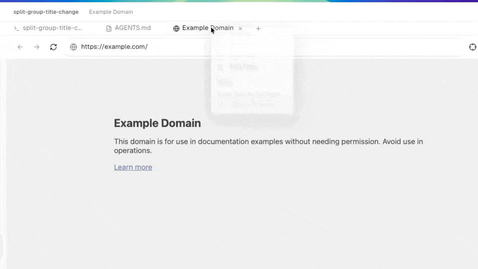
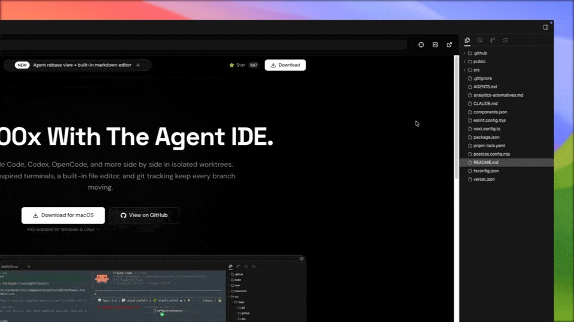

<h1 align="center">
  <a href="https://onOrca.dev"></a> Orca
</h1>

<p align="center">
  <a href="https://github.com/stablyai/orca"></a>
  <a href="https://github.com/stablyai/orca/releases"></a>
  
  <a href="https://discord.gg/fzjDKHxv8Q"></a>
  <a href="https://x.com/orca_build"></a>
  
</p>

<p align="center">
  <sub><a href="../../README.md">English</a> · <a href="README.zh-CN.md">中文</a> · <a href="README.ja.md">日本語</a> · <a href="README.ko.md">한국어</a> · <a href="README.es.md">Español</a> · <a href="README.fr.md">Français</a> · <a href="README.pt.md">Português</a></sub>
</p>

<p align="center">
  <strong>100x geliştiriciler için yapay zekâ orkestratörü.</strong><br/>
  Codex, Claude Code, OpenCode veya Pi'yi yan yana çalıştırın: her biri kendi worktree'sinde, hepsi tek bir yerden takip edilir.
</p>

<h3 align="center"><a href="https://onorca.dev/download"><ins>Orca'yı İndir</ins></a></h3>

<p align="center">
  
</p>

## Özellikler

<table>
<tr>
<td width="50%" valign="middle">

### Mobil Yardımcı Uygulama

Ajanlarınızı telefonunuzdan izleyin ve yönlendirin: bir ajan işini bitirdiğinde bildirim alın, nerede olursanız olun devam talimatı gönderin.

[iOS App Store](https://apps.apple.com/us/app/orca-ide/id6766130217) · [TestFlight](https://testflight.apple.com/join/YjeGMQBA) · [Android APK 0.0.48](https://github.com/stablyai/orca/releases/download/mobile-android-v0.0.48/app-release.apk) · [Dokümanlar →](https://www.onorca.dev/docs/mobile)

</td>
<td width="50%">
  <a href="https://www.onorca.dev/docs/mobile"><picture><source srcset="../assets/feature-wall/mobile-companion-app-showcase.gif" type="image/gif"></picture></a>
</td>
</tr>
<tr>
<td width="50%" valign="middle">

### Paralel Worktree'ler

Tek bir istemi beş ajana dağıtın, her biri kendi izole git worktree'sinde çalışsın; sonuçları karşılaştırın ve kazananı merge edin.

[Dokümanlar →](https://www.onorca.dev/docs/model/worktrees)

</td>
<td width="50%">
  <a href="https://www.onorca.dev/docs/model/worktrees"><picture><source srcset="../site/public/docs/tab-split.gif" type="image/gif"></picture></a>
</td>
</tr>
<tr>
<td width="50%" valign="middle">

### Terminal Bölmeleri

Ghostty sınıfı terminaller: WebGL ile render, sınırsız bölme ve yeniden başlatmalarda kaybolmayan geçmiş.

[Dokümanlar →](https://www.onorca.dev/docs/terminal)

</td>
<td width="50%">
  <a href="https://www.onorca.dev/docs/terminal"><picture><source srcset="../../resources/onboarding/feature-wall/tile-02.gif" type="image/gif"></picture></a>
</td>
</tr>
<tr>
<td width="50%" valign="middle">

### Tasarım Modu

Gerçek bir Chromium penceresinde herhangi bir arayüz öğesine tıklayın; HTML'i, CSS'i ve kırpılmış ekran görüntüsü doğrudan ajanınızın istemine gitsin.

[Dokümanlar →](https://www.onorca.dev/docs/browser/design-mode)

</td>
<td width="50%">
  <a href="https://www.onorca.dev/docs/browser/design-mode"><picture><source srcset="../site/public/docs/orca-design-mode.gif" type="image/gif"></picture></a>
</td>
</tr>
<tr>
<td width="50%" valign="middle">

### GitHub ve Linear, Yerleşik

PR'ları, issue'ları ve proje panolarını uygulama içinde gezin; herhangi bir görevden worktree açın ve bağlam değiştirmeden inceleyin.

[Dokümanlar →](https://www.onorca.dev/docs/review/linear)

</td>
<td width="50%">
  <a href="https://www.onorca.dev/docs/review/linear"><picture><source srcset="../../resources/onboarding/feature-wall/tile-03.gif" type="image/gif"></picture></a>
</td>
</tr>
<tr>
<td width="50%" valign="middle">

### SSH Worktree'leri

Ajanları güçlü bir uzak makinede çalıştırın: tam dosya düzenleme, git ve terminaller, otomatik yeniden bağlanma ve port yönlendirme dahil.

[Dokümanlar →](https://www.onorca.dev/docs/ssh)

</td>
<td width="50%">
  <a href="https://www.onorca.dev/docs/ssh"><picture><source srcset="../../resources/onboarding/feature-wall/tile-06.gif" type="image/gif"></picture></a>
</td>
</tr>
<tr>
<td width="50%" valign="middle">

### Yapay Zekâ Diff'lerine Not Düşün

Herhangi bir diff satırına yorum bırakın ve ajana geri gönderin: Orca'dan çıkmadan inceleyin, düzenleyin ve commit'leyin.

[Dokümanlar →](https://www.onorca.dev/docs/review/annotate-ai-diff)

</td>
<td width="50%">
  <a href="https://www.onorca.dev/docs/review/annotate-ai-diff"><picture><source srcset="../site/public/docs/annotate-ai-diff.gif" type="image/gif"></picture></a>
</td>
</tr>
<tr>
<td width="50%" valign="middle">

### Dosyaları Ajanlara Sürükleyin

Her yerde otomatik kayıtlı VS Code editörü: dosyaları veya görselleri doğrudan bir ajan istemine sürükleyin.

[Dokümanlar →](https://www.onorca.dev/docs/editing/file-explorer)

</td>
<td width="50%">
  <a href="https://www.onorca.dev/docs/editing/file-explorer"><picture><source srcset="../../resources/onboarding/feature-wall/tile-07.gif" type="image/gif"></picture></a>
</td>
</tr>
<tr>
<td width="50%" valign="middle">

### Orca CLI

Ajanlar Orca'yı da yönetebilir: `orca worktree create`, `snapshot`, `click` ve `fill` ile her iş akışını betikleştirin.

[Dokümanlar →](https://www.onorca.dev/docs/cli/overview)

</td>
<td width="50%">
  <a href="https://www.onorca.dev/docs/cli/overview"><picture><source srcset="../../resources/onboarding/feature-wall/tile-09.gif" type="image/gif"></picture></a>
</td>
</tr>
</table>

**Kutudan çıkan diğer özellikler:**

- **[Hızlı açma](https://www.onorca.dev/docs/model/quick-open)**: Akışınızdan kopmadan worktree'ler, dosyalar, ajanlar, komutlar ve repo bağlamı arasında arama yapın.
- **[Hesap değiştirici ve kullanım takibi](https://www.onorca.dev/docs/agents/usage-tracking)**: Claude ve Codex kullanımınızı ve limit sıfırlanma zamanlarını görün, yeniden giriş yapmadan hesap değiştirin.
- **[Zengin repo önizlemeleri](https://www.onorca.dev/docs/editing/markdown)**: Markdown, görsel, PDF ve repo dokümanlarını çalışma alanında önizleyin.
- **[Bilgisayar Kullanımı](https://www.onorca.dev/docs/cli/computer-use)**: Bir iş akışı gerçek etkileşim gerektirdiğinde ajanların masaüstü uygulamalarını ve görünür arayüzü kullanmasına izin verin.
- **[Bildirimler ve okunmamış durumu](https://www.onorca.dev/docs/notifications)**: Bir ajan bitirdiğinde veya ilginizi beklediğinde haberdar olun, sonra dönmek için konuları okunmadı olarak işaretleyin.
- **Ve çok, çok daha fazlası**: Her gün yeni sürüm çıkarıyoruz, bu liste hep geride kalıyor. Gerçek özellik listesi [değişiklik günlüğü](https://github.com/stablyai/orca/releases).

---

## Desteklenen Ajanlar

**Her CLI ajanıyla** çalışır: terminalde çalışıyorsa Orca'da da çalışır.

<p>
  <a href="https://docs.anthropic.com/claude/docs/claude-code"><kbd> Claude Code</kbd></a> &nbsp;
  <a href="https://github.com/openai/codex"><kbd> Codex</kbd></a> &nbsp;
  <a href="https://x.ai/cli"><kbd> Grok</kbd></a> &nbsp;
  <a href="https://cursor.com/cli"><kbd> Cursor</kbd></a> &nbsp;
  <a href="https://docs.github.com/en/copilot/how-tos/set-up/install-copilot-cli"><kbd> GitHub Copilot</kbd></a> &nbsp;
  <a href="https://opencode.ai/docs/cli/"><kbd> OpenCode</kbd></a> &nbsp;
  <a href="https://mimo.xiaomi.com/coder"><kbd> MiMo Code</kbd></a> &nbsp;
  <a href="https://ampcode.com/manual#install"><kbd> Amp</kbd></a> &nbsp;
  <a href="https://openclaude.gitlawb.com/"><kbd> OpenClaude</kbd></a> &nbsp;
  <a href="https://antigravity.google/docs/cli-overview"><kbd> Antigravity</kbd></a> &nbsp;
  <a href="https://pi.dev"><kbd> Pi</kbd></a> &nbsp;
  <a href="https://omp.sh"><kbd> oh-my-pi</kbd></a> &nbsp;
  <a href="https://hermes-agent.nousresearch.com/docs/"><kbd> Hermes Agent</kbd></a> &nbsp;
  <a href="https://devin.ai/cli"><kbd> Devin</kbd></a> &nbsp;
  <a href="https://block.github.io/goose/docs/quickstart/"><kbd> Goose</kbd></a> &nbsp;
  <a href="https://docs.augmentcode.com/cli/overview"><kbd> Auggie</kbd></a> &nbsp;
  <a href="https://github.com/autohandai/code-cli"><kbd> Autohand Code</kbd></a> &nbsp;
  <a href="https://github.com/charmbracelet/crush"><kbd> Charm</kbd></a> &nbsp;
  <a href="https://docs.cline.bot/cline-cli/overview"><kbd> Cline</kbd></a> &nbsp;
  <a href="https://www.codebuff.com/docs/help/quick-start"><kbd> Codebuff</kbd></a> &nbsp;
  <a href="https://commandcode.ai/docs/quickstart"><kbd> Command Code</kbd></a> &nbsp;
  <a href="https://docs.continue.dev/guides/cli"><kbd> Continue</kbd></a> &nbsp;
  <a href="https://docs.factory.ai/cli/getting-started/quickstart"><kbd> Droid</kbd></a> &nbsp;
  <a href="https://kilo.ai/docs/cli"><kbd> Kilocode</kbd></a> &nbsp;
  <a href="https://www.kimi.com/code/docs/en/kimi-code-cli/getting-started.html"><kbd> Kimi</kbd></a> &nbsp;
  <a href="https://kiro.dev/docs/cli/"><kbd> Kiro</kbd></a> &nbsp;
  <a href="https://github.com/mistralai/mistral-vibe"><kbd> Mistral Vibe</kbd></a> &nbsp;
  <a href="https://github.com/QwenLM/qwen-code"><kbd> Qwen Code</kbd></a> &nbsp;
  <a href="https://support.atlassian.com/rovo/docs/install-and-run-rovo-dev-cli-on-your-device/"><kbd> Rovo Dev</kbd></a> &nbsp;
  <kbd>+ herhangi bir CLI ajanı</kbd>
</p>

---

## Kurulum

### Masaüstü: macOS, Windows, Linux

- **[onOrca.dev'den indirin](https://onorca.dev/download)**
- Ya da doğrudan bir derleme alın: [macOS Apple Silicon](https://github.com/stablyai/orca/releases/latest/download/orca-macos-arm64.dmg) · [macOS Intel](https://github.com/stablyai/orca/releases/latest/download/orca-macos-x64.dmg) · [Windows (.exe)](https://github.com/stablyai/orca/releases/latest/download/orca-windows-setup.exe) · [Linux AppImage](https://github.com/stablyai/orca/releases/latest/download/orca-linux.AppImage) · [Tüm derlemeler](https://github.com/stablyai/orca/releases/latest)
- Ekransız bir Linux sunucusunda `orca serve` mi çalıştırıyorsunuz? [Ekransız Linux sunucu rehberine](../reference/headless-linux-server.md) bakın.

_Ya da bir paket yöneticisiyle:_

```bash
# macOS (Homebrew)
brew install --cask stablyai/orca/orca

# Arch Linux (AUR), kaynaktan derlemek için stably-orca-git
yay -S stably-orca-bin
```

### Mobil Yardımcı Uygulama: iOS, Android

Masaüstü uygulamanızla eşleştirin, ajanlarınızı telefonunuzdan izleyin ve yönlendirin.

- **iOS:** [App Store'dan indirin](https://apps.apple.com/us/app/orca-ide/id6766130217) veya [TestFlight'a katılın](https://testflight.apple.com/join/YjeGMQBA)
- **Android:** [APK 0.0.48'i indirin](https://github.com/stablyai/orca/releases/download/mobile-android-v0.0.48/app-release.apk) · [Kurulum rehberi](https://www.onorca.dev/docs/android-apk)

---

## Topluluk ve Destek

- **Discord:** Topluluğa **[Discord](https://discord.gg/fzjDKHxv8Q)** üzerinden katılın.
- **Twitter / X:** Güncellemeler ve duyurular için **[@orca_build](https://x.com/orca_build)** hesabını takip edin.
- **WeChat:** Orca topluluğunun 8 numaralı WeChat grubuna katılmak için kodu tarayın. 8. grup dolmuş olabilir; öyleyse 9. grubun QR kodunu tarayın.

  &nbsp;&nbsp;

- **Geri Bildirim ve Fikirler:** Hızlı geliştiriyoruz. Eksik bir şey mi var? [Yeni özellik isteyin](https://github.com/stablyai/orca/issues).
- **Gizlilik:** Orca'nın hangi anonim kullanım verilerini topladığını ve nasıl kapatacağınızı [gizlilik ve telemetri dokümanlarında](https://www.onorca.dev/docs/telemetry) bulabilirsiniz.
- **Destek Olun:** Günlük sürümlerimizi takip etmek için bu repoya [yıldız verin](https://github.com/stablyai/orca).

---

## Geliştirme

Katkıda bulunmak veya yerelde çalıştırmak mı istiyorsunuz? [CONTRIBUTING.md](../../.github/CONTRIBUTING.md) rehberimize bakın.

Mobil uygulamayı masaüstü ile eşleştiren relay de bu repoda, ayrı bir pnpm çalışma alanı ve kurulum rehberiyle
[`cloud/`](../../cloud/README.md) altında bulunuyor.

<a href="https://github.com/stablyai/orca/graphs/contributors">
  
</a>

<p align="center">
  
</p>

## İmzalı Derlemeler

Windows kod imzalama [SignPath.io](https://signpath.io) tarafından sağlanmakta, sertifika [SignPath Foundation](https://signpath.org) tarafından verilmektedir.

## Lisans

Orca, [MIT Lisansı](../../LICENSE) altında ücretsiz ve açık kaynaklıdır.
