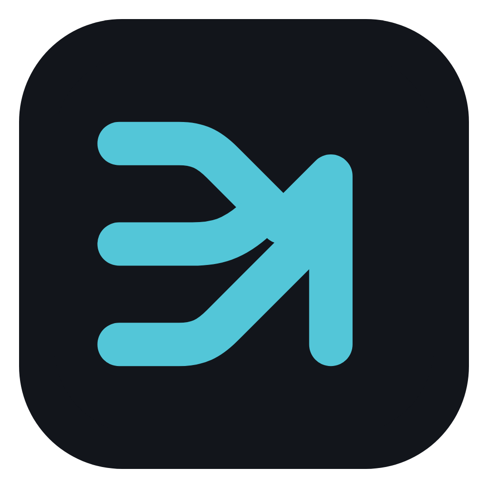
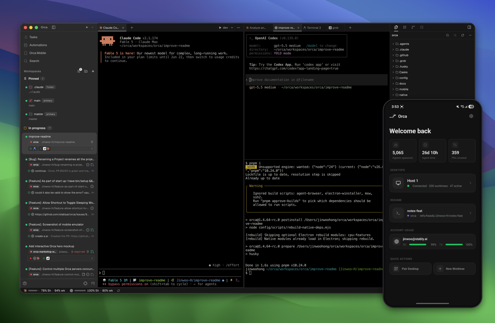

<h1 align="center">
  <a href="https://onOrca.dev"></a> Orca
</h1>

<p align="center">
  <a href="https://github.com/stablyai/orca"></a>
  <a href="https://github.com/stablyai/orca/releases"></a>
  
  <a href="https://discord.gg/fzjDKHxv8Q"></a>
  <a href="https://x.com/orca_build"></a>
  
</p>

<p align="center">
  <sub><a href="../../README.md">English</a> · <a href="README.zh-CN.md">中文</a> · <a href="README.ja.md">日本語</a> · <a href="README.ko.md">한국어</a> · <a href="README.es.md">Español</a> · <a href="README.fr.md">Français</a> · <a href="README.pt.md">Português</a></sub>
</p>

<p align="center">
  <strong>AI-оркестратор для розробників рівня 100x.</strong><br/>
  Запускайте Codex, Claude Code, OpenCode або Pi паралельно — кожен у власному worktree, усі під контролем в одному місці.
</p>

<h3 align="center"><a href="https://onorca.dev/download"><ins>Завантажити Orca</ins></a></h3>

<p align="center">
  
</p>

## Можливості

<table>
<tr>
<td width="50%" valign="middle">

### Супутній мобільний застосунок

Стежте за агентами та керуйте ними з телефону — отримуйте сповіщення про завершення роботи агента та надсилайте подальші вказівки, де б ви не були.

[App Store для iOS](https://apps.apple.com/us/app/orca-ide/id6766130217) · [TestFlight](https://testflight.apple.com/join/YjeGMQBA) · [Android APK 0.0.44](https://github.com/stablyai/orca/releases/download/mobile-android-v0.0.44/app-release.apk) · [Документація →](https://www.onorca.dev/docs/mobile)

</td>
<td width="50%">
  <a href="https://www.onorca.dev/docs/mobile"><picture><source srcset="../assets/feature-wall/mobile-companion-app-showcase.gif" type="image/gif"></picture></a>
</td>
</tr>
<tr>
<td width="50%" valign="middle">

### Паралельні worktree

Надішліть один промпт одразу п’ятьом агентам, кожен із яких працюватиме у власному ізольованому git worktree, — порівняйте результати та виконайте злиття найкращого з них.

[Документація →](https://www.onorca.dev/docs/model/worktrees)

</td>
<td width="50%">
  <a href="https://www.onorca.dev/docs/model/worktrees"><picture><source srcset="../assets/feature-wall/parallel-worktrees.gif" type="image/gif"></picture></a>
</td>
</tr>
<tr>
<td width="50%" valign="middle">

### Розділені термінали

Термінали рівня Ghostty з рендерингом на WebGL, необмеженою кількістю розділень і буфером прокручування, який зберігається після перезапуску.

[Документація →](https://www.onorca.dev/docs/terminal)

</td>
<td width="50%">
  <a href="https://www.onorca.dev/docs/terminal"><picture><source srcset="../assets/feature-wall/terminal-splits.gif" type="image/gif"></picture></a>
</td>
</tr>
<tr>
<td width="50%" valign="middle">

### Режим дизайну

Клацніть на будь-якому елементі інтерфейсу у справжньому вікні Chromium, щоб надіслати його HTML, CSS і обрізаний скриншот прямо в промпт агента.

[Документація →](https://www.onorca.dev/docs/browser/design-mode)

</td>
<td width="50%">
  <a href="https://www.onorca.dev/docs/browser/design-mode"><picture><source srcset="../assets/feature-wall/design-mode.gif" type="image/gif"></picture></a>
</td>
</tr>
<tr>
<td width="50%" valign="middle">

### GitHub і Linear, нативно

Переглядайте PR, issue та дошки проєктів прямо в застосунку — відкривайте worktree з будь-якої задачі та рев'юйте без перемикання контексту.

[Документація →](https://www.onorca.dev/docs/review/linear)

</td>
<td width="50%">
  <a href="https://www.onorca.dev/docs/review/linear"><picture><source srcset="../assets/feature-wall/github-linear.gif" type="image/gif"></picture></a>
</td>
</tr>
<tr>
<td width="50%" valign="middle">

### SSH worktree

Запускайте агентів на потужній віддаленій машині з повноцінним редагуванням файлів, git і терміналами — з автоперепідключенням і прокиданням портів.

[Документація →](https://www.onorca.dev/docs/ssh)

</td>
<td width="50%">
  <a href="https://www.onorca.dev/docs/ssh"><picture><source srcset="../assets/feature-wall/ssh-worktrees.gif" type="image/gif"></picture></a>
</td>
</tr>
<tr>
<td width="50%" valign="middle">

### Анотуйте diff-и агентів

Залишайте коментарі на будь-якому рядку diff-у й надсилайте їх агенту — рев'юйте, редагуйте та комітьте, не виходячи з Orca.

[Документація →](https://www.onorca.dev/docs/review/annotate-ai-diff)

</td>
<td width="50%">
  <a href="https://www.onorca.dev/docs/review/annotate-ai-diff"><picture><source srcset="../assets/feature-wall/annotate-diff.gif" type="image/gif"></picture></a>
</td>
</tr>
<tr>
<td width="50%" valign="middle">

### Перетягуйте файли агентам

Редактор на базі VS Code з автозбереженням усюди — перетягуйте файли чи зображення прямо в промпт агента.

[Документація →](https://www.onorca.dev/docs/editing/file-explorer)

</td>
<td width="50%">
  <a href="https://www.onorca.dev/docs/editing/file-explorer"><picture><source srcset="../assets/feature-wall/file-drag.gif" type="image/gif"></picture></a>
</td>
</tr>
<tr>
<td width="50%" valign="middle">

### Orca CLI

Агенти теж керують Orca — автоматизуйте будь-який робочий процес командами `orca worktree create`, `snapshot`, `click` і `fill`.

[Документація →](https://www.onorca.dev/docs/cli/overview)

</td>
<td width="50%">
  <a href="https://www.onorca.dev/docs/cli/overview"><picture><source srcset="../assets/feature-wall/orca-cli.gif" type="image/gif"></picture></a>
</td>
</tr>
</table>

**Також у комплекті:**

- **[Швидкий пошук](https://www.onorca.dev/docs/model/quick-open)** — Шукайте серед worktree, файлів, агентів, команд і контексту репозиторію, не відриваючись від роботи.
- **[Перемикач акаунтів і відстеження використання](https://www.onorca.dev/docs/agents/usage-tracking)** — Стежте за використанням Claude і Codex та скиданням лімітів, перемикайте акаунти на льоту без повторного входу.
- **[Розширені перегляди репозиторію](https://www.onorca.dev/docs/editing/markdown)** — Переглядайте Markdown, зображення, PDF та документацію репозиторію прямо в робочому просторі.
- **[Computer Use](https://www.onorca.dev/docs/cli/computer-use)** — Дозвольте агентам керувати десктопними застосунками та видимим інтерфейсом, коли робочий процес потребує реальної взаємодії.
- **[Сповіщення та статус непрочитаного](https://www.onorca.dev/docs/notifications)** — Дізнавайтеся, коли агент завершив роботу або потребує уваги, і позначайте треди як непрочитані, щоб повернутися пізніше.
- **І багато іншого** — ми випускаємо оновлення щодня, тож цей список завжди відстає. Справжній перелік можливостей — це [changelog](https://github.com/stablyai/orca/releases).

---

## Підтримувані агенти

Працює з **будь-яким CLI-агентом** — якщо він запускається в терміналі, він запуститься і в Orca.

<p>
  <a href="https://docs.anthropic.com/claude/docs/claude-code"><kbd> Claude Code</kbd></a> &nbsp;
  <a href="https://github.com/openai/codex"><kbd> Codex</kbd></a> &nbsp;
  <a href="https://x.ai/cli"><kbd> Grok</kbd></a> &nbsp;
  <a href="https://cursor.com/cli"><kbd> Cursor</kbd></a> &nbsp;
  <a href="https://docs.github.com/en/copilot/how-tos/set-up/install-copilot-cli"><kbd> GitHub Copilot</kbd></a> &nbsp;
  <a href="https://opencode.ai/docs/cli/"><kbd> OpenCode</kbd></a> &nbsp;
  <a href="https://mimo.xiaomi.com/coder"><kbd> MiMo Code</kbd></a> &nbsp;
  <a href="https://ampcode.com/manual#install"><kbd> Amp</kbd></a> &nbsp;
  <a href="https://openclaude.gitlawb.com/"><kbd> OpenClaude</kbd></a> &nbsp;
  <a href="https://antigravity.google/docs/cli-overview"><kbd> Antigravity</kbd></a> &nbsp;
  <a href="https://pi.dev"><kbd> Pi</kbd></a> &nbsp;
  <a href="https://omp.sh"><kbd> oh-my-pi</kbd></a> &nbsp;
  <a href="https://hermes-agent.nousresearch.com/docs/"><kbd> Hermes Agent</kbd></a> &nbsp;
  <a href="https://devin.ai/cli"><kbd> Devin</kbd></a> &nbsp;
  <a href="https://block.github.io/goose/docs/quickstart/"><kbd> Goose</kbd></a> &nbsp;
  <a href="https://docs.augmentcode.com/cli/overview"><kbd> Auggie</kbd></a> &nbsp;
  <a href="https://github.com/autohandai/code-cli"><kbd> Autohand Code</kbd></a> &nbsp;
  <a href="https://github.com/charmbracelet/crush"><kbd> Charm</kbd></a> &nbsp;
  <a href="https://docs.cline.bot/cline-cli/overview"><kbd> Cline</kbd></a> &nbsp;
  <a href="https://www.codebuff.com/docs/help/quick-start"><kbd> Codebuff</kbd></a> &nbsp;
  <a href="https://commandcode.ai/docs/quickstart"><kbd> Command Code</kbd></a> &nbsp;
  <a href="https://docs.continue.dev/guides/cli"><kbd> Continue</kbd></a> &nbsp;
  <a href="https://docs.factory.ai/cli/getting-started/quickstart"><kbd> Droid</kbd></a> &nbsp;
  <a href="https://kilo.ai/docs/cli"><kbd> Kilocode</kbd></a> &nbsp;
  <a href="https://www.kimi.com/code/docs/en/kimi-code-cli/getting-started.html"><kbd> Kimi</kbd></a> &nbsp;
  <a href="https://kiro.dev/docs/cli/"><kbd> Kiro</kbd></a> &nbsp;
  <a href="https://github.com/mistralai/mistral-vibe"><kbd> Mistral Vibe</kbd></a> &nbsp;
  <a href="https://github.com/QwenLM/qwen-code"><kbd> Qwen Code</kbd></a> &nbsp;
  <a href="https://support.atlassian.com/rovo/docs/install-and-run-rovo-dev-cli-on-your-device/"><kbd> Rovo Dev</kbd></a> &nbsp;
  <kbd>+ будь-який CLI-агент</kbd>
</p>

---

## Встановлення

### Десктоп — macOS, Windows, Linux

- **[Завантажити з onOrca.dev](https://onorca.dev/download)**
- Або завантажте білд напряму: [macOS Apple Silicon](https://github.com/stablyai/orca/releases/latest/download/orca-macos-arm64.dmg) · [macOS Intel](https://github.com/stablyai/orca/releases/latest/download/orca-macos-x64.dmg) · [Windows (.exe)](https://github.com/stablyai/orca/releases/latest/download/orca-windows-setup.exe) · [Linux AppImage](https://github.com/stablyai/orca/releases/latest/download/orca-linux.AppImage) · [Усі білди](https://github.com/stablyai/orca/releases/latest)
- Запускаєте `orca serve` на headless Linux-сервері? Дивіться [посібник із headless Linux-сервера](../reference/headless-linux-server.md).

_Або через пакетний менеджер:_

```bash
# macOS (Homebrew)
brew install --cask stablyai/orca/orca

# Arch Linux (AUR) — або stably-orca-git для збірки з джерела
yay -S stably-orca-bin
```

### Супутній мобільний застосунок — iOS, Android

Під’єднайте мобільний застосунок до десктопного, щоб стежити за агентами та керувати ними з телефону.

- **iOS:** [Завантажити з App Store](https://apps.apple.com/us/app/orca-ide/id6766130217) або [приєднатися до TestFlight](https://testflight.apple.com/join/YjeGMQBA)
- **Android:** [Завантажити APK 0.0.44](https://github.com/stablyai/orca/releases/download/mobile-android-v0.0.44/app-release.apk) · [Інструкція зі встановлення](https://www.onorca.dev/docs/android-apk)

---

## Спільнота та підтримка

- **Discord:** Приєднуйтеся до спільноти в **[Discord](https://discord.gg/fzjDKHxv8Q)**.
- **Twitter / X:** Стежте за **[@orca_build](https://x.com/orca_build)**, щоб бути в курсі оновлень і анонсів.
- **WeChat:** Відскануйте QR-код, щоб приєднатися до групи № 7 спільноти Orca у WeChat. Якщо вона заповнена, приєднайтеся до групи № 8.

  &nbsp;&nbsp;
  

- **Зворотний зв'язок та ідеї:** Ми випускаємо оновлення швидко. Чогось бракує? [Запропонуйте нову функцію](https://github.com/stablyai/orca/issues).
- **Конфіденційність:** Перегляньте [документацію про конфіденційність і телеметрію](https://www.onorca.dev/docs/telemetry), щоб дізнатися, які анонімні дані про використання збирає Orca і як від цього відмовитися.
- **Підтримайте нас:** Поставте [зірку](https://github.com/stablyai/orca) цьому репозиторію, щоб стежити за нашими щоденними релізами.

---

## Розробка

Хочете зробити внесок або запустити проєкт локально? Перегляньте наш посібник [CONTRIBUTING.md](../../.github/CONTRIBUTING.md).

<a href="https://github.com/stablyai/orca/graphs/contributors">
  
</a>

<p align="center">
  
</p>

## Підписані білди
Підписання коду для Windows надано за підтримки [SignPath.io](https://signpath.io), сертифікат надано [SignPath Foundation](https://signpath.org).

## Ліцензія

Orca — безкоштовний проєкт із відкритим кодом за ліцензією [MIT](../../LICENSE).
