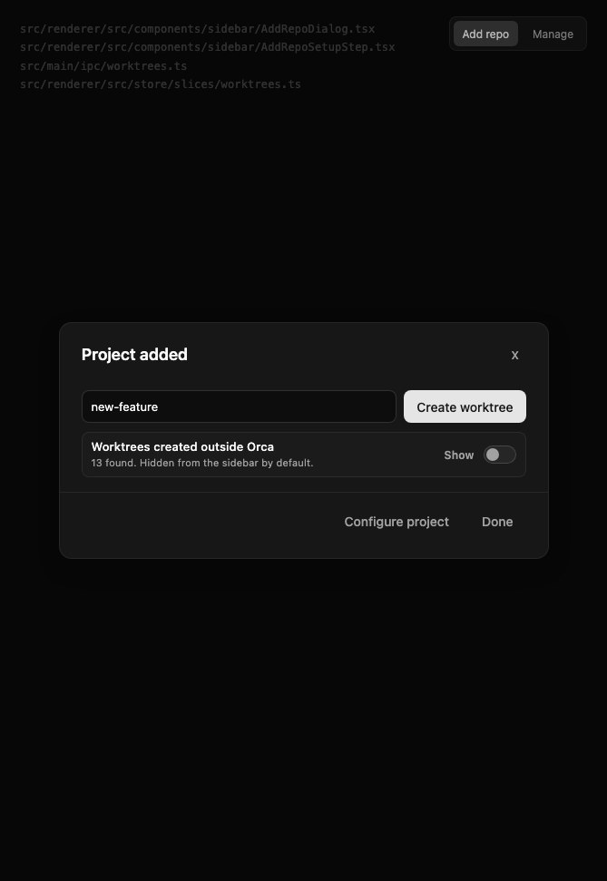
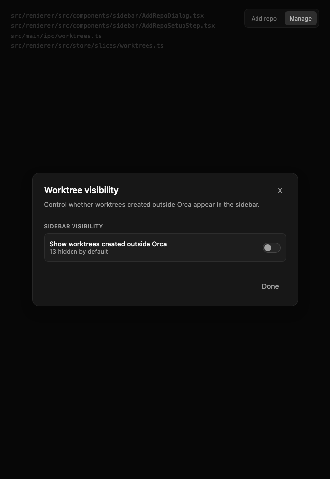

# Other Worktree Onboarding

## Goal

Reduce add-repo churn caused by Orca showing every Git worktree for a repo at once, especially worktrees created by other tools. Adding a repo should show the folder the user chose, keep Orca-created worktrees visible, and offer one clear sidebar visibility choice for the rest.

## Mockup

- HTML mockup: [worktree-import-mockup.html](../assets/worktree-import-mockup.html)
- Add-repo state:

  

- Worktree Visibility state:

  

## Current Problem

Today, adding a Git repo calls the worktree discovery path and writes every discovered worktree into renderer state. In practice, discovery is treated as sidebar import. Users who have many historical worktrees from tools like Conductor, Codex, scripts, or manual Git workflows immediately see an overwhelming sidebar.

This is especially bad for first-run onboarding because the user selected one folder, but Orca appears to take responsibility for many folders they did not explicitly choose. `git worktree list` is a detection signal, not user intent.

## Product Model

Separate three concepts:

- **Detected worktree:** a worktree returned by `git worktree list`.
- **Orca-managed worktree:** a worktree Orca created or can confidently associate with Orca's workspace root/metadata.
- **Visible worktree:** a worktree shown in the sidebar.
- **Hidden worktree:** a detected worktree omitted from the sidebar by policy. It still exists and must not be treated as deleted.

The sidebar should show:

- the selected checkout (`worktree.path` equals `repo.path` under normalized path comparison), even when that checkout is a linked Git worktree rather than Git's canonical main worktree;
- Orca-managed worktrees;
- external worktrees only when the repo's visibility policy allows it.

Do not conflate the selected checkout with Git's `isMainWorktree` flag. If the user adds a linked worktree folder, `git worktree list` can mark some other path as the main worktree; showing that path while hiding the selected folder would recreate the surprise this design is meant to remove.

## UX

### New Repo Add

After adding a repo, show a small completion dialog:

- Title: `Project added`
- Primary row: branch/name input plus `Create worktree`
- Secondary visibility row only when external or unrecognized worktrees exist:
  - `Other Git worktrees`
  - `13 found. Hidden from the sidebar by default.`
  - `Show in sidebar` toggle, default off
- Footer: `Configure project`, `Done`

This completion view must be shared by both project-entry flows:

- normal in-app `Add Project` from the sidebar/repo picker;
- first-run onboarding's project step.

Do not implement this only inside the sidebar add dialog. The first-run path is where the surprise is most damaging, so both paths should use the same post-add model, same default `externalWorktreeVisibility: 'hide'`, same detected-worktree count rules, and same primary create-worktree action.

This preserves hierarchy:

- creating an Orca worktree is the primary next step;
- other-worktree visibility is explicit but does not compete with the primary action;
- no "import all" prompt blocks the happy path.

Do not add a per-worktree picker in onboarding. `Open selected` is ambiguous because it can sound like Orca is importing or taking ownership of individual outside worktrees. The product question is simpler: should worktrees Orca did not create, or cannot recognize as Orca-created, be shown in the sidebar for this repo?

### Repo Menu

Add a repo-menu entry:

```text
Worktree Visibility
```

or, if we keep the existing language:

```text
Manage Worktrees
```

The surface should be about visibility, not destructive cleanup:

```text
Show other Git worktrees in sidebar    [toggle]

13 hidden
```

Do not start with a checklist-heavy import UI; the main issue is bulk visibility, and "Remove"/"Import checked"/"Open selected" language makes a view preference sound like filesystem ownership.

## Technical Design

### Data Model

Add a repo-level visibility policy:

```ts
type ExternalWorktreeVisibility = 'hide' | 'show'

type Repo = {
  externalWorktreeVisibility?: ExternalWorktreeVisibility
  externalWorktreeVisibilityLegacy?: boolean
  externalWorktreeVisibilityPromptDismissedAt?: number
}
```

Semantics:

- `undefined` is migration-dependent. Existing repos should be treated as `show` until migrated. Newly added repos should explicitly write `hide`.
- `hide` means external worktrees are detected but not shown by default.
- `show` means external worktrees are shown in the sidebar.
- `externalWorktreeVisibilityLegacy` records that a repo predates hidden-by-default external worktrees, so legacy protections survive after the user later changes the visibility value.
- `externalWorktreeVisibilityPromptDismissedAt` is the one-shot guard for the optional existing-user prompt.
- Legacy status must be computed independently from `externalWorktreeVisibility`, using `externalWorktreeVisibilityLegacy` once present and upgrade-safe defaults for old records. Do not infer "legacy repo" only from the current visibility value; after an existing user chooses `hide`, the repo still needs legacy protections for `unknown-legacy` rows.
- `effectiveExternalWorktreeVisibility(repo, false)` must treat an `undefined` stored value as `hide`. New repo creation paths are still expected to persist `hide`, but this fallback keeps a missed writer from importing every outside worktree by accident.

Add a worktree ownership classifier result:

```ts
type WorktreeOwnership = 'orca-managed' | 'external' | 'unknown-legacy'
```

Add an explicit creation marker for new Orca-created worktrees:

```ts
type WorktreeMeta = {
  orcaCreatedAt?: number
  orcaCreationSource?: 'desktop' | 'runtime' | 'cli' | 'ssh'
  orcaCreationWorkspaceLayout?: {
    path: string
    nestWorkspaces: boolean
  }
}
```

This marker is the new canonical ownership signal going forward. Stamp it from every Orca worktree-create path: desktop IPC, runtime RPC, CLI/runtime create, SSH create, sparse create, and any direct work-item launch path that creates a worktree.

When Orca actually deletes a worktree, delete the persisted `WorktreeMeta` for that worktree ID, including the ownership marker. Hiding a worktree from the sidebar must not delete this metadata; only confirmed worktree removal or repo removal should.

Keep the older metadata signals below as backward-compatible evidence for worktrees created before this marker exists. Do not keep expanding the classifier by adding incidental UI fields.

Do not rely on path substrings like `conductor` or `codex` for primary classification. Use them only as diagnostic hints if we surface debug metadata later.

Do not treat `instanceId`, `lastActivityAt`, `displayName`, `comment`, pin/archive/sort fields, or linked issue/PR fields as ownership evidence. Existing discovery paths can stamp those fields for worktrees Orca did not create.

Do not treat Git's `worktree.isMainWorktree` flag as ownership evidence. It identifies Git's primary worktree for the repository, not the folder the user selected in Orca.

### Orca Workspace Roots

Use Orca's workspace root as a first-class ownership signal:

- local: `settings.workspaceDir`
- nested local: `settings.workspaceDir/<repo-name>/<worktree-name>`, matching `computeWorktreePath`
- flat local: `settings.workspaceDir/<worktree-name>`, but only as weak legacy evidence because the path does not encode the repo
- WSL: `~/orca/workspaces` derived from the WSL home path, matching existing create logic
- historical roots: `settings.workspaceDirHistory`

Add:

```ts
type OrcaWorkspaceLayout = {
  path: string
  nestWorkspaces: boolean
}

type GlobalSettings = {
  workspaceDirHistory?: OrcaWorkspaceLayout[]
}
```

When `workspaceDir` or `nestWorkspaces` changes, append the previous normalized `{ path, nestWorkspaces }` pair to `workspaceDirHistory`. This preserves ownership classification for worktrees created under a previous Orca root or previous flat/nested layout mode.

Build classifier input from the current `{ workspaceDir, nestWorkspaces }`, any WSL-derived current layout, and each `workspaceDirHistory` entry. For WSL repos, derive a WSL layout from the current setting and from every historical `nestWorkspaces` value; the local Windows/macOS/Linux `workspaceDir` string is not itself the remote WSL root. The path-shape check must use the `nestWorkspaces` value from the matched layout, not the current setting globally.

Path-only ownership evidence must not be "any descendant of the workspace root". A repo can be selected from inside `~/orca/workspaces`, and other tools can also create worktrees there. Treat path evidence as strong only when it matches a repo-specific Orca create-path shape. For flat layouts, a direct child of the workspace root is not repo-specific, so classify it as `unknown-legacy` unless strong metadata exists. That keeps legacy flat-layout users visible and avoids calling other tools' flat worktrees Orca-managed.

Moved-root behavior:

- If the user changes `workspaceDir` or `nestWorkspaces` inside Orca, `workspaceDirHistory` preserves the previous root/layout so old nested Orca worktrees still classify as Orca-managed.
- If the user moves the workspace root outside Orca and then points Orca at the new root, path history may not know the old location. Explicit `orcaCreatedAt` metadata still makes those worktrees Orca-managed after discovery.
- If an individual worktree is moved outside Orca and its path-derived worktree ID changes, path-keyed `WorktreeMeta` may not follow. Without explicit metadata at the new ID or a readable worktree-local marker, classify it as `unknown-legacy`, not confidently external and not Orca-managed.
- For new worktrees, prefer writing the explicit ownership marker both to persisted `WorktreeMeta` and, where the provider supports it, to a lightweight worktree-local marker such as Git config. The local marker lets ownership survive path moves, restored SSH sessions, and store loss. It must be read only from worktrees already returned by Git discovery, never by crawling arbitrary folders.
- If Git config is used as the worktree-local marker, use a per-worktree config mechanism only after validating support on that provider. Do not write a common repo config key that would mark every worktree in the repository as Orca-created.

Use the shared cross-platform path helpers for these checks. Do not use raw `startsWith` path comparisons; Windows drive-letter casing, UNC prefixes, WSL paths, and mixed separators all need normalized comparison.

### Ownership Classifier

Strong Orca-managed evidence:

- `meta.orcaCreatedAt`
- `meta.createdAt`
- `meta.createdWithAgent`
- `meta.pushTarget`
- `meta.sparseBaseRef`, `meta.sparsePresetId`
- `meta.preserveBranchOnDelete`
- path matches a known nested Orca workspace root plus the repo-specific path shape Orca would have generated for this repo

For flat workspace roots, a path under `settings.workspaceDir` is not strong ownership evidence unless one of the metadata signals above is present; flat roots do not encode the repo name.

External evidence:

- path can be compared to known roots and is outside all Orca roots; or
- path is inside a nested Orca root but does not match this repo's Orca-created path shape;
- no strong Orca metadata exists.

Unknown legacy:

- metadata exists but predates the fields above;
- path cannot be confidently compared because a root is unavailable;
- path is under a flat Orca workspace root without strong metadata;
- remote/SSH fallback metadata is present but current provider state prevents authoritative path checks.

Classifier sketch:

```ts
function classifyWorktreeOwnership(args: {
  repo: Repo
  worktree: Worktree
  meta?: WorktreeMeta
  settings: GlobalSettings
  knownOrcaLayouts: OrcaWorkspaceLayout[]
}): WorktreeOwnership {
  if (
    args.meta?.orcaCreatedAt ||
    args.meta?.createdAt ||
    args.meta?.createdWithAgent ||
    args.meta?.pushTarget ||
    args.meta?.sparseBaseRef ||
    args.meta?.sparsePresetId ||
    args.meta?.preserveBranchOnDelete
  ) {
    return 'orca-managed'
  }

  if (matchesStrongOrcaCreatePath(args.worktree.path, args.knownOrcaLayouts, args.repo)) {
    return 'orca-managed'
  }

  if (isUnderFlatOrUntrustedOrcaRoot(args.worktree.path, args.knownOrcaLayouts)) {
    return 'unknown-legacy'
  }

  if (canClassifyAsExternal(args.worktree.path, args.knownOrcaLayouts, args.repo.connectionId)) {
    return 'external'
  }

  return 'unknown-legacy'
}
```

### Visibility

```ts
function shouldShowWorktree(args: {
  worktree: Worktree
  ownership: WorktreeOwnership
  repo: Repo
  isLegacyRepoForVisibility: boolean
  isSelectedCheckout: boolean
}): boolean {
  if (args.isSelectedCheckout) {
    return true
  }

  if (args.ownership === 'orca-managed') {
    return true
  }

  if (args.ownership === 'unknown-legacy' && args.isLegacyRepoForVisibility) {
    return true
  }

  return effectiveExternalWorktreeVisibility(args.repo, args.isLegacyRepoForVisibility) === 'show'
}
```

`effectiveExternalWorktreeVisibility(repo, true)` should return `show` when the stored value is `undefined`; `effectiveExternalWorktreeVisibility(repo, false)` should return `hide` when the stored value is `undefined`. Newly created repo records should store `hide` so they do not depend on either fallback. `unknown-legacy` worktrees stay visible for legacy repos even after the user hides confidently external worktrees, because the hide action is not allowed to sweep up rows we cannot classify.

### Add Repo Behavior

For newly added repos:

1. Add repo with `externalWorktreeVisibility: 'hide'` only when a new repo record is actually created. If local IPC (`repos:add`, `repos:addRemote`, `repos:create`, `repos:clone`) or runtime RPC (`repo.add`, `repo.create`, `repo.clone`) dedupes to an existing repo, preserve the existing visibility fields.
2. Run discovery.
3. Keep all detected worktrees in a separate detected-worktree result/cache, but only write visible worktrees into the sidebar list. The selected checkout must be in the visible list even when it is classified as external.
4. If hidden external or unknown worktrees exist, show the secondary other-worktree visibility row in the completion dialog. The count can include both buckets, but the copy should not claim every row was definitely created outside Orca.
5. If the user turns the row on, set `externalWorktreeVisibility: 'show'` for the repo and refresh the visible sidebar list.

Reason: there should be no ambiguity about what Orca will do. The user is not choosing an individual worktree to import; they are deciding whether other Git worktrees appear in the sidebar for this repo.

Folder repos do not have a Git worktree graph. Keep their existing one-workspace behavior and do not show worktree visibility controls for them.

Important state boundary: visibility filtering is not deletion. Existing `fetchWorktrees` and hydration-time `fetchAllWorktrees` purge tabs, metadata, and related UI state for IDs that disappear from `worktreesByRepo`; hiding a worktree must not feed those hidden IDs through the deletion/missing-worktree purge path. Compute purge from the authoritative detected list, not from the visible sidebar list, or keep a separate `detectedWorktreesByRepo` cache so the renderer can distinguish "hidden by policy" from "gone from git".

Do not repair this by stuffing hidden rows into `worktreesByRepo` with a `hidden` flag. Too many selectors, dashboards, palettes, terminal restoration paths, and cleanup paths already treat that map as the visible worktree contract. Keep detected data separate and feed only visible rows to sidebar consumers.

Renderer state should have two explicit read models:

- `worktreesByRepo`: visible sidebar rows only.
- `detectedWorktreesByRepo` or an equivalent detected-worktree cache: all rows from the latest authoritative scan, including rows hidden by policy.

Add a narrowly named lookup selector for non-sidebar surfaces that must keep an already-open hidden worktree usable, for example `getKnownWorktreeById`. It may read visible rows plus detected rows, but do not silently change the existing `useWorktreeMap`/`allWorktrees` semantics until every caller is audited. Activation, terminal/editor restoration, source control, file watching, notifications, and session hydration need a resolvable worktree record for a hidden active/open workspace; sidebar grouping, jump palettes, dashboards, and bulk actions should keep using the visible-list contract unless the surface is explicitly about Worktree Visibility.

Apply backend cleanup from the detected list before visibility filtering, and only after a successful authoritative scan. In particular, `registerWorktreeRootsForRepo`, `pruneLineageForMissingRepoWorktrees`, missing-worktree metadata cleanup, hydration-time stale-tab purge, and runtime resolved-worktree cache invalidation must see the authoritative Git result, not the visible sidebar subset.

The detected-list path should read existing `WorktreeMeta` but should not create discovery-stamp metadata for hidden worktrees just to render the visibility count. Stamp or create metadata when a worktree becomes visible; otherwise a hidden row gets recency/fallback metadata merely because Orca detected it.

### Existing User Migration

Do not suddenly hide worktrees currently visible in existing repos.

Migration:

- Existing repos get effective `externalWorktreeVisibility: 'show'` while the persisted value is `undefined`.
- Do not rewrite every existing repo on load just to set `show`; the effective default preserves visible worktrees without creating avoidable persistence churn.
- Newly added repos write `externalWorktreeVisibility: 'hide'` and `externalWorktreeVisibilityLegacy: false`.
- Legacy repo detection is based on the explicit legacy marker once present, with rollout timing only as a fallback for records that already changed visibility before the marker existed.
- Optionally show one non-blocking prompt for existing repos with many external worktrees:

```text
Orca is showing 13 worktrees outside its workspace folder.
Hide them from the sidebar?
```

Actions:

- `Hide external worktrees`
- `Keep showing`

This prompt should only appear once per repo and should not block app startup. Dismissal should be recorded separately from the visibility value so `Keep showing` does not need to write `show`.

The prompt count and hide action should target confidently external worktrees. Unknown legacy rows can be listed in the visibility surface later, but they should not be swept up by a one-click migration cleanup.

If the user chooses `Hide external worktrees`, store `externalWorktreeVisibility: 'hide'` and `externalWorktreeVisibilityPromptDismissedAt`, then hide confidently external worktrees from the sidebar without deleting any tabs, terminal state, metadata, lineage, or history. If the user chooses `Keep showing`, store only `externalWorktreeVisibilityPromptDismissedAt`. If the active worktree is external, delay the prompt until the user switches away or word the action as a direct sidebar visibility change; do not make the current workspace disappear as a side effect of a background cleanup prompt. The selected checkout is still always visible.

### Remote and SSH

Remote repos need the same product model but cannot always use local path checks.

Discovery modes:

- Connected SSH provider: `provider.listWorktrees(repo.path)` is authoritative for detected rows. It may classify confidently external rows when remote paths can be compared safely.
- Disconnected SSH provider: persisted `WorktreeMeta` and restored session tabs are fallback visibility data, not authoritative Git discovery.
- Remote runtime: follows the same connected/fallback distinction as desktop IPC. Runtime selector scans must not return a different ownership label for the same connected discovery result.

Rules:

- If the SSH provider is connected, compare remote paths against a remote Orca workspace root only when that root is actually known on the remote host.
- Do not compare remote paths using the local machine's `settings.workspaceDir`; `/Users/alice/orca/workspaces` on the laptop says nothing about `/home/alice/orca/workspaces` on the SSH host.
- Current SSH worktree creation may place new worktrees beside the repo path rather than under `settings.workspaceDir`, so the repo parent directory is not ownership evidence by itself.
- If disconnected and using persisted metadata fallback, classify fallback rows as `unknown-legacy` unless strong Orca metadata exists.
- Never hide unknown remote worktrees during migration.
- Existing repos with unknown remote fallback metadata remain visible until the repo has authoritative connected discovery and the user has explicitly chosen to hide outside worktrees.
- Restored SSH session placeholders exist to keep terminals and sidebar rows alive while reconnecting. They should be visible for legacy/session continuity but should not be used to stamp metadata, prune missing worktrees, or prove that a hidden worktree still exists on disk.
- Remote runtime and desktop IPC must use the same ownership labels for the same connected discovery result; otherwise the web/runtime sidebar and desktop sidebar will disagree about what is visible.

Visibility behavior by SSH state:

| State                                  | Source of rows                      | Classification                                         | Can hide by default?                                                                              | Can purge missing state?                                              |
| -------------------------------------- | ----------------------------------- | ------------------------------------------------------ | ------------------------------------------------------------------------------------------------- | --------------------------------------------------------------------- |
| Connected, authoritative scan succeeds | `provider.listWorktrees(repo.path)` | normal classifier using remote-safe roots and metadata | yes, for confidently external rows on new repos                                                   | yes, but only from the full detected scan before visibility filtering |
| Connected, scan fails                  | persisted metadata/session fallback | `unknown-legacy` unless strong metadata exists         | no; keep selected/restored rows visible, and do not show a found-count from fallback data         | no                                                                    |
| Disconnected or provider missing       | persisted metadata/session fallback | `unknown-legacy` unless strong metadata exists         | no for existing repos; keep restored active/session rows visible and do not show a new-repo count | no                                                                    |

The add-repo completion count for an SSH repo should only be shown after an authoritative connected scan. If Orca only has fallback metadata, do not show a confident "13 found" count; keep selected/restored rows visible, use existing restored rows when available, and wait for connected discovery.

### APIs

Add or extend IPC/RPC surfaces:

```ts
worktrees:listDetected({ repoId }): Promise<DetectedWorktreeListResult>
repos:update({
  repoId,
  externalWorktreeVisibility,
  externalWorktreeVisibilityPromptDismissedAt
})
```

`DetectedWorktreeListResult` should include:

```ts
type DetectedWorktreeListResult = {
  repoId: string
  authoritative: boolean
  source: 'git' | 'metadata-fallback' | 'session-fallback'
  worktrees: DetectedWorktree[]
}
```

`DetectedWorktree` should include:

```ts
type DetectedWorktree = Worktree & {
  ownership: WorktreeOwnership
  selectedCheckout: boolean
  visible: boolean
}
```

Renderer state should avoid conflating all detected worktrees with `worktreesByRepo`.

Implementation notes:

- Keep `worktrees:list` / runtime `worktree.list` as the visible-list contract consumed by the sidebar.
- Add a detected-list path for the add-repo completion dialog and Worktree Visibility surface.
- Apply the same classifier and visibility policy in local IPC and runtime RPC so local, SSH, and remote-environment clients agree.
- Do not represent scan failure as an authoritative empty detected list. The caller needs to know "scan failed; fallback data shown" so it does not purge state or show a misleading hidden-worktree count.
- Extend every repo-update whitelist and schema that currently enumerates `Repo` fields: shared `Repo`, preload API types, renderer `RepoUpdate`, local `repos:update`, runtime `repo.update`, `Store.updateRepo`, and the RPC zod schema. Otherwise the new fields will appear to update in one surface and be dropped in another.
- Do not rely on `undefined` as a cross-process clear value for the new repo fields. The runtime update path strips undefined properties before calling `Store.updateRepo`; use concrete values (`'hide'`, `'show'`, timestamp) or add an explicit `null` clear contract if one is needed.
- Add `workspaceDirHistory` to the shared `GlobalSettings` type and preserve it through `settings:set`, renderer `updateSettings`, `Store.updateSettings`, defaults, and persistence tests. The history update belongs in the store layer so direct settings writes and UI writes behave the same way.
- Add a preload/runtime method for detected worktrees rather than overloading `worktree.list`. CLI help currently describes `orca worktree list` as Orca-managed worktrees; changing that response to detected worktrees would be a product break.

### Tests

Unit:

- path classifier handles POSIX, Windows, UNC, and WSL roots;
- Orca metadata wins over external-looking path;
- path inside current workspace root is not enough by itself; it must match a nested Orca create-path shape for the repo;
- path under a flat workspace root without strong metadata is `unknown-legacy`, not `orca-managed` and not confidently `external`;
- path inside workspaceDirHistory is Orca-managed only when it matches a nested Orca create-path shape using that history entry's recorded `nestWorkspaces` value;
- changing `nestWorkspaces` records the previous workspace layout in `workspaceDirHistory` even when `workspaceDir` itself does not change;
- WSL classifier inputs derive historical WSL layouts from every recorded `nestWorkspaces` value, not from the local `workspaceDir` path string;
- explicit `orcaCreatedAt` metadata makes a worktree Orca-managed even after the workspace root moves;
- moved individual worktree with changed path and no explicit/readable ownership marker becomes `unknown-legacy`, not confidently external;
- `isLegacyRepoForVisibility` is stable after the user changes `externalWorktreeVisibility` from `undefined` to `hide`;
- `effectiveExternalWorktreeVisibility(repo, false)` treats an undefined stored value as `hide`;
- selected linked worktree path remains visible even when Git's `isMainWorktree` points at a different checkout;
- Git's `isMainWorktree` alone does not make a non-selected checkout Orca-managed;
- external path with no Orca metadata is external;
- unknown remote fallback remains visible for existing repos;
- unknown remote fallback remains visible for existing repos until authoritative discovery is available or the user explicitly hides outside worktrees;
- disconnected SSH fallback rows are not used as authoritative detected rows for purge decisions;
- restored SSH session placeholders remain visible while reconnecting but do not create ownership metadata.

Integration:

- new repo with 13 external worktrees shows only the selected checkout in the sidebar plus the secondary visibility row;
- first-run onboarding add-project path and normal in-app Add Project path both show the same completion view and apply the same external visibility default;
- new repo added from a linked worktree shows the selected linked worktree, not Git's separate main worktree, unless that main worktree is otherwise visible by policy;
- turning on outside-worktree visibility shows external worktrees for that repo;
- repo-level visibility toggle shows/hides all external worktrees;
- existing repo migration keeps current worktrees visible;
- existing-user hide prompt does not make the active external worktree disappear as a side effect;
- existing-user hide prompt preserves currently visible `unknown-legacy` worktrees after `externalWorktreeVisibility` changes from `undefined` to `hide`;
- selected checkout remains visible after the user hides other worktrees;
- hiding external worktrees does not purge tabs, terminal state, metadata, lineage, or history for those worktrees;
- hidden active/open worktrees remain resolvable by terminal, editor, source-control, file-watch, notification, and session-hydration paths, while staying absent from sidebar grouping and general navigation surfaces;
- hydration-time stale-tab purge uses authoritative detected IDs, not visible sidebar IDs;
- filesystem authorization roots are registered from authoritative detected worktrees, including hidden rows;
- SSH repo with authoritative connected discovery applies the same visibility policy in desktop IPC and runtime RPC;
- SSH repo with disconnected fallback does not show the new-repo "13 found" completion count until a connected scan succeeds;
- SSH repo scan failure returns a non-authoritative detected-list result and does not trigger purge or hidden-count UI;
- SSH repo reconnect failure preserves restored terminal/sidebar placeholders and does not trigger missing-worktree purge;
- rendering the hidden outside-worktree count does not create discovery-stamp `WorktreeMeta` for hidden rows;
- every Orca worktree-create path stamps `orcaCreatedAt`/creation metadata, including desktop, runtime, CLI, SSH, sparse, and work-item launch creates;
- local worktree markers do not use common repo config as per-worktree ownership evidence;
- confirmed Orca worktree deletion removes `WorktreeMeta`, including ownership metadata, while visibility hiding does not;
- backend lineage pruning and missing-worktree cleanup use detected worktrees, not the filtered visible list;
- deduping an already-added repo does not overwrite its visibility policy;
- new repo records created through runtime `repo.add`, `repo.create`, and `repo.clone` persist `externalWorktreeVisibility: 'hide'`;
- existing-user prompt actions both set `externalWorktreeVisibilityPromptDismissedAt`, while only `Hide external worktrees` changes `externalWorktreeVisibility`;
- repo visibility updates persist through local IPC and runtime RPC;
- repo visibility updates do not get dropped by `Store.updateRepo` or the runtime `repo.update` zod schema;
- no destructive deletion or archival behavior is triggered by hiding.

UX:

- add-repo completion has one primary action;
- secondary other-worktree path is visible but does not compete visually;
- no status-heavy labels like clean/dirty/missing in onboarding.

## Rollout

1. Add ownership classifier and tests without changing UI.
2. Add detected-worktree state/API plumbing while keeping visible `worktreesByRepo` behavior unchanged.
3. Add repo visibility fields and migration defaults.
4. Change new repo add path to default external visibility to `hide`.
5. Add completion dialog secondary row.
6. Add Worktree Visibility surface.
7. Add existing-user one-time prompt after telemetry confirms classifier behavior.

## Open Questions

- Should external visibility be per repo or global? Recommendation: per repo.
- Should the selected checkout ever be hidden? Recommendation: no. The folder the user selected must always remain visible.
- Should Git's canonical main worktree be visible when it is not the selected checkout? Recommendation: only when it is Orca-managed or allowed by the external visibility policy.
