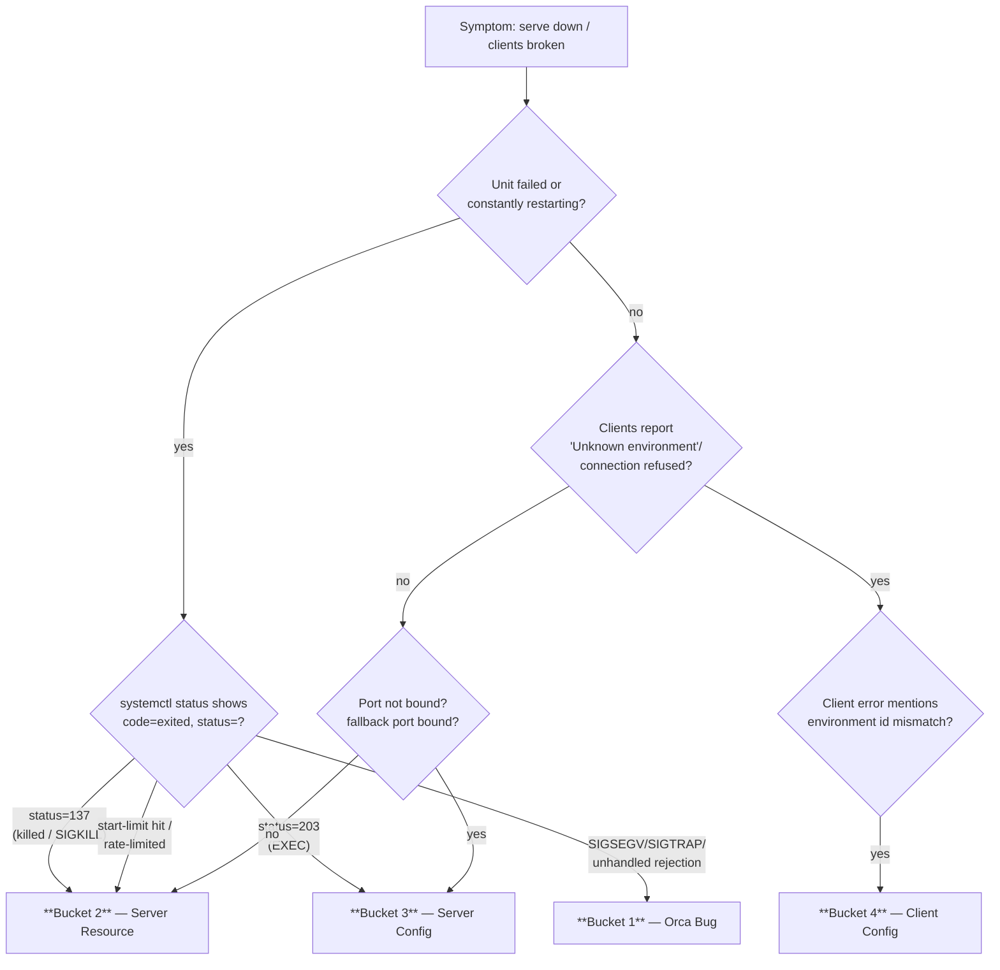

# Orca Serve Troubleshooting Matrix

Triaging the headless `orca serve` runtime from symptom to root cause. Every failure lands in
exactly one of four buckets; the hard part is picking the right bucket before you reach for a
fix. Start at the flowchart, then read that bucket's table and run its **≤ 5**-command cheat
sheet. Evidence before remedies: capture the journal and status first, then act.

---

## 1. Decision flowchart



ASCII fallback (same routing):

```text
 serve down / clients broken
        │
        ├─ unit failed / restart-looping ──► status=137 ────────────► BUCKET 2 (resource)
        │                                   status=203 (EXEC) ─────► BUCKET 3 (server config)
        │                                   SIGSEGV/SIGTRAP /
        │                                   unhandled rejection ────► BUCKET 1 (orca bug)
        │                                   start-limit hit ───────► BUCKET 2 (resource)
        │
        └─ clients "Unknown environment" / "connection refused"
                │
                ├─ environment-id mismatch ──► BUCKET 4 (client config)
                ├─ pinned port not bound /
                │   fallback bound          ──► BUCKET 3 (server config)
                └─ OOM / ENOSPC / fd        ──► BUCKET 2 (resource)
```

**Cross-bucket discriminator (5 questions):**

| # | Question | Points to |
|---|----------|-----------|
| 1 | Does `systemctl status orca-serve@<instance>` show `status=137` (`n/a` or 128+9)? | **2** — OOM-kill |
| 2 | Does it show `status=203` (`Failed at step EXEC`)? | **3** — exec/path/permission |
| 3 | Is the pinned port LISTENing, or is a fallback port bound instead? | **3** — port/override |
| 4 | Does the journal carry `SIGSEGV`, `SIGTRAP`, `UnhandledPromiseRejection`, `RuntimeEnvironmentStoreError`? | **1** — in-process bug |
| 5 | Does the client error name an environment id not in the registry, or a stale runtimeId? | **4** — client state |

---

## 2. Bucket 1 — Orca bug (in-process)

Faults *inside* the Electron/TS runtime itself. You cannot fix these with config or resources;
you pin the build, capture the journal, and fix upstream.

| Signature | Root cause | Evidence to collect |
|-----------|-----------|---------------------|
| **SIGSEGV** in main process | Native crash — most common: headless path self-spawns Xvfb on a stale `:99` lock, a GPU-less host, or a native module | `journalctl` SIGSEGV signature, crashpad minidumps, `crash-reports.json` |
| **SIGTRAP** | WebGL2/GPU blocklisted, renderer gone — GPU-less host, or wrong DISPLAY wiring | `journalctl` SIGTRAP / WebGL2 blocklist signature, serve log tail |
| **Unhandled rejection** | `UnhandledPromiseRejectionWarning` / uncaught exception in TS — restarts never converge | journal `UnhandledPromiseRejection` / `uncaughtException` signatures |
| **`RuntimeEnvironmentStoreError` / "Unknown environment"** | Runtime identity churned and `orca-runtime.json` points at a phantom/dead pid; CLI resolves an env id with no live runtime | journal error count, `orca-runtime.json` pid vs `ss` listener |
| **Deadlocks / state churn** | daemon-init vs serve race; a runtimeId minted anew on every restart while a client pins the old one | restart count vs start-limit, journal before/after |

**Remediation (in order):** (1) capture the journal and status before/after and read the delta
("did the runtime identity, port, or crash signature change across the restart?"); (2)
reproduce on a spare instance at the same build; (3) pin or roll back the suspect build via
`ORCA_VERSION`; (4) fix upstream. Never hand-edit `orca-runtime.json` to "unphantasm" it —
that masks, not fixes.

**Triage cheat sheet (5):**

```bash
systemctl status orca-serve@<instance>.service --no-pager                 # active vs 137/203
journalctl -u orca-serve@<instance>.service -b -o cat --no-pager \
  | grep -iE 'SIGSEGV|SIGTRAP|UnhandledPromiseRejection|uncaughtException|RuntimeEnvironmentStoreError'
ss -ltnp | grep -E ':(6768|6769|6770|6771)'                                # who actually LISTENs
orca --environment <id> status --json | jq '.runtime | {runtimeId, reachable, appVersion}'
cat "${ORCA_USER_DATA_PATH:-$HOME/.config/orca}/orca-runtime.json" | jq '{runtimeId, pid}'
```

---

## 3. Bucket 2 — Server resource

The box (or its cgroup) ran out of a finite resource. The serve usually *was* healthy; the
kernel or systemd killed it.

| Signature | Root cause | Evidence to collect |
|-----------|-----------|---------------------|
| **Exit 137 / `status=137` / OOM killer** | cgroup memory limit hit (systemd) or host OOM — kernel sends SIGKILL (128+9); Electron never logs it itself | `systemctl status` result code, `journalctl -k | grep -i oom`, `coredumpctl`, memory usage |
| **`ENOSPC` (no space left)** | A data volume or `/tmp` full — AppImage self-extract or session writes fail. Never put log/state under a small `/tmp` fs | `df -h` free space on `/`, `/tmp`, and the data volume |
| **`EMFILE` (too many open files)** | fd exhaustion — fd leak in a plugin/pty loop, or `LimitNOFILE` too low vs session count | `ls /proc/<pid>/fd | wc -l`, `lsof -p <pid>` |
| **CPU starvation** | Pegged cores — runaway renderer/pty loop, or WSL2 `autoMemoryReclaim`/tight slab reclaim; startup TLS/timeout failures | `uptime` loadavg vs `nproc`, `top -bn1`, `pidstat` |

**Remediation (in order):** (1) confirm the resource (free space / fd / loadavg) and trend
over time; (2) raise the systemd **resource limits** in the unit (see template's
`MemoryHigh`/`MemoryMax`/`LimitNOFILE` — then `daemon-reload` + restart); (3) free the
exhausted resource (prune logs, purge a dead `/tmp` extraction, close leaked fds); (4) if the
killer is the cgroup, tune `MemoryMax` up or fix the leak, don't just crank the limit.

**Triage cheat sheet (5):**

```bash
systemctl status orca-serve@<instance>.service | sed -n 's/.*status=//p'    # 137/203/…
journalctl -k --since "1 hour ago" -o cat | grep -iE 'oom|killed process'
df -h /tmp / && free -h                                                    # ENOSPC / memory pressure
ls /proc/$(ss -ltnp | sed -n 's/.*pid=\([0-9]*\).*/\1/p' | head -1)/fd 2>/dev/null | wc -l
systemctl show -p MemoryCurrent -p MemoryMax -p NRestarts orca-serve@<instance>.service
```

---

## 4. Bucket 3 — Server configuration

The unit or its config is wrong: exec fails before the process starts, the port is stolen, or
permission/path denies the start.

| Signature | Root cause | Evidence to collect |
|-----------|-----------|---------------------|
| **Exit 203 / `Failed at step EXEC`** | `ExecStart` binary missing/unexecutable, bad `WorkingDirectory`, missing mount, or a needed `PATH` entry missing | `systemctl status` exec line, `journalctl -u … -b -o cat`, `systemd-analyze verify` |
| **Port collision** | Another process already LISTENs on the pinned port (dual-serve/split-brain), or an EADDRINUSE at startup | `ss -ltnp | grep <port>`, the serve journal's EADDRINUSE signature |
| **`mobile-ws-fallback-port.json` stale override** | A persisted fallback port file is bound *before* the pinned `--port`, so serve binds the remembered port and never the pin | `ls -la "$ORCA_USER_DATA_PATH/mobile-ws-fallback-port.json"` |
| **Permission denied** | `User=`/`Group=` mismatch, a dir owned by another uid, or a non-executable `ExecStart` | `journalctl -u … | grep -iE 'permission denied|operation not permitted'`, `namei -l <path>` |
| **Misconfig fail-loud** | A referenced `EnvironmentFile` is missing → unit fails loudly (no leading `-`) rather than a silent default | `systemctl status` + `journalctl`, `grep EnvironmentFile= orca-serve@.service` |

**Remediation (in order):** (1) fix the exec/path/mount cause (`203`), do not band-aid with
`Restart=always`; (2) when using `serve --port`, the pinned port is preferred over any stale
fallback (`preferPinnedPort`, issue #8535) — if the pin is still pre-empted, remove the stale
`mobile-ws-fallback-port.json` and restart; (3) resolve the port contender (kill the stray
listener, or move the instance's `--port`); (4) correct ownership/permissions and re-verify
with `systemd-analyze verify` before `daemon-reload`.

**Triage cheat sheet (5):**

```bash
systemctl status orca-serve@<instance>.service --no-pager -l | tail -20       # 203 / EXEC / permission
ss -ltnp | grep -E ':(6768|6769|6770|6771)'                                    # who owns the port
ls -la "${ORCA_USER_DATA_PATH:-$HOME/.config/orca}/mobile-ws-fallback-port.json" 2>/dev/null \
  && cat "${ORCA_USER_DATA_PATH:-$HOME/.config/orca}/mobile-ws-fallback-port.json" # stale override?
systemd-analyze verify /etc/systemd/system/orca-serve@.service                # pre-reload syntax gate
namei -l "$(systemctl cat orca-serve@<instance>.service 2>/dev/null | sed -n 's/^ExecStart=//p' | awk '{print $1}')"
```

---

## 5. Bucket 4 — Client configuration

The serve is healthy (bound, LISTENing); the *client* cannot resolve, reach, or authenticate
to it.

| Signature | Root cause | Evidence to collect |
|-----------|-----------|---------------------|
| **"Unknown environment: \<id\>"** | Client environment id (registry `name`) has no matching live runtime — served env-id unset/blank, or the selector stripped/mismatched on a local CLI call | client stderr, `--environment` flag, environment registry on the client, serve-side journal |
| **Connection refused** | Wrong host/port, overlay IP unreachable, `localhostForwarding` off in WSL2, or serve not actually bound to the expected address | `nc -zv <addr> <port>`, `ss -ltn` on serve host vs advertised pairing address |
| **Token mismatch** | Device token / E2EE keypair on one side ≠ other side (re-paired or a restored-from-stale-backup keypair) | pair logs on both ends, presence of `orca-e2ee-keypair.json` vs its backup copy |
| **Stale pairing id / `activeRuntimeEnvironmentId`** | Restart minted a **new runtimeId**; client still pins the old id and never detects the change — classic orphan-until-relaunch | `orca-runtime.json` runtimeId change across restart, client "disconnected, retrying" stuck state |
| **Version skew** | Client/serve different protocol versions — daemon-init `killStaleDaemon` vs newer runtime, or flag/transport contract drift | `orca --version` on client vs the serve's `ORCA_VERSION`, protocol handshake rejection in logs |

**Remediation (in order):** (1) verify the transport ends (address, port, reachability)
before auth — most "connection refused" is network, not token; (2) reconcile environment id +
pairing address between client registry and serve (`ORCA_ENVIRONMENT` / `--pairing-address`);
(3) if the runtimeId changed under a pinned client, relaunch the client (or fix the stale-id
reconnect bug) — keypair/token usually persist so this is a session rebuild, not a re-pair;
(4) align client/serve versions.

**Triage cheat sheet (5):**

```bash
nc -zv <pairing-address> <port>                                              # transport reachability
orca --environment <id> status --json | jq '.runtime | {runtimeId, appVersion, reachable}'
cat "${ORCA_USER_DATA_PATH:-$HOME/.config/orca}/orca-runtime.json" | jq '{runtimeId, pid}'
orca --version                                                               # client build vs serve ORCA_VERSION
cmp "$HOME/.config/orca/orca-e2ee-keypair.json" "$BACKUP/orca-e2ee-keypair.json" && echo matched
```

---

## 6. Host Environment Divergence Matrix (Ubuntu, WSL2, Docker, macOS)

`orca serve` behaves differently depending on the host virtualization and init system.
Use this matrix to identify divergence traps across OS targets:

| Architectural Layer | Ubuntu / Debian Bare-Metal | WSL2 (Windows Subsystem) | Docker / Container | macOS (Darwin) |
|---|---|---|---|---|
| **Init / Service Manager** | `systemd` (PID 1, multi-instance template `orca-serve@.service`) | `systemd` (conditional via `/etc/wsl.conf` `[boot] systemd=true`) or manual background runner | None (unless custom init such as `tini` / `dumb-init`); container PID 1 lifecycle | `launchd` plist (user agent or system daemon), no native `systemd` |
| **Networking & Binding** | Direct network stack; loopback or LAN/overlay IP interface binding | Virtual vSwitch NAT (dynamic IP) or Mirrored mode (`networkingMode=mirrored`) | Bridge network (NAT/port-mapping), host networking (`--net=host`), or custom overlay | Native BSD socket stack; loopback or Wi-Fi/Ethernet interface binding |
| **Display / Headless** | Private self-spawned Xvfb or managed Xvfb service (X11 dummy server) | WSLg X11 socket (`/tmp/.X11-unix/X0`) or virtual Wayland; falls back to Xvfb | No default display; requires `/tmp/.X11-unix` bind mount or in-container Xvfb | Headless Quartz engine; Electron headless runs without X11 or Xvfb |
| **Filesystems & Shared Memory** | Standard ext4/xfs; `/dev/shm` sized to ~50% RAM | Linux VHDX mount; `/mnt/c` via 9P/drvfs (slow, no flock); native `/dev/shm` | `/dev/shm` default is only **64MB** (crashes Electron renderers unless tuned) | APFS/HFS+; native Mach shared memory, no standard Linux `/dev/shm` |

---

### Display / Headless Implementation Guide

Electron renderers require an active display subsystem even in headless serve mode. The table below outlines concrete, step-by-step implementation and recovery procedures for each platform:

#### 1. Ubuntu / Debian Bare-Metal Headless

Ubuntu servers running without a desktop environment must provide a virtual framebuffer (`Xvfb`).

- **Auto-Xvfb (Default):**
  If `DISPLAY` and `WAYLAND_DISPLAY` are unset, `orca serve` attempts to self-spawn an internal `Xvfb` on display `:99`.
  - **Prerequisite:** Ensure `xvfb` package is installed:
    ```bash
    sudo apt-get update && sudo apt-get install -y xvfb
    ```
  - **Trap:** Dirty restarts leave a stale lock file at `/tmp/.X99-lock` or `/tmp/.X11-unix/X99`, causing the self-spawn to fail with `SIGSEGV` or exit status 1.
  - **Remediation:** Remove the stale lock before restart:
    ```bash
    rm -f /tmp/.X99-lock /tmp/.X11-unix/X99
    ```

- **Managed Xvfb Service (Recommended for Multi-Instance Production):**
  Running a dedicated, supervisor-managed `xvfb.service` avoids display lifecycle races between multiple instances.
  1. Create `/etc/systemd/system/xvfb.service`:
     ```ini
     [Unit]
     Description=X Virtual Frame Buffer
     After=network.target

     [Service]
     Type=simple
     ExecStart=/usr/bin/Xvfb :99 -screen 0 1280x1024x24 -nolisten tcp -ac
     Restart=always

     [Install]
     WantedBy=multi-user.target
     ```
  2. Enable and start the managed Xvfb:
     ```bash
     sudo systemctl daemon-reload
     sudo systemctl enable --now xvfb.service
     ```
  3. Supply `DISPLAY=:99` to `orca-serve@.service` via a systemd drop-in (`/etc/systemd/system/orca-serve@.service.d/display.conf`):
     ```ini
     [Service]
     Environment=DISPLAY=:99
     ```

#### 2. WSL2 (Windows Subsystem for Linux)

WSL2 features WSLg on modern Windows builds, but headless server instances frequently hit stale socket traps.

- **WSLg Detection & Usage:**
  - Modern WSL2 provisions `/tmp/.X11-unix/X0` backed by the Windows host GUI.
  - Verify WSLg socket presence: `ls -la /tmp/.X11-unix/X0`.
  - If present and healthy, `DISPLAY=:0` connects to WSLg directly.

- **Stale Display Fallback:**
  - If Windows sleeps or WSLg restarts, `DISPLAY=:0` hangs or throws `SIGTRAP`.
  - Fix: Unset `DISPLAY` and `WAYLAND_DISPLAY` in `/etc/default/orca-serve` or the systemd unit so `orca serve` falls back to its private virtual framebuffer:
    ```bash
    # In service environment or unit drop-in:
    UnsetEnvironment=DISPLAY WAYLAND_DISPLAY
    ```

- **Software Rendering & GPU Blocklist:**
  - WSL2 virtual D3D12 GPU drivers (`/dev/dxg`) can crash Chromium/Electron renderers.
  - Disable hardware acceleration in instance flags when running headless:
    ```bash
    ORCA_DISABLE_GPU=1
    # or pass Electron flags: --disable-gpu --disable-software-rasterizer
    ```

#### 3. Docker / Containerized Runtimes

Containers running Electron face shared memory limits, lack of PID 1 init, and missing display servers.

- **Shared Memory (`/dev/shm`) Configuration:**
  - Docker defaults `/dev/shm` to 64MB. Chromium renderers crash with `status=137` (SIGBUS/SIGKILL) when rendering DOM or terminal canvasses.
  - **Action:** Always run Docker containers with either `--shm-size=2gb` or `--ipc=host`:
    ```bash
    docker run -d --shm-size=2gb -p 6768:6768 orca-serve:latest
    ```
  - In Docker Compose:
    ```yaml
    services:
      orca-serve:
        shm_size: '2gb'
    ```

- **Display in Containers:**
  - **Option A (In-container Xvfb):** Install `xvfb` inside the container image and wrap the startup script with `xvfb-run`:
    ```bash
    xvfb-run --auto-servernum --server-args="-screen 0 1280x1024x24 -nolisten tcp" orca serve --port 6768
    ```
  - **Option B (Host X11 Mount):** Mount the host socket into the container:
    ```bash
    -v /tmp/.X11-unix:/tmp/.X11-unix:ro -e DISPLAY=$DISPLAY
    ```

- **Init and PID 1 Zombie Reaping:**
  - Electron spawns multiple helper zygotes, crashpad handlers, and pty sub-processes. Without a proper PID 1, defunct processes accumulate and exhaust PIDs.
  - Pass `--init` (Docker built-in `tini`) or use `dumb-init` as container entrypoint:
    ```bash
    docker run --init -d --shm-size=2gb -p 6768:6768 orca-serve:latest
    ```

#### 4. macOS (Darwin)

macOS handles headless execution through Quartz WindowServer without requiring an X11 server.

- **Display Subsystem:**
  - macOS runs headless Electron directly without `Xvfb`. Do NOT install or configure X11/XQuartz for `orca serve`.
- **Process Supervision (`launchd`):**
  - `systemd` is absent. Manage `orca serve` using a `launchd` plist under `~/Library/LaunchAgents/com.orca.serve.plist`:
    ```xml
    <?xml version="1.0" encoding="UTF-8"?>
    <!DOCTYPE plist PUBLIC "-//Apple//DTD PLIST 1.0//EN" "http://www.apple.com/DTDs/PropertyList-1.0.dtd">
    <plist version="1.0">
    <dict>
        <key>Label</key>
        <string>com.orca.serve</string>
        <key>ProgramArguments</key>
        <array>
            <string>/Applications/Orca.app/Contents/MacOS/Orca</string>
            <string>serve</string>
            <string>--port</string>
            <string>6768</string>
        </array>
        <key>KeepAlive</key>
        <true/>
        <key>RunAtLoad</key>
        <true/>
        <key>StandardOutPath</key>
        <string>/tmp/orca-serve.stdout.log</string>
        <key>StandardErrorPath</key>
        <string>/tmp/orca-serve.stderr.log</string>
    </dict>
    </plist>
    ```
  - Load and inspect with:
    ```bash
    launchctl load ~/Library/LaunchAgents/com.orca.serve.plist
    launchctl list | grep com.orca.serve
    ```

---

### Networking & Filesystem Divergence Patterns

#### Networking, Binding & IP Drift
- **Ubuntu Bare-Metal:** Binds cleanly to `0.0.0.0` or specific LAN/WireGuard overlay IPs (`tailscale0`, `wg0`). IP addresses remain static across reboots.
- **WSL2 NAT Mode (Default):**
  - WSL2 uses a hypervisor virtual switch. The Linux IP (`ip addr show eth0`) changes on every Windows reboot.
  - Clients on Windows dialing `localhost` depend on `localhostForwarding=true` in `%USERPROFILE%\.wslconfig`. If disabled or broken, connection is refused.
  - For LAN client access to WSL2, port forwarding (`netsh interface portproxy`) or Mirrored Networking (`networkingMode=mirrored` in Windows 11 23H2+) is required.
- **Docker Bridge Mode:**
  - Binding to `127.0.0.1` inside a container binds to the container's isolated loopback, making it unreachable from the host. Always bind `orca serve` to `0.0.0.0` inside containers and publish via `-p <host_port>:<container_port>`.

#### Filesystems & Locks
- **WSL2 Drvfs (`/mnt/c`):** Storing user data or workspace directories under `/mnt/c/` causes file locking (`fcntl`/`flock`) failures and severe I/O penalties. Always keep `ORCA_USER_DATA_PATH` inside the native Linux ext4 root (`~/.config/orca` or `/opt/orca_serve`).
- **Docker Volumes:** Ensure `/tmp` inside the container is not a small tmpfs mount. SQLite and AppImage unpackers require adequate free blocks.

---

### Environment-Specific Diagnostic Commands

Run these targeted diagnostics to inspect the active environment stack:

```bash
# --- WSL2 Diagnostics ---
uname -r | grep -i microsoft                                   # Returns WSL kernel string if WSL2
grep -iE 'localhostforwarding|networkingmode' /mnt/c/Users/*/.wslconfig 2>/dev/null || true
ls -la /tmp/.X11-unix/X0 2>/dev/null || echo "WSLg X0 socket missing"

# --- Container / Docker Diagnostics ---
cat /proc/1/cgroup 2>/dev/null | grep -iE 'docker|containerd|kubepods' || test -f /.dockerenv && echo "Inside Container"
df -h /dev/shm                                                 # Ensure Size >= 2GB (not 64MB)
ps -p 1 -o comm=                                               # Shows init: tini, dumb-init, systemd, or bash

# --- Ubuntu / Debian Bare-Metal Diagnostics ---
which Xvfb || echo "Xvfb binary not installed"
ls -la /tmp/.X99-lock /tmp/.X11-unix/X99 2>/dev/null || echo "No stale X99 locks"
systemctl is-active xvfb.service 2>/dev/null || echo "Managed xvfb.service not running"

# --- macOS (Darwin) Diagnostics ---
uname -s | grep Darwin && echo "macOS Host Detected"
launchctl list | grep orca || echo "No orca launchd job registered"
log show --predicate 'process == "Orca"' --last 10m 2>/dev/null | tail -20
```

---

## 7. Evidence-first checklist

Before any remedy, capture status and the journal and read the delta — it answers "did the
runtime identity, port, or crash signature change across the restart?".

```bash
# 1. snapshot the runtime now
orca --environment <id> status --json > /tmp/orca-status-now.json
# 2. the serve's own words since boot
journalctl -u orca-serve@<instance>.service -b -o cat --no-pager > /tmp/orca-serve-journal.txt
# 3. crash + resource signals in one grep
grep -iE 'SIGSEGV|SIGTRAP|SIGKILL|Unhandled|uncaught|oom|killed process' /tmp/orca-serve-journal.txt
```
