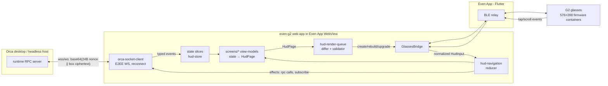

# Orca for Even Realities G2 — Design Spec

Date: 2026-09-05
Status: Ready for implementation
Author: design phase (fable)

An Even Realities G2 smart-glasses companion for Orca: a glanceable HUD that shows what your
agents are doing across hosts and worktrees, pushes "agent needs input" to your eyes, and lets
you answer permission asks with a ring click — without touching the phone or desktop.

Platform facts below were verified against `@evenrealities/even_hub_sdk` **0.0.14** (the actual
`dist/index.d.ts`) and the de-facto G2 platform docs (nickustinov/even-g2-notes, Feb 2026).
Orca wire facts were verified against `mobile/src/transport/` and `src/shared/` in this repo.

---

## 1. Summary, goals, non-goals

### Goals (v1)

1. **Pair** with an Orca desktop using the existing `orca://pair?code=` offer (pasted into the
   phone-side WebView page), speaking the existing E2EE WebSocket protocol unchanged.
2. **Agent status dashboard** (the killer feature): per-worktree agent state
   (working / needs-input / done / idle), worktree name, elapsed since last output — rendered as
   a glanceable HUD page that updates in place without flicker.
3. **Notifications on the HUD**: agent-needs-input / permission asks / task-done events pushed to
   the glasses, with **quick actions** — answer a numbered prompt option via ring scroll+click.
4. **Host & worktree lists** — ring-scrollable, click to drill in.
5. **Terminal tail** — last lines of a worktree's terminal as paginated plain text.
6. **Fully testable without hardware and without a live desktop**: an in-browser canvas simulator
   (mock bridge) plus an in-memory mock Orca server that speaks the real E2EE handshake.

### Non-goals (v1) — cut deliberately

| Cut | Why |
|---|---|
| Full terminal input / interactive xterm | 576×288 proportional-font monochrome page with click+scroll input cannot host an editor loop; quick-action digits cover the high-value case. Transport keeps `terminal.send` generic so this can grow later. |
| PR diff review, file browsing | Diffs need color/alignment/width the display doesn't have. Stays on mobile/desktop. |
| Browser mirroring / screencast | 4-bit 576×288 + ~104 ms per image call ≈ ≤9 fps grayscale thumbnails; useless and battery-hostile. |
| Relay transport (`mobile-relay-*`) | The relay stack is ~40 modules (credential rotation, cell failover, invite director). v1 dials the offer's direct endpoints (LAN/Tailscale). The socket client keeps the same handshake so relay can be added behind the same interface later. |
| Image containers | v1 renders text/list only. This sidesteps the SDK 0.0.12+ `compressMode: 2` image regression and the exit-dialogue image-channel wedge entirely (both are image-path-only defects). |
| Audio/mic, location, accounts, git operations, task creation, structured agent-session transcripts | Not glanceable, or requires capabilities (`agent-session.structured.v1`) whose rendering surface we don't have. |
| React / any UI framework | The HUD is not a DOM. The phone-side page is one settings/pairing form. Plain TS + DOM. |

### Wire-compatibility posture (per `docs/reference/remote-wire-compatibility.md`)

This client makes **zero wire changes**. It only calls existing RPCs
(`status.get`, `worktree.ps`, `terminal.list`, `terminal.send`, `terminal.subscribe`,
`notifications.subscribe`, `runtime.clientCapabilities.update`), advertises an **empty**
client-capability list (so hosts never show it structured sessions it can't render), and checks
`status.get`'s `protocolVersion` / `minCompatibleMobileVersion` via the canonical
`src/shared/protocol-compat.ts` evaluator. Old hosts and new hosts both work; nothing a host
publishes changes.

---

## 2. Package layout

A **standalone project at repo root**, mirroring exactly how `mobile/` is isolated: the root
`pnpm-workspace.yaml` has `packages: []`, so `even-g2/` carries its own `package.json`,
`pnpm-lock.yaml`, and its own `pnpm-workspace.yaml` with `packages: []` (same trick `mobile/`
uses to stay out of the root graph and avoid `ERR_PNPM_UNUSED_PATCH`).

```
even-g2/
├── package.json              # own deps + lockfile; NOT in root pnpm graph
├── pnpm-workspace.yaml       # packages: [] — keep self-contained
├── pnpm-lock.yaml
├── tsconfig.json             # includes ../src/shared via path mapping (see below)
├── vite.config.ts            # server.fs.allow: ['..'] so ../src/shared resolves in dev
├── vitest.config.ts
├── app.json                  # EvenHub manifest (packaging, §11)
├── index.html                # loads src/main.ts; phone-side settings/pairing DOM
├── sim.html                  # dev-only: canvas simulator + mock server playground
└── src/
    ├── main.ts                            # bootstrap: bridge detect → connect → first render
    ├── glasses/
    │   ├── glasses-bridge.ts              # GlassesBridge interface + page/event types (contract, Unit 0)
    │   ├── even-hub-bridge.ts             # real impl over @evenrealities/even_hub_sdk
    │   ├── glasses-event-normalization.ts # CLICK 0→undefined fix, sys-event dedupe, scroll throttle
    │   └── glasses-storage-cache.ts       # in-memory Map over bridge set/getLocalStorage
    ├── hud/
    │   ├── hud-page-spec.ts               # HudPage / HudTextRegion / HudListRegion types (contract, Unit 0)
    │   ├── hud-page-validator.ts          # ≤12 containers, 1× isEventCapture, char limits…
    │   ├── hud-page-differ.ts             # upgrade-vs-rebuild decision
    │   ├── hud-render-queue.ts            # serialized, latest-wins render loop
    │   ├── hud-text-pagination.ts         # ~400-char page splitter at line boundaries
    │   └── hud-glyphs.ts                  # status glyphs, progress bars, fullwidth conversion
    ├── transport/
    │   ├── glasses-e2ee.ts                # tweetnacl box, atob/btoa framing (browser flavor)
    │   ├── orca-rpc-wire.ts               # RpcRequest/RpcResponse/ConnectionState types
    │   ├── orca-socket-client.ts          # WS + handshake + requests + streaming subs + reconnect
    │   ├── pairing-code-decode.ts         # orca:// URL / base64url → PairingOffer (shared schema)
    │   ├── host-profile-store.ts          # persisted host profiles via GlassesBridge storage
    │   └── terminal-tail-decoder.ts       # binary frames → plain-text lines (ANSI stripped)
    ├── state/
    │   ├── hud-store.ts                   # tiny observable store (contract, Unit 0)
    │   ├── connection-status-state.ts
    │   ├── worktree-dashboard-state.ts    # worktree.ps rows + poll scheduling
    │   ├── notification-inbox-state.ts
    │   └── terminal-tail-state.ts
    ├── navigation/
    │   ├── hud-navigation.ts              # pure reducer: (NavState, HudInput) → NavState + effects
    │   └── hud-input-router.ts            # bridge events → HudInput, root double-tap exit rule
    ├── screens/
    │   ├── screen-view-model.ts           # ScreenId union + renderScreen dispatch (contract, Unit 0)
    │   ├── host-list-screen.ts
    │   ├── worktree-list-screen.ts
    │   ├── dashboard-screen.ts
    │   ├── ask-screen.ts
    │   ├── terminal-tail-screen.ts
    │   └── pairing-screen.ts              # HUD-side "pair on phone" instruction page
    ├── phone-page/
    │   └── phone-settings-page.ts         # DOM: paste pairing code, host list, connection log
    └── sim/
        ├── mock-glasses-bridge.ts         # GlassesBridge impl driving a 576×288 canvas
        ├── glasses-canvas-preview.ts      # canvas painter (containers → pixels, green-on-black)
        ├── memory-socket-pair.ts          # in-memory WebSocket-shaped pair (client ⇄ server)
        ├── mock-orca-server.ts            # real E2EE handshake + fixture RPC handlers
        └── mock-orca-fixtures.ts          # hosts/worktrees/notifications/terminal fixtures
```

Tests are colocated `*.test.ts` next to each module (repo convention). No file may be named
`utils`/`helpers`/`common`.

### Dependencies

```jsonc
// even-g2/package.json (essentials)
{
  "dependencies": {
    "@evenrealities/even_hub_sdk": "0.0.14",   // EXACT pin — see §12 risks
    "tweetnacl": "^1.0.3",
    "zod": "^4.5.4"                            // must satisfy src/shared's zod imports
  },
  "devDependencies": {
    "typescript": "^5.9", "vite": "^7", "vitest": "^3",
    "@evenrealities/evenhub-cli": "latest",    // qr / pack
    "happy-dom": "^15"                         // DOM for phone-page tests
  },
  "scripts": {
    "dev": "vite --host 0.0.0.0 --port 5173",
    "sim": "vite --host 0.0.0.0 --port 5173 --open /sim.html",
    "qr": "evenhub qr --http --port 5173",
    "build": "vite build",
    "pack": "vite build && evenhub pack app.json dist -o orca-g2.ehpk",
    "test": "vitest run",
    "tc": "tsc --noEmit"
  }
}
```

### Importing `src/shared/*` wire types

Same mechanism as `mobile/` (which imports e.g. `../../../src/shared/mobile-relay-pairing-offer`),
but simpler because Vite (unlike Metro) resolves outside the project root:

- **tsconfig paths**: `"paths": { "@orca-shared/*": ["../src/shared/*"] }` with
  `"baseUrl": "."`; `include` covers `src` and `../src/shared`.
- **vite.config.ts**: `resolve.alias: { '@orca-shared': path.resolve(__dirname, '../src/shared') }`
  and `server.fs.allow: [path.resolve(__dirname, '..')]` so the dev server may serve files above
  the project root.
- **Import only browser-pure modules** (pure TS + zod + tweetnacl). Approved imports:
  - `@orca-shared/mobile-relay-pairing-offer` — `PairingOfferSchema`, `PairingOffer`
  - `@orca-shared/protocol-compat` — `evaluateCompat`, `CompatVerdict` (canonical evaluator)
  - `@orca-shared/terminal-stream-protocol` — `TerminalStreamOpcode`, `decodeTerminalStreamFrame`
  - `@orca-shared/agent-status-types` — `AgentStatusState` (type-only)
  - **Do NOT import** `@orca-shared/e2ee-crypto` or `@orca-shared/pairing` — they use Node
    `Buffer`. The browser-safe equivalents live in `even-g2/src/transport/` (precedent:
    `mobile/src/transport/e2ee.ts` and `pairing.ts` exist for the same reason on Hermes; each
    carries a "keep in sync with src/shared" header comment, and ours will too).
- A guard test (`transport/shared-import-surface.test.ts`) asserts the built bundle contains no
  `Buffer` reference, so an accidental Node-only shared import fails CI.

---

## 3. Architecture & data flow

Official G2 model: the app is a **web app on our dev server / packaged `.ehpk`**; the phone's
Even App loads it in a WebView and relays containers/input over BLE. No code runs on the glasses.



In the simulator (`sim.html`): `MockGlassesBridge` replaces `BR` (canvas + keyboard), and
`MockOrcaServer` over `memory-socket-pair` replaces the desktop. **Everything between them —
transport, state, nav, view-models, renderer — is the production code path.**

### G2 platform constraints the design is built around (verified)

- Canvas 576×288, origin top-left, 4-bit greyscale (16 green levels), black = pixels off.
- Firmware **containers** only: absolute pixel rects, no DOM/CSS/flex. Max **12 per page**
  (≤4 image + ≤8 text/list); **exactly one** container has `isEventCapture: 1`;
  `containerTotalNum` must match; `containerName` ≤16 chars unique; `containerID` unique.
- Text: single proportional LVGL font, no size/weight/align. `\n` works; missing glyphs are
  silently skipped. ~400–500 chars fill a full-screen container. Content limits: 1000 chars on
  create/rebuild, 2000 on `textContainerUpgrade`. Fullwidth CJK (`　`, `Ａ`–`ｚ`, `０`–`９`)
  is the only monospace workaround for aligned columns.
- List container: native firmware scrolling + selection highlight, ≤20 items, ≤64 chars each,
  plain single-line text, no per-item styling, items not updatable in place (rebuild only).
- Lifecycle: `createStartUpPageContainer` is **one-shot per session** (retry after failure blocks
  ~2.1 s and is rejected — latch "spent", not "succeeded"); `rebuildPageContainer` ~165 ms flat,
  full redraw + flicker + selection reset; `textContainerUpgrade` ~83 ms, flicker-free, so
  break-even vs rebuild is 2 containers.
- Input events (`OsEventTypeList`): CLICK=0, SCROLL_TOP=1, SCROLL_BOTTOM=2 (boundary events, not
  raw gestures), DOUBLE_CLICK=3, FOREGROUND_ENTER=4, FOREGROUND_EXIT=5, ABNORMAL_EXIT=6,
  SYSTEM_EXIT=7 (0.0.14 also defines LONG_PRESS=9/10 — unused v1). Quirks handled in §7:
  CLICK arrives as `undefined` after SDK JSON normalization; simulator sends `sysEvent` where
  hardware sends `textEvent`/`listEvent`; duplicate sys events ~50–100 ms apart; scroll needs a
  ~300 ms cooldown.
- Submission rule: **root page double-tap must call `shutDownPageContainer(1)`** (exit dialogue).
  The exit dialogue inverts foreground events (ENTER=dialogue shown → rebuild cue; EXIT=user
  cancelled; SYSTEM_EXIT=really exiting) — handled by an armed flag in `hud-input-router.ts`.
- Storage: **browser `localStorage` is wiped** in the `.ehpk` WebView. Only
  `bridge.setLocalStorage/getLocalStorage` (async, phone-side) persists. No delete — write `''`.
- Device: `getDeviceInfo()` → model/sn + status (`batteryLevel`, `isWearing`, `isCharging`,
  `isInCase`, `connectType`); `onDeviceStatusChanged(cb)` returns unsubscribe.

---

## 4. Bridge abstraction

`even-g2/src/glasses/glasses-bridge.ts` — the **contract module** everything renders through.
Method set is derived from the exact `EvenAppBridge` d.ts (0.0.14), narrowed to what v1 uses,
with SDK model classes kept out of the interface so the mock and tests never import the SDK.

```ts
// glasses-bridge.ts (types are the real deliverable; no logic)
export type HudTextContainerSpec = {
  kind: 'text'
  id: number                    // containerID
  name: string                  // containerName, ≤16 chars
  x: number; y: number; width: number; height: number
  content: string               // ≤1000 chars at build time
  isEventCapture: 0 | 1
  borderWidth?: number          // 0–5
  borderColor?: number          // 0–16
  borderRadius?: number         // 0–10
  paddingLength?: number        // 0–32
}

export type HudListContainerSpec = {
  kind: 'list'
  id: number; name: string
  x: number; y: number; width: number; height: number
  items: string[]               // 1–20 items, each ≤64 chars
  isEventCapture: 0 | 1
  showSelectionBorder: boolean  // isItemSelectBorderEn
  borderWidth?: number; borderColor?: number; borderRadius?: number; paddingLength?: number
}

export type HudContainerSpec = HudTextContainerSpec | HudListContainerSpec
export type HudPageBuild = { containers: HudContainerSpec[] }

export type HudTextUpgrade = { id: number; name: string; content: string /* ≤2000 */ }

export type GlassesDeviceSnapshot = {
  connected: boolean
  batteryLevel?: number
  isWearing?: boolean
  isCharging?: boolean
  isInCase?: boolean
}

// Raw-ish event, minimally unified across listEvent/textEvent/sysEvent.
// Normalization (dedupe, throttle, CLICK-undefined fix) happens in
// glasses-event-normalization.ts, NOT in bridge impls.
export type GlassesRawEvent = {
  source: 'list' | 'text' | 'sys'
  eventType: number | undefined          // OsEventTypeList value; undefined ≡ CLICK (SDK quirk)
  containerId?: number
  listItemIndex?: number                 // may be missing for index 0 (SDK quirk)
  listItemName?: string
}

export type StartupBuildResult = 'success' | 'invalid' | 'oversize' | 'outOfMemory'

export interface GlassesBridge {
  createStartUpPage(page: HudPageBuild): Promise<StartupBuildResult>
  rebuildPage(page: HudPageBuild): Promise<boolean>
  upgradeText(update: HudTextUpgrade): Promise<boolean>
  shutDownPage(exitMode: 0 | 1): Promise<boolean>
  getDeviceSnapshot(): Promise<GlassesDeviceSnapshot | null>
  setStoredValue(key: string, value: string): Promise<boolean>   // '' deletes
  getStoredValue(key: string): Promise<string>                   // '' means absent
  onRawEvent(cb: (event: GlassesRawEvent) => void): () => void
  onDeviceStatusChanged(cb: (snapshot: GlassesDeviceSnapshot) => void): () => void
}
```

### `EvenHubBridge` (`even-hub-bridge.ts`)

Wraps the real SDK. Exact underlying calls (verified signatures):

```ts
import {
  waitForEvenAppBridge, CreateStartUpPageContainer, RebuildPageContainer,
  TextContainerProperty, ListContainerProperty, ListItemContainerProperty,
  TextContainerUpgrade, StartUpPageCreateResult, type EvenAppBridge, type EvenHubEvent
} from '@evenrealities/even_hub_sdk'

export async function connectEvenHubBridge(): Promise<GlassesBridge>  // awaits waitForEvenAppBridge()
```

- `createStartUpPage` → `bridge.createStartUpPageContainer(new CreateStartUpPageContainer({ containerTotalNum, textObject, listObject }))`,
  mapping `StartUpPageCreateResult` (0/1/2/3) to the string union.
- `rebuildPage` → `bridge.rebuildPageContainer(new RebuildPageContainer({...}))`.
- `upgradeText` → `bridge.textContainerUpgrade(new TextContainerUpgrade({ containerID, containerName, contentOffset: 0, contentLength: <previous content length>, content }))`.
  The bridge impl tracks the last written content length per container id to fill `contentLength`.
- `shutDownPage(n)` → `bridge.shutDownPageContainer(n)`.
- Storage → `bridge.setLocalStorage/getLocalStorage`.
- `onRawEvent` → `bridge.onEvenHubEvent((e: EvenHubEvent) => ...)` mapping
  `e.listEvent` → `{source:'list', eventType, listItemIndex: currentSelectItemIndex, listItemName: currentSelectItemName, containerId}`,
  `e.textEvent` → `{source:'text', ...}`, `e.sysEvent` → `{source:'sys', eventType}`.
  `audioEvent`/`menuItemClickEvent`/`jsonData` are ignored in v1.
- `getDeviceSnapshot` → `bridge.getDeviceInfo()` → flatten `DeviceInfo.status`
  (`batteryLevel`, `isWearing`, `isCharging`, `isInCase`, `status.isConnected()`).
- Bridge detection in `main.ts`: race `waitForEvenAppBridge()` against a 1500 ms timer; on
  timeout, if the page runs in a plain browser, fall back to `MockGlassesBridge` and show the
  simulator (`import('./sim/mock-glasses-bridge')` — dynamic so the prod bundle stays lean but
  a plain-browser open still works for development).

### `MockGlassesBridge` (`sim/mock-glasses-bridge.ts`)

Full `GlassesBridge` implementing firmware semantics in-browser:

- Holds current page state; `glasses-canvas-preview.ts` paints a 576×288 `<canvas>`
  (scaled ×2 CSS): black background, green text (`#3ba03b` at 4 brightness steps), borders,
  list rows with selection highlight; proportional `sans-serif` at ~20 px approximates the LVGL
  font (documented as approximate — pagination limits are enforced by character count, not pixels).
- Enforces the same invariants as hardware: rejects pages failing `hud-page-validator` with
  `'invalid'`; second `createStartUpPage` call rejects with `'invalid'` after an (accelerable)
  delay, mirroring the real one-shot trap so tests can cover the startup latch.
- Input: keyboard (`Space`=click, `ArrowUp/Down`=scroll boundary events, `d`=double-click) and
  on-canvas buttons. Emits `sysEvent`-sourced events by default (matching the real simulator's
  behavior) with a toggle to emit `text`/`list` source (matching hardware) — both paths tested.
- List semantics: scroll moves an internal selection index and repaints **without** emitting
  events until a boundary is hit (mirrors native firmware scrolling); click emits
  `listItemIndex`/`listItemName`, with a quirk toggle that omits `listItemIndex` for index 0.
- `shutDownPage(1)` shows an in-canvas confirm dialog and replays the real event polarity:
  emits FOREGROUND_ENTER on open, FOREGROUND_EXIT on "No", SYSTEM_EXIT on "Yes".
- Storage: in-memory `Map` behind the same async API (optionally mirrored to
  `sessionStorage` for dev convenience — never `localStorage`, to avoid habits that break on
  device).
- Deterministic hooks for tests: `mock.flushRenders()`, `mock.pageSnapshot()` (returns the
  current `HudPageBuild`), `mock.emitRaw(event)`.

---

## 5. HUD renderer / view-model

### Page anatomy

Every screen renders into one of two fixed layouts, chosen per screen. Fixed layouts are what
make `textContainerUpgrade` diffing trivial and keep every page inside the container budget.

**Layout T (text rows)** — used by dashboard, ask, terminal tail, pairing:

```
┌────────────────────────────────────────────┐ 576×288
│ header (id 1, 0,0 576×36)                  │  title · page x/y · battery/conn glyph
│ body   (id 2, 0,36 576×216, isEventCapture)│  content rows (fullwidth-aligned)
│ footer (id 3, 0,252 576×36)                │  contextual hints: "click=…  2tap=back"
└────────────────────────────────────────────┘
```

3 containers, all text. Body holds `isEventCapture: 1` so scroll events arrive. Content is
pre-paginated (§ pagination) — body text never overflows, so firmware internal scrolling never
engages and SCROLL_TOP/BOTTOM arrive immediately as page-turn commands.

**Layout L (native list)** — used by host list, worktree list:

```
│ header (text, id 1, 0,0 576×36)            │
│ list   (id 2, 0,36 576×216, isEventCapture)│  ≤7 items shown per page (≤20 hard cap)
│ footer (text, id 3, 0,252 576×36)          │
```

Native list scrolling/selection is free (no rebuild per scroll). Click reports the selected
index. Item labels are truncated to 64 chars with `…`.

### `hud-page-spec.ts` (contract)

```ts
export type HudScreenPage =
  | { layout: 'text'; header: string; body: string; footer: string }
  | { layout: 'list'; header: string; items: string[]; footer: string }

// Compile a screen page into validated container specs (ids/geometry fixed as above).
export function buildHudPage(page: HudScreenPage): HudPageBuild
```

`buildHudPage` truncates defensively (header/footer ≤200 chars, body ≤1000, items ≤20×64) and is
the single place geometry lives.

### Invariant enforcement — `hud-page-validator.ts`

```ts
export type HudPageViolation =
  | { code: 'too-many-containers'; count: number }              // >8 text/list or >12 total
  | { code: 'event-capture-count'; count: number }               // ≠ 1
  | { code: 'duplicate-container-id' | 'duplicate-container-name'; value: string }
  | { code: 'container-name-too-long'; name: string }            // >16
  | { code: 'text-too-long'; id: number; length: number }        // >1000
  | { code: 'list-item-limit'; id: number; count: number }       // >20 items or item >64 chars
  | { code: 'geometry-out-of-bounds'; id: number }
export function validateHudPage(page: HudPageBuild): HudPageViolation[]
```

Called by `hud-render-queue` before every bridge call; a violation throws in dev/test and is
logged + dropped in production (never sent to firmware). This is our client-side twin of the
SDK's `validateEvenHubPageContainer`.

### Upgrade vs rebuild — `hud-page-differ.ts`

Measured costs: rebuild ≈165 ms flat; upgrade ≈83 ms per container → break-even at 2.

```ts
export type HudRenderPlan =
  | { kind: 'create'; page: HudPageBuild }
  | { kind: 'rebuild'; page: HudPageBuild }
  | { kind: 'upgrade'; updates: HudTextUpgrade[] }   // length 1..2
  | { kind: 'noop' }
export function planHudRender(previous: HudPageBuild | null, next: HudPageBuild,
                              startupSpent: boolean): HudRenderPlan
```

Rules:
1. No previous page or `!startupSpent` → `create`.
2. Same container skeleton (same ids/kinds/geometry/isEventCapture) and only text `content`
   changed in **≤2** text containers → `upgrade` (flicker-free dashboard ticks).
3. Anything else (layout switch, list items changed, >2 text changes) → `rebuild`.

### Render loop — `hud-render-queue.ts`

```ts
export class HudRenderQueue {
  constructor(bridge: GlassesBridge)
  submit(page: HudPageBuild): void      // latest-wins; coalesces while a call is in flight
  readonly startupSpent: boolean
}
```

- **Serialized**: one bridge call in flight, ever (SDK forbids concurrency; every call has
  ~83–165 ms fixed cost). While busy, `submit` overwrites a single `pending` slot — intermediate
  frames are dropped, never queued.
- **Startup latch**: `createStartUpPage` is attempted once; `startupSpent` latches **whether or
  not it succeeded** (retrying a failed startup blocks ~2.1 s per attempt and is rejected —
  verified platform trap). After a failed create, falls through to `rebuild`.
- Checks return values: a `false` rebuild or non-`success` create schedules one retry via
  `rebuild` after 500 ms, then surfaces a connection-style error row on the next page.

### Pagination — `hud-text-pagination.ts`

```ts
export function paginateHudBody(lines: string[], opts?: { maxCharsPerPage?: number /* 400 */,
  maxLinesPerPage?: number /* 9 */ }): string[]   // page bodies, split at line boundaries
```

Splits at line boundaries only (a HUD never shows half a terminal line), ~400 chars / 9 lines per
page (216 px body ÷ ~24 px line height). No trailing `\n` on the last line of a page (avoids the
phantom scrollbar). Screens display `page i/n` in the header and map SCROLL_BOTTOM/TOP → next/prev
page via a rebuild.

### Glyph vocabulary — `hud-glyphs.ts`

Only glyphs verified present in the firmware font:

| Meaning | Glyph |
|---|---|
| agent working | `▶` |
| needs input / permission | `▲` (+ header pulse `!`) |
| done | `●` |
| idle / inactive | `○` |
| disconnected host | `◇` |
| selection cursor (text layouts) | `>` prefix |
| progress/elapsed bar | `━` filled / `─` empty |

`toFullwidthColumns(rows: string[][], widths: number[]): string[]` aligns tabular dashboard rows
using `　` (ideographic space) padding — the proportional font makes ASCII spaces unusable
for columns. Status glyph + name stay ASCII (narrow); only the padding is fullwidth.

---

## 6. Transport adapter

Browser reimplementation of the mobile direct transport — same wire bytes, ~4 small modules
instead of mobile's 60 (no relay, no Expo, no React context).

### Wire protocol (verbatim from `mobile/src/transport/`, unchanged)

1. WebSocket to `endpoint` (e.g. `ws://192.168.x.x:6768` from the pairing offer).
2. Client → plaintext JSON `{"type":"e2ee_hello","publicKeyB64":<client Curve25519 pk>}`.
3. Server → plaintext `{"type":"e2ee_ready"}` (or `e2ee_error`).
4. Both derive `sharedKey = nacl.box.before(peerPk, ownSk)`; every later text frame is
   `base64(24-byte nonce ∥ XSalsa20-Poly1305 ciphertext)`.
5. Client → encrypted `{"type":"e2ee_auth","deviceToken":<from offer>}`.
6. Server → encrypted `{"type":"e2ee_authenticated"}` (or `e2ee_error` code `unauthorized`).
7. Requests: `{id, deviceToken, method, params?}`. Responses:
   `{id, ok:true, result, streaming?:true, _meta:{runtimeId}}` |
   `{id, ok:false, error:{code,message,data?}, _meta}`. Streaming subscriptions keep emitting
   responses under the subscribe request's `id`.
8. Binary frames (terminal streams) are E2EE byte bundles: `[24B nonce][ciphertext]` raw, not
   base64 — decrypt then parse with `decodeTerminalStreamFrame` (16-byte header, kind `0x74`).
9. After auth, advertise capabilities:
   `runtime.clientCapabilities.update` `{clientCapabilities: []}` — result discarded; only a
   frame that never reached the wire is fatal (mirrors `settleMobileRuntimeCapabilities`).
10. Compat gate: `status.get` → `{protocolVersion?, minCompatibleMobileVersion?, appVersion?}`
    → `evaluateCompat` from `@orca-shared/protocol-compat`. `blocked` renders a hard-block screen.

### `glasses-e2ee.ts`

Browser flavor of `mobile/src/transport/e2ee.ts` (same header comment convention: "mirrors
src/shared/e2ee-crypto.ts; keep semantics in sync"). tweetnacl works natively in browsers
(`crypto.getRandomValues` exists — no PRNG shim, no `Buffer`).

```ts
export function generateKeyPair(): { publicKey: Uint8Array; secretKey: Uint8Array }
export function deriveSharedKey(ourSecretKey: Uint8Array, peerPublicKey: Uint8Array): Uint8Array
export function publicKeyFromBase64(b64: string): Uint8Array   // throws unless 32 bytes
export function publicKeyToBase64(key: Uint8Array): string
export function encryptText(plaintext: string, sharedKey: Uint8Array): string        // → base64
export function decryptText(encrypted: string, sharedKey: Uint8Array): string | null
export function decryptBytes(bundle: Uint8Array, sharedKey: Uint8Array): Uint8Array | null
```

### `orca-rpc-wire.ts`

Local copies of the pure wire types (`RpcRequest`, `RpcSuccess`, `RpcFailure`, `RpcResponse`,
`ConnectionState = 'connecting'|'handshaking'|'connected'|'reconnecting'|'auth-failed'|'disconnected'`)
— shapes identical to `mobile/src/transport/types.ts` (which is not importable: it pulls
mobile-relay modules). Also defines the narrow client port state slices depend on, so Unit 4
never imports the concrete client:

```ts
export type RpcPort = {
  sendRequest(method: string, params?: unknown, timeoutMs?: number): Promise<RpcResponse>
  subscribe(method: string, params: unknown, onData: (result: unknown) => void,
            onBinary?: (payload: Uint8Array) => void): () => void
}
// OrcaSocketClient implements RpcPort; MockOrcaServer tests drive slices through a stub RpcPort.
```

### `orca-socket-client.ts`

```ts
export type OrcaSocketClientOptions = {
  endpoint: string
  deviceToken: string
  serverPublicKeyB64: string
  socketFactory?: (url: string) => WebSocket          // injection point for memory-socket-pair
  onState?: (state: ConnectionState) => void
  onLog?: (line: string) => void                      // phone-page connection log
}

export class OrcaSocketClient {
  constructor(options: OrcaSocketClientOptions)
  sendRequest(method: string, params?: unknown, timeoutMs?: number /* 15000 */): Promise<RpcResponse>
  subscribe(method: string, params: unknown, onData: (result: unknown) => void,
            onBinary?: (payload: Uint8Array) => void): () => void
  getState(): ConnectionState
  close(): void
}
```

Behavior (deliberately smaller than `DirectRpcClient`, same semantics where it matters):

- Auto-connects on construction; reconnects with backoff `1s, 2s, 4s, 8s, 15s (cap)`;
  `auth-failed` (server says `unauthorized`) latches — no retry storm against a revoked pairing.
- Active subscriptions are re-sent after every re-authentication (mirrors
  `streams.replayAfterAuthentication`); in-flight `sendRequest`s reject on disconnect.
- Streaming teardown mirrors mobile's `buildTerminalUnsubscribeParams`: unsubscribing a
  `terminal.subscribe` sends `terminal.unsubscribe` `{subscriptionId: <terminal>}`.
- FOREGROUND_ENTER (glasses event, wired from nav) triggers an immediate `status.get` probe;
  FOREGROUND_EXIT pauses dashboard polling (the WebView may be throttled anyway).
- Request ids: `g2-<counter>-<Date.now()>`.
- One host connected at a time in v1 (the HUD shows one host's data; multi-host is a list switch,
  closing the previous client). Keeps the client set trivially small.

### Pairing — `pairing-code-decode.ts` + `host-profile-store.ts`

```ts
// pairing-code-decode.ts — browser flavor of mobile/src/transport/pairing.ts,
// validated by the canonical PairingOfferSchema from @orca-shared.
export function parsePairingCode(input: string): PairingOffer | null
// accepts `orca://pair?code=…`, bare base64url, restores stripped padding, atob-decodes.
```

```ts
// host-profile-store.ts — persisted via GlassesBridge storage (NOT localStorage).
export type GlassesHostProfile = {
  id: string; name: string; endpoint: string
  deviceToken: string; publicKeyB64: string; lastConnected: number
}
export class HostProfileStore {
  constructor(bridge: GlassesBridge)
  load(): Promise<GlassesHostProfile[]>      // key 'orca.hostProfiles.v1', zod-validated JSON
  upsert(profile: GlassesHostProfile): Promise<void>
  remove(id: string): Promise<void>          // writes '' when list becomes empty
}
```

Security note (accepted, documented): the phone-side Even App storage is the only persistence,
so the device token lives there — same trust level as the Even App itself. The E2EE key pair is
ephemeral per connection (as in mobile); only the desktop's public key is pinned via the offer.

Pairing UX: typing on glasses is impossible, so pairing happens on the **phone page**
(`phone-settings-page.ts`): paste the `orca://pair?code=` string (or code) from Orca desktop →
parse → probe-connect → save profile. The HUD `pairing-screen` just says
"Open Orca on your phone's Even app page to pair" until a profile exists.

### `terminal-tail-decoder.ts`

Binary frame payloads → displayable lines:

```ts
export class TerminalTailDecoder {
  constructor(opts?: { maxLines?: number /* 120 */; maxCols?: number /* 60 */ })
  pushFrame(frame: TerminalStreamFrame): void   // Output/SnapshotStart/Chunk/End/Resized/Error
  lines(): string[]                             // ANSI-stripped, wrapped, last maxLines
}
```

Strips CSI/OSC/control sequences with a bounded regex, expands tabs, hard-wraps at `maxCols`.
Snapshot frames reset the buffer (SnapshotStart) then append (mirrors opcode semantics in
`@orca-shared/terminal-stream-protocol`). Fidelity target is "readable tail", not xterm.

### `MockOrcaServer` (`sim/mock-orca-server.ts` + `sim/memory-socket-pair.ts`)

- `memory-socket-pair.ts`: `createMemorySocketPair(): { clientSocket: WebSocket-shaped, serverEndpoint }`
  — an object implementing the WebSocket surface `OrcaSocketClient` touches
  (`send`, `close`, `onopen/onmessage/onclose/onerror`, `binaryType`), delivering frames via
  microtask. Injected through `socketFactory`. Works identically in browser and vitest/node.
- `MockOrcaServer`: performs the **real** E2EE handshake (tweetnacl, honest keypair — printed
  public key feeds the fixture pairing offer) and serves fixture handlers for:
  `status.get` (protocolVersion 3, minCompatibleMobileVersion 2), `worktree.ps`,
  `terminal.list`, `terminal.send` (echoes into the fixture terminal), `terminal.subscribe`
  (streams encoded frames via `encodeTerminalStreamFrame`), `notifications.subscribe`
  (`{type:'ready',subscriptionId}` then scripted pushes), `runtime.clientCapabilities.update`.
  Scenario controls: `pushNotification(event)`, `setWorktreeStatus(id, status)`,
  `dropConnection()`, `rejectAuth()`, `delayMs`.
- `mobile/scripts/mock-server.ts` is the semantic reference (not imported — it is Node/`ws`
  specific); `MockOrcaServer` keeps its message-flow contract: hello→ready→auth→authenticated,
  unknown method → `{ok:false, error:{code:'method_not_found'}}`.

---

## 7. Input & navigation

### Event normalization — `glasses-event-normalization.ts`

```ts
export type HudInput =
  | { kind: 'click' } | { kind: 'doubleClick' }
  | { kind: 'scrollPrev' } | { kind: 'scrollNext' }          // SCROLL_TOP / SCROLL_BOTTOM
  | { kind: 'listSelect'; index: number; label?: string }     // click on a list container
  | { kind: 'foregroundEnter' } | { kind: 'foregroundExit' }
  | { kind: 'systemExit' } | { kind: 'abnormalExit' }

export function createGlassesEventNormalizer(opts?: {
  now?: () => number; scrollCooldownMs?: number /* 300 */; sysDedupeWindowMs?: number /* 600 */
}): (raw: GlassesRawEvent) => HudInput | null
```

Handles every verified platform quirk in one tested place:
1. **CLICK = 0 arrives as `undefined`** — `eventType === 0 || eventType === undefined` → click.
2. **Simulator sends `sysEvent` where hardware sends `textEvent`/`listEvent`** — source is
   ignored for type mapping; only `listItemIndex` presence distinguishes `listSelect`.
3. **Missing `listItemIndex` for item 0** — a list-source click without an index maps to
   `listSelect` with the *navigation state's* tracked index (normalizer emits
   `{kind:'listSelect', index: -1}`; the nav reducer substitutes its own selection).
4. **Duplicate sys events** — identical event types within 600 ms are dropped.
5. **Scroll storm** — scrollPrev/scrollNext apply a 300 ms cooldown.

### Navigation state machine — `hud-navigation.ts`

Pure reducer + effect descriptors (fully unit-testable, no bridge/transport imports):

```ts
export type ScreenId = 'pairing' | 'hostList' | 'dashboard' | 'worktreeList'
                     | 'ask' | 'terminalTail'

export type NavState = {
  stack: ScreenFrame[]                 // top = visible; bottom = root
  exitDialogArmed: boolean             // shutDownPage(1) in flight — invert foreground events
}
export type ScreenFrame =
  | { screen: 'pairing' }
  | { screen: 'hostList'; selectedIndex: number }
  | { screen: 'dashboard'; hostId: string; page: number }
  | { screen: 'worktreeList'; hostId: string; selectedIndex: number; page: number }
  | { screen: 'ask'; hostId: string; notificationId: string; selectedOption: number }
  | { screen: 'terminalTail'; hostId: string; worktreeId: string; terminalId: string; page: number }

export type NavEffect =
  | { kind: 'requestShutdownDialog' }                       // → bridge.shutDownPage(1)
  | { kind: 'connectHost'; hostId: string }
  | { kind: 'openTerminalTail'; worktreeId: string }        // resolve terminal + subscribe
  | { kind: 'closeTerminalTail'; terminalId: string }
  | { kind: 'sendAskAnswer'; hostId: string; worktreeId: string; option: AskQuickAction }
  | { kind: 'refreshDashboard' } | { kind: 'pausePolling' } | { kind: 'resumePolling' }

export function reduceHudInput(state: NavState, input: HudInput,
                               ctx: NavContext): { state: NavState; effects: NavEffect[] }
// NavContext: read-only lookups the reducer needs (list lengths, page counts, pending ask) —
// supplied by hud-store selectors, keeps the reducer pure.
```

Rules:
- **Root** is `hostList` (or `dashboard` once exactly one host exists — the common case jumps
  straight to the killer feature; `hostList` is reachable via its footer entry).
- `doubleClick` pops one frame. **On the root frame it emits `requestShutdownDialog`**
  (submission requirement: root double-tap must invoke `shutDownPageContainer(1)`; v1 has no
  image containers, so the known post-dialogue image-channel wedge cannot affect us and the
  direct call is safe).
- Exit-dialogue polarity (verified trap): when `exitDialogArmed`,
  `foregroundEnter` = dialogue visible, host cleared the page → effect `refreshDashboard` +
  re-render (rebuild) cue; `foregroundExit` = user answered **No** → disarm, resume polling
  (NOT backgrounded); `systemExit` = really exiting → close sockets, unsubscribe. Outside the
  armed window the events have their normal meaning (pause/resume polling).
- `scrollPrev/scrollNext`: on `list` layouts → nothing (firmware scrolls natively); on `text`
  layouts → page turn (dashboard pages, terminal tail pages) or option cursor (ask screen).
- `click`: on `ask` → `sendAskAnswer` with the highlighted option; on `dashboard` → drill into
  the highlighted worktree's `terminalTail` (dashboard maintains a `>` cursor via scroll when it
  has ≤1 page; with >1 page scroll means page-turn and click opens `worktreeList` instead —
  footer always states the current click meaning).
- `listSelect`: `hostList` → `connectHost` + push `dashboard`; `worktreeList` → push
  `terminalTail`.
- `abnormalExit`: tear down subscriptions, keep state (reconnect on next foregroundEnter).

### Ask quick actions — the highest-value interaction

```ts
export type AskQuickAction =
  | { kind: 'option'; digit: 1 | 2 | 3 | 4 }   // send "<digit>\r"
  | { kind: 'enter' }                           // send "\r"      (accept default)
  | { kind: 'escape' }                          // send "\x1b"  (dismiss/deny)
```

Flow: a `NotificationEvent` (`{type:'notification', source, title, body, worktreeId?,
notificationId?}` — verified shape) whose worktree shows `status: 'permission'` opens the `ask`
screen: title + body (paginated) and an option strip
`> 1    2    3    Enter    Esc`, cursor moved by scroll, fired by click. The effect resolves the
worktree's live agent terminal (`terminal.list` filtered by `worktreeId`, newest agent terminal)
and sends the keys via `terminal.send` — the exact mechanism mobile's chat uses to answer
interactive prompts (body then Enter; we reuse the 500 ms body→Enter spacing from
`@orca-shared/native-chat-answer-stepping` constants for multi-key sequences). After sending:
optimistic "answered ✓" footer; the next `worktree.ps` poll confirms the status left
`permission`, else the footer shows "still waiting — check phone".

Uncertainty flag (see §12): the notification body's option list formatting varies by agent;
v1 sends raw digit/enter/escape keys and does not claim to parse options. This is deliberate —
it works for Claude Code / Codex numbered permission prompts, and misfires are recoverable
(prompts re-render on invalid input).

---

## 8. Data / state model

`hud-store.ts` — minimal typed observable store (no framework):

```ts
export type HudStore = {
  getState(): HudState
  update(fn: (state: HudState) => HudState): void   // notifies subscribers on change
  subscribe(listener: (state: HudState) => void): () => void
}
export function createHudStore(initial: HudState): HudStore
```

```ts
export type HudState = {
  connection: ConnectionSlice
  hosts: GlassesHostProfile[]            // from HostProfileStore
  dashboard: DashboardSlice
  inbox: NotificationInboxSlice
  terminalTail: TerminalTailSlice
  device: GlassesDeviceSnapshot | null   // battery/wearing for the header
  nav: NavState
}
```

### Slices ← RPC mapping

| Slice | Source | Shape |
|---|---|---|
| `ConnectionSlice` | `OrcaSocketClient.onState` + compat verdict | `{ hostId: string \| null; state: ConnectionState; compat: CompatVerdict \| null; lastError?: string }` |
| `DashboardSlice` | `worktree.ps` `{limit}` → `result.worktrees` (verified fields: `worktreeId`, `repo`, `branch`, `displayName`, `liveTerminalCount`, `status?: 'working'\|'active'\|'permission'\|'done'\|'inactive'`, `lastOutputAt?`) | `{ rows: DashboardRow[]; fetchedAt: number; stale: boolean }` where `DashboardRow = { worktreeId; displayName; status; elapsedLabel }` |
| `NotificationInboxSlice` | `notifications.subscribe` stream (`ready` then `NotificationEvent`/`DismissNotificationEvent`) | ring buffer of last 20 `{ notificationId; title; body; worktreeId?; receivedAt; kind: 'ask'\|'done'\|'info' }`; `kind:'ask'` when the row's worktree status is `permission` |
| `TerminalTailSlice` | `terminal.subscribe` binary frames → `TerminalTailDecoder` | `{ terminalId: string \| null; lines: string[]; live: boolean }` |
| `device` | `bridge.onDeviceStatusChanged` | direct |

### Update cadence (`worktree-dashboard-state.ts` owns scheduling)

- `worktree.ps` polled every **5 s** while the dashboard/worktree list is the visible screen and
  the app is foregrounded; paused on `foregroundExit`/screen change; refreshed immediately on
  `foregroundEnter` and on any incoming notification (push-nudged poll — same pattern as
  mobile's home card).
- Renders flow: any slice change → `renderScreen(state)` → `HudRenderQueue.submit`. The differ
  turns a lone elapsed-time tick into a single `textContainerUpgrade` (~83 ms, flicker-free);
  the elapsed label is minute-granular so idle dashboards issue ≤1 upgrade/min.
- A notification with `kind:'ask'` while any screen is up: header line 1 swaps to
  `▲ <displayName> needs input — click` (one-container upgrade); click jumps to the ask screen.
  (v1 does not auto-push the full ask screen — a HUD must not steal the user's view mid-glance.)

### Screens (pure view-models, `screens/*.ts`)

```ts
export function renderScreen(state: HudState): HudScreenPage   // dispatch on state.nav top frame
```

| Screen | Layout | Content |
|---|---|---|
| `pairing-screen` | text | "Pair on phone" instructions + connection state |
| `host-list-screen` | list | `◆ name — ok / ◇ name — offline` per host; footer "click=open 2tap=exit" |
| `dashboard-screen` | text | one row per worktree: `▶ api-refactor   12m`, fullwidth-aligned columns; header `Orca · 3 running · 1 waiting · page 1/2`; paginated ≥8 rows |
| `worktree-list-screen` | list | worktrees with status glyph prefix |
| `ask-screen` | text | title, body pages, option strip with `>` cursor |
| `terminal-tail-screen` | text | last lines, paginated; header `term · <worktree> · 2/3`; footer "scroll=pages 2tap=back" |

---

## 9. Testing strategy (how we finish without hardware)

Vitest, colocated. The mock bridge and mock server make **every layer testable end-to-end in
node**; `sim.html` gives the human visual check.

### Unit tests

| File | Asserts |
|---|---|
| `hud/hud-page-validator.test.ts` | each violation code fires; valid pages pass; the 3-container standard layouts always pass |
| `hud/hud-page-differ.test.ts` | create-before-startup; ≤2 text changes → upgrade; 3 changes / list change / geometry change → rebuild; noop on identical |
| `hud/hud-render-queue.test.ts` | serialization (never 2 in-flight), latest-wins coalescing, startup latch **spent-on-failure** + rebuild fallthrough, failed-rebuild single retry |
| `hud/hud-text-pagination.test.ts` | line-boundary splits, 400-char/9-line caps, no trailing newline, 1-page passthrough |
| `hud/hud-glyphs.test.ts` | fullwidth column alignment (equal code-unit widths per row), truncation with `…` |
| `glasses/glasses-event-normalization.test.ts` | CLICK-undefined→click; sys dedupe window; scroll cooldown; listSelect index -1 substitution contract |
| `navigation/hud-navigation.test.ts` | stack push/pop; root double-tap → `requestShutdownDialog`; exit-dialogue polarity (armed ENTER→refresh, EXIT→cancel/resume, SYSTEM_EXIT→teardown); scroll semantics per layout; ask cursor + `sendAskAnswer` |
| `transport/glasses-e2ee.test.ts` | round-trip encrypt/decrypt; tamper → null; 32-byte key validation; interop vector against `src/shared/e2ee-crypto` output (fixture ciphertext decrypts) |
| `transport/pairing-code-decode.test.ts` | `orca://pair?code=`, bare base64url, stripped padding, garbage → null (cases mirrored from `mobile/src/transport/pairing.test.ts`) |
| `transport/host-profile-store.test.ts` | persistence via mock bridge storage, `''`-deletion, corrupt JSON → empty list |
| `transport/terminal-tail-decoder.test.ts` | ANSI strip, snapshot reset, wrap, maxLines bound |
| `transport/shared-import-surface.test.ts` | no `Buffer` in the transport module graph |
| `state/worktree-dashboard-state.test.ts` | poll scheduling (visible+foreground only), push-nudged refresh, stale marking on failure (counts kept) |
| `state/notification-inbox-state.test.ts` | ring bound 20, ask-kind derivation from worktree status |
| `screens/dashboard-screen.test.ts` (et al per screen) | exact `HudScreenPage` output for fixture states, incl. pagination + header counts |

### Integration tests (mock bridge + mock server, real everything else)

| File | Scenario |
|---|---|
| `sim/mock-orca-server.test.ts` | full handshake hello→ready→auth→authenticated over memory pair; bad token → unauthorized; unknown method error shape |
| `transport/orca-socket-client.test.ts` | request/response, timeout, reconnect+backoff, auth-failed latch, subscription replay after reconnect, terminal unsubscribe params |
| `app-boot.integration.test.ts` | boot with saved profile → connect → dashboard rendered on mock bridge; assert `pageSnapshot()` contents |
| `ask-flow.integration.test.ts` | server pushes permission notification → header nudge upgrade → click → ask screen → scroll+click option 1 → server receives `terminal.send('1\r')` → status flips → footer confirms |
| `terminal-tail.integration.test.ts` | subscribe → snapshot+output frames → paginated pages on the mock canvas; scroll turns pages |
| `exit-flow.integration.test.ts` | root double-tap → mock exit dialog → "No" resumes polling; "Yes" closes socket |

### Visual check — `sim.html`

Boots `MockGlassesBridge` (canvas ×2) + `MockOrcaServer` with scenario buttons
(push ask / flip status / drop connection / slow RPC). This is the demo and the manual QA rig;
`pnpm sim` opens it. Real-hardware validation happens later via `pnpm dev` + `pnpm qr`
(Even App sideload) and changes no code.

---

## 10. Decomposition into parallel implementation units

**Unit 0 is the contract layer and must land first** (it is small: types + three pure function
signatures, no logic beyond `buildHudPage` geometry). Units 1–7 then build in parallel with no
file overlap; each ships with its tests. Integration (Unit 8) goes last.

| Unit | Scope / files | Public interface it OWNS | Depends on |
|---|---|---|---|
| **0. Contracts** | `glasses/glasses-bridge.ts`, `hud/hud-page-spec.ts`, `transport/orca-rpc-wire.ts`, `state/hud-store.ts`, `screens/screen-view-model.ts` (types + `ScreenId`/`ScreenFrame`/`HudInput`/`NavEffect` unions + `createHudStore`), plus `package.json`/`tsconfig`/`vite.config`/`vitest.config` scaffolding | everything in §4 types, §5 `HudScreenPage`/`buildHudPage`, §6 wire types, §7 input/effect types, §8 `HudState` | — |
| **1. HUD renderer** | `hud/hud-page-validator.ts`, `hud-page-differ.ts`, `hud-render-queue.ts`, `hud-text-pagination.ts`, `hud-glyphs.ts` + tests | `validateHudPage`, `planHudRender`, `HudRenderQueue`, `paginateHudBody`, `toFullwidthColumns`, glyph constants | 0 |
| **2. Glasses layer** | `glasses/even-hub-bridge.ts`, `glasses-event-normalization.ts`, `glasses-storage-cache.ts` + tests | `connectEvenHubBridge`, `createGlassesEventNormalizer`, `GlassesStorageCache` | 0 (only; SDK-facing) |
| **3. Transport** | `transport/glasses-e2ee.ts`, `orca-socket-client.ts`, `pairing-code-decode.ts`, `host-profile-store.ts`, `terminal-tail-decoder.ts` + tests | §6 signatures | 0, `@orca-shared/*` |
| **4. State slices** | `state/connection-status-state.ts`, `worktree-dashboard-state.ts`, `notification-inbox-state.ts`, `terminal-tail-state.ts` + tests | slice reducers/schedulers over `HudStore`; RPC calls typed against the `RpcPort` interface defined in Unit 0's `orca-rpc-wire.ts` (§6) | 0 |
| **5. Navigation + screens** | `navigation/hud-navigation.ts`, `hud-input-router.ts`, `screens/*.ts` + tests | `reduceHudInput`, `renderScreen`, per-screen view-models | 0, 1 (glyphs/pagination) |
| **6. Simulator + mock server** | `sim/*` + `sim.html` + tests | `MockGlassesBridge`, `MockOrcaServer`, `createMemorySocketPair`, fixtures | 0, `@orca-shared/terminal-stream-protocol`; uses Unit 3's e2ee functions **or** its own tweetnacl calls until 3 lands (tiny; converge in Unit 8) |
| **7. Phone page + packaging** | `phone-page/phone-settings-page.ts`, `index.html`, `app.json`, icon asset + tests | pairing/paste DOM flow bound to `HostProfileStore` + `OrcaSocketClient` interfaces | 0 (interfaces only; wire-up stubs until 8) |
| **8. App shell + integration** | `main.ts`, the four `*.integration.test.ts`, glue fixes | boot sequence, bridge detect, store wiring | ALL |

Dependency edges: `0 → {1,2,3,4,5,6,7} → 8`, plus soft edges `1 → 5` (glyphs) and `3 → 6`
(e2ee reuse, deferrable). So after Unit 0, **seven agents can run concurrently**; Unit 8 is a
single integrator. No two units touch the same file.

Boot sequence (Unit 8, for reference):
1. `connectEvenHubBridge()` raced with mock fallback → `GlassesBridge`.
2. `HostProfileStore.load()`; `HudStore` seeded; `HudRenderQueue` created;
   first render (pairing screen or host list) — **before** any network await (a
   `getAppLocation`-class await before first paint leaves the glasses blank; verified trap).
3. If exactly one profile: `connectHost` effect → `OrcaSocketClient` → compat check → dashboard.
4. `hud-input-router` subscribes `bridge.onRawEvent` → normalizer → reducer → effects.

---

## 11. Packaging & manifest

- `app.json` (validated field rules): `package_id: "com.stably.orcag2"` (reverse-domain,
  lowercase, no hyphens), `edition: "202601"` (exact required literal), `name: "Orca"` (≤20
  chars), three-part `version`, `entrypoint: "index.html"`, `supported_languages: ["en"]`,
  `min_sdk_version: "0.0.14"`, `min_app_version: "2.2.7"` (the SDK's own `minAppVersion`
  claim of 2.2.6 is known-wrong for image sends; irrelevant to us without images, but 2.2.7 is
  the honest floor for the SDK we pin), and permissions:
  `[{ "name": "network", "desc": "Connects to your paired Orca desktop.", "whitelist": [<origins>] }]`.
- App icon: 24×24 1-bit per the portal requirement (asset checked in; referenced by portal
  submission, not the manifest).
- Dev loop: `pnpm dev` + `pnpm qr` (Even App scans, loads the LAN URL, Vite HMR works).
  Distribution: `pnpm pack` → `orca-g2.ehpk` for hub.evenrealities.com. `*.ehpk` gitignored.
- Primary distribution for v1 is **dev-server sideload via QR**; see risk R4 on the network
  whitelist before any portal submission.

---

## 12. Risks & uncertainties

- **R1 — SDK pin.** `@evenrealities/even_hub_sdk` pinned **exactly 0.0.14**. History justifies
  paranoia: 0.0.12 stamped `compressMode: 2` on uncompressed image payloads (breaking images on
  Even App <2.2.7, unfixable through the public API), and 0.0.13 shipped a wrong
  `minAppVersion`. v1 avoids the image path entirely, but any SDK bump requires re-reading the
  d.ts diff. The `GlassesBridge` seam confines any such change to `even-hub-bridge.ts`.
- **R2 — d.ts vs runtime drift.** Signatures were verified against the published 0.0.14 typings,
  not against hardware. Known typed-but-quirky behaviors (CLICK→`undefined`, missing index 0,
  sysEvent-vs-textEvent source) are normalized behind tested seams; unknown ones will surface in
  hardware QA and belong in `even-hub-bridge.ts`/normalizer only.
- **R3 — no hardware in the loop.** The mock bridge encodes every documented firmware behavior
  (incl. the startup one-shot trap and exit-dialogue polarity), but timing (~165 ms rebuilds,
  BLE latency) is simulated. Mitigation: the render queue is already built for the measured cost
  model (serialization, latest-wins, upgrade-vs-rebuild); a hardware QA pass with `pnpm qr` is a
  release gate, not a design input.
- **R4 — `.ehpk` network whitelist vs dynamic LAN endpoints.** The manifest whitelist wants
  fixed origins; Orca desktop endpoints are arbitrary `ws://192.168.x.x:port` / Tailscale hosts.
  Whether the Even App enforces the whitelist against WebSocket dials (and whether wildcards
  exist) is **unverified**. v1 ships via QR-sideloaded dev URL where docs indicate no such
  enforcement; portal submission is blocked on testing this. Fallback if enforcement bites:
  relay transport (fixed HTTPS origins) graduates from non-goal to requirement.
  **Note (verified against `src/main/runtime/rpc/e2ee-channel.ts` + `mobile-socket-wiring.ts`):**
  the desktop sets `requireV2: metadata.transport === 'relay'`, so the relay path rejects this
  app's legacy `e2ee_hello` (`publicKeyB64`, no `v:2`). Adopting relay is therefore NOT a
  transport-only swap — it also requires implementing the E2EE **v2** handshake
  (`clientPublicKeyB64` + `clientNonceB64` + `v:2`, per `src/shared/mobile-e2ee-v2-contract.ts`).
  Direct (LAN/Tailscale) accepts legacy (`requireV2` defaults false), which is why v1 works today.
- **R5 — ask quick actions are keystroke-based.** Sending `1\r`/`\r`/`\x1b` via
  `terminal.send` matches how interactive agent prompts are actually answered (mobile does the
  body+Enter dance through the same RPC), but option numbering/meaning varies by agent and
  prompt. v1's UI never labels options with semantics it can't verify (buttons say `1`, `2`,
  `Enter`, `Esc` — not "Approve"). Structured asks (`nativeChat.readSession` +
  `parseAskPrompt`) are the v2 upgrade path and require no wire changes.
- **R6 — `worktree.ps` field stability.** The dashboard reads the same fields mobile's home card
  reads (`HomeWorktreeSummary`), which is a locally-typed **subset** of what the host sends —
  the safest kind of dependency (extra fields ignored; absent optional fields degrade: no
  `status` → `○`, no `lastOutputAt` → elapsed hidden). Compat gate via `status.get` +
  `evaluateCompat` matches mobile.
- **R7 — shared-module duplication.** `glasses-e2ee.ts` and `pairing-code-decode.ts` are
  browser-flavored mirrors of `src/shared` modules (Buffer-free), exactly as `mobile/` already
  does for Hermes. Interop is pinned by fixture tests against `src/shared` outputs (§9), so a
  semantic change in shared code fails our suite instead of failing in the field.
- **R8 — WebView throttling.** iOS may throttle timers in a backgrounded WebView; polling
  already pauses on `foregroundExit` and refreshes on `foregroundEnter`, and the socket
  tolerates silent death via reconnect-on-foreground. No keepalive heroics in v1.

---

## Appendix A — verified SDK surface used (0.0.14 `dist/index.d.ts`)

```ts
waitForEvenAppBridge(): Promise<EvenAppBridge>
EvenAppBridge.getInstance(): EvenAppBridge
bridge.createStartUpPageContainer(c: CreateStartUpPageContainer): Promise<StartUpPageCreateResult> // 0 success,1 invalid,2 oversize,3 outOfMemory
bridge.rebuildPageContainer(c: RebuildPageContainer): Promise<boolean>
bridge.textContainerUpgrade(c: TextContainerUpgrade): Promise<boolean>   // {containerID, containerName, contentOffset?, contentLength?, content, textColor?}
bridge.shutDownPageContainer(exitMode?: number): Promise<boolean>        // 0 immediate, 1 dialog
bridge.getDeviceInfo(): Promise<DeviceInfo | null>                       // .model, .sn, .status{batteryLevel,isWearing,isCharging,isInCase,connectType}
bridge.onDeviceStatusChanged(cb: (s: DeviceStatus) => void): () => void
bridge.onEvenHubEvent(cb: (e: EvenHubEvent) => void): () => void         // {listEvent?, textEvent?, sysEvent?, audioEvent?, menuItemClickEvent?, jsonData?}
bridge.setLocalStorage(key: string, value: string): Promise<boolean>
bridge.getLocalStorage(key: string): Promise<string>
// containers: TextContainerProperty{xPosition,yPosition,width,height,containerID,containerName,
//   isEventCapture,content,textColor?,borderWidth?,borderColor?,borderRadius?,paddingLength?,zOrderIndex?}
// ListContainerProperty{...same layout..., itemContainer: ListItemContainerProperty{itemCount(1–20),
//   itemWidth, isItemSelectBorderEn, itemName: string[] (≤64 chars each)}}
// events: OsEventTypeList{CLICK_EVENT:0, SCROLL_TOP_EVENT:1, SCROLL_BOTTOM_EVENT:2, DOUBLE_CLICK_EVENT:3,
//   FOREGROUND_ENTER_EVENT:4, FOREGROUND_EXIT_EVENT:5, ABNORMAL_EXIT_EVENT:6, SYSTEM_EXIT_EVENT:7,
//   IMU_DATA_REPORT:8, LONG_PRESS_EVENT:9, LONG_PRESS_RELEASE_EVENT:10}
// List_ItemEvent{containerID?, containerName?, currentSelectItemName?, currentSelectItemIndex?, eventType?}
// unused in v1: updateImageRawData, audioControl, imuControl, getAppLocation, getUserInfo,
//   pickImageFromAlbum, captureImageFromCamera, menuObject (MenuContainerProperty)
```

## Appendix B — verified Orca RPC surface used

```
status.get                          → { appVersion?, protocolVersion?, minCompatibleMobileVersion?, ... }
worktree.ps {limit}                 → { worktrees: [{ worktreeId, repo, branch, displayName,
                                        liveTerminalCount, status?, isActive?, lastOutputAt? }] }
terminal.list {worktree: 'id:<worktreeId>', includeVisualLayouts: false}
                                    → terminals for a worktree (resolve ask target)
terminal.send {terminal, text}      → keystrokes to a PTY
terminal.subscribe {terminal, viewport:{cols,rows}} → streaming; binary frames (kind 0x74, v1):
                                      opcodes Output=1, SnapshotStart=2, SnapshotChunk=3,
                                      SnapshotEnd=4, Resized=5, Error=6, Metadata=12
terminal.unsubscribe {subscriptionId}
notifications.subscribe             → {type:'ready',subscriptionId,epoch?} then
                                      {type:'notification', source, title, body, worktreeId?,
                                       notificationId?, notificationSeq?, notificationEpoch?}
                                      | {type:'dismiss', notificationId, ...}
runtime.clientCapabilities.update {clientCapabilities: []}
```
