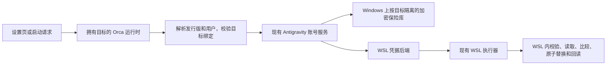

# Antigravity WSL 原生账号管理：方案 B

日期：2026-10-06。状态：方案 B 和本文已获用户批准；产品实现尚未开始。

按用户随后提出的 Git 管理要求，本文与实施计划通过精确的 `.gitignore` 白名单
纳入版本控制；其他本地设计文档仍保持原来的忽略规则。

## 1. 目标与范围

Windows Orca 的“设置 > 账号 > Antigravity”应能管理指定 WSL 发行版内的原生 agy
账号：读取、保存当前账号、选择已保存账号、删除未使用的账号，并在 Orca 启动
新的 agy 终端前检查实际使用的账号。

凭据文件操作在 WSL 内执行。拥有该 WSL 的 Windows Orca 运行时保留按目标隔离的
加密保险库。客户端只收到账号摘要，不收到凭据或 OAuth token。

成功标准：操作只影响指定发行版的指定默认用户；Host 与其他发行版的数据不变；
不安全或无法核实的状态明确失败；真实 Windows/WSL 验证和项目质量检查有可复查证据。
文件夹工作区和 git worktree 使用相同规则，账号作用域不依赖仓库类型。

本次不增加 Orca 管理的 OAuth 登录，不支持 Windows 原生 Credential Manager 或
普通 Linux Secret Service，不给独立 SSH relay 增加 Accounts RPC，不开启 WSL
用量查询。已有 agy 登录流程、Host 账号路径和当前 WSL 用量按钮的禁用行为保留。

## 2. 已确认的基础与证据边界

| 现有实现 | 复用方式 |
| --- | --- |
| [账号服务](../../../src/main/antigravity/native-account-service.ts) | 继续拥有列表、保存、选择、删除、刷新同步、启动检查与操作队列 |
| [凭据 codec](../../../src/main/antigravity/native-credential-codec.ts) | 保留原始 JSON、稳定 subject/authMethod 身份、64 KiB 上限 |
| [加密保险库](../../../src/main/antigravity/native-account-store.ts) | 复用格式校验、加密要求、4 MiB 上限，扩展受保护的异步文件访问 |
| [WSL 执行器](../../../src/main/wsl/wsl-runner.ts) | 复用 --exec、Windows cwd、环境策略、超时及子进程入口，增加独立 stdin 输入 |
| [文件保护](../../../src/shared/secure-file.ts)与 [Windows ACL](../../../src/shared/secure-path-windows-acl.ts) | 复用权限应用和验证，增加严格失败与密文二进制写入支持 |

[现有架构文档](../../reference/antigravity-native-accounts.md)记录了 agy 在 WSL
环境下使用文件凭据的依据；现有真实验证证明了 macOS 的文件旁路，尚未证明本方案
在真实 WSL 上可用。发布前必须补充后文的真实 WSL 证据。

现有文件写入使用固定 `.tmp`，Windows chmod 是无效的权限保障；不能把 Windows
文件后端直接指向 UNC 路径，也不能把原子替换描述成外部写入者之间的原子比较更新。

## 3. 数据流与职责

增加 `native-wsl-account-target.ts`、`native-wsl-credential-backend.ts` 和
`native-wsl-credential-script.ts`。分别负责目标解析、后端协议、固定 guest 脚本；
超过文件长度限制时按读取/写入协议拆分，不能禁用 max-lines。

现有 `native-account-host.ts` 改为服务注册表。WSL 服务构建需要异步解析目标，
调用它的 RPC 和启动入口显式等待。注册表按解析后的作用域缓存构建中的 Promise，
构建失败移除条目，防止永久拒绝；同一作用域只创建一个账号服务和操作队列。
缓存不得在服务仍有请求时淘汰并创建第二个同作用域服务。

账号业务流程不另建平行实现。保险库 read/write 允许返回同步结果或 Promise，
账号服务在每个调用处 await；现有同步 store 与测试替身仍可使用。异步保护过程
发生在该账号服务的队列内，失败不能绕过队列或恢复旧快照。

## 4. 目标解析与隔离

WSL 分支只允许拥有目标的 Windows 运行时进入。客户端的平台不决定后端；例如
macOS 客户端连接 Windows Orca 时仍由 Windows 宿主执行。

每次操作确认实际 WSL_DISTRO_NAME、数值 UID、实际登录 HOME 与规范化后的 HOME。
复用已有登录环境探测和 stdout fencing，但不能把进程生命周期缓存当作当前身份
的唯一证据。账号操作应刷新目标身份探测，目标有变化时使对应旧环境缓存失效。
读取凭据用确定的 HOME 和系统工具，不反复加载交互式 shell 配置。

`wslDistro: null` 表示本次操作使用系统默认发行版。先通过不指定发行版的只读身份
探测取得实际发行版，再固定其名字执行所有后续步骤；不得把发行版列表第一项当作
默认发行版的安全依据。显式发行版也必须核实实际名字，并以该名字进行后续执行。
同一操作中默认发行版改变不能让后续写入漂移到另一个发行版。

每个实际 guest 文件访问步骤重新核实 UID、HOME 和发行版仍与操作绑定一致；不能
只在服务创建时核实。绑定改变时旧服务中的排队操作也必须拒绝，不能继续访问旧路径。

内部作用域为版本化、无歧义编码的 `{ runtime: 'wsl', distro, uid, home }`。
发行版按现有大小写不敏感约定匹配，HOME 使用 POSIX 路径规则。哈希此作用域形成
`authorityId` 和安全目录名；它只用于绑定与隔离，不是身份验证凭据。

Host 保险库继续使用 `userData/antigravity-accounts/vault`；WSL 保险库使用
`userData/antigravity-accounts/wsl/<scopeHash>/vault`，通过宿主 path.join 构建。
密文内部带可选的版本化作用域元数据；WSL store 要求它与当前作用域一致，Host
旧格式继续可读。账号 id、selectedAccountId 和快照均在各自作用域内独立保存。

列表响应可选增加 `resolvedTarget: { runtime: 'wsl', wslDistro, authorityId }`。
WSL 修改请求在 target 内携带可选字段 `expectedAuthorityId`；新版宿主对 WSL
的 AddCurrent、Select、Remove 要求该字段存在并匹配当前解析结果。Host 不要求。
缺失或不匹配时，在读取账号快照或修改凭据前拒绝并要求刷新。

前端把绑定值保存在当前列表状态内。选择“系统默认”时修改请求仍保留原请求的
null 语义并提交绑定值：系统默认已改变会被拒绝，而不会悄悄操作新目标。切换
owner/target 时立即清空列表、错误、绑定和用量状态；异步结果用请求代次隔离，
不能仅凭 mounted 标志让旧目标的请求结果覆盖新页面。

UID/HOME 改变后不迁移旧保险库。发行版重装但名字、UID、HOME 完全相同的情况
不属于本版本可辨识的安装身份；原生凭据缺失或改变时启动检查仍拒绝，不自动
恢复旧账号。可靠区分此情况需要未来独立的发行版安装身份机制。

## 5. WSL 执行与内部协议

扩展 `WslSpec` 的可选 `input: string`，作为数据发送给子进程 stdin，不能与脚本
正文拼接。带 input 的脚本使用短固定脚本的 argv 形式；若命令行超过既有预算，
在 spawn 前拒绝，不能占用 stdin 来传脚本。无 input 的现有长脚本行为保持。
同时传递明确的 outputTruncated，凭据调用开启超限终止并拒绝任何截断结果。

固定脚本通过 runWslProcess 调用，凭据步骤使用 loginPath: 'none'，不执行用户
profile；所需环境身份由前面的有围栏探测提供。需要解析交互登录 shell 的输出时
继续使用 buildWslCapturedLoginShellCommand。所有 WSL argv 经 buildWslExecArgs。

首版支持具备 sh、id、stat、base64、cmp、head、mktemp、flock、mv、sync 等必要
功能的发行版。探测实际使用的选项并固定系统工具 PATH；工具或功能缺失明确拒绝，
不安装依赖，不假定存在 Node/Python，不增加 PowerShell 或 cmd.exe 包装。

内部输入协议为固定版本行、expected 的 missing 标记或 canonical base64、new
contents 的 canonical base64，严格校验行数和大小。64 KiB 的 expected 与 new
编码后合计输入限制为 192 KiB。base64 是传输编码，不是加密。

输出为携带请求随机 nonce 的固定协议头、明确状态与 base64 数据。凭据原始字节
与末尾换行必须保留，不能经过 shell 命令替换或 trim。Host 解码时核实 canonical
base64、UTF-8 往返和长度，再调用现有 codec。stdout 上限为 192 KiB。
状态包完整性、退出码与 nonce 必须同时符合；仅凭 wsl.exe 数值退出码不判定缺失。

只有明确的 guest 文件缺失状态返回 null。不存在的发行版、权限异常、坏文件、
协议失败和超时均抛出可操作的错误。stderr 使用固定安全诊断；禁止 set -x、echo
凭据，以及把原始 stdout/stderr/input 拼进错误、遥测或日志。

## 6. 文件安全与提交步骤

原生文件固定为实际 HOME 下的 `.gemini/antigravity-cli/antigravity-oauth-token`。
guest 路径通过 POSIX 路径工具构造，禁止客户端传入任意凭据路径。

文件必须为当前 UID 所有的普通文件，权限位严格 0600，无特殊权限位，大小不超过
64 KiB。现有 `(mode & 0o077) === 0` 条件宽于严格 0600，WSL 后端不能沿用这个
较宽判定。已有权限不合规时返回错误，不把权限失败当作未登录或静默修复文件。

解析并检查 HOME 到目标目录的路径：拒绝符号链接，拒绝可由非信任用户写入的目录，
凭据目录必须由目标用户所有。新建私密目录为 0700；现有只读可遍历目录可接受，
但 group/other 写权限不可接受。首版拒绝 HOME 或凭据目录落在 DrvFS 等 Windows
挂载文件系统，不能仅凭 chmod 成功宣称具有 Linux 私密权限。

读取时打开文件描述符，验证所打开文件的类型、所有者、权限和大小，从该描述符
限量读取并比较前后元数据；路径上的 lstat 与另一次 cat 不能成为唯一检查。
固定 shell 方案的安全边界是受保护的目录和正常并发写入者，不声称能抵御恶意同 UID
进程：这样的进程本来就能读取和修改该用户的凭据。

写入步骤：

1. 校验目标绑定、输入、保险库可保护性与路径；获得本目标专用的 guest flock。
2. 在目标目录创建唯一、私密的临时目录，解码 expected/new 到 0600 文件；任何
   预先存在的目标临时路径都不能被覆盖或跟随。限制输入和解码后的大小。
3. 对原生文件进行安全读取，用 cmp 比较原始 expected；missing 必须对应真实缺失，
   不能对应权限失败或悬空链接。不匹配返回现有 CONFLICT 含义。
4. 同步新文件，复核路径与原生旧字节，在同文件系统内原子替换，同步父目录，再
   从实际原生文件回读核实字节、权限与身份。同步失败不能被当作持久化成功。
5. 账号服务再次核实账号身份及最新快照后保存 selectedAccountId；清理本次临时
   数据。失败不自动回滚原生文件，避免覆盖独立 agy 的后续刷新。

读写脚本使用同一个 guest 锁；读取只在目标目录存在时创建/核实私密锁文件，
缺失目录的只读操作不创建凭据目录。锁等待最多 2 秒；锁文件必须是当前 UID 的
0600 普通文件，文件描述符锁在进程退出后释放，不使用容易遗留的目录锁。

此锁仅约束这些 Orca 脚本。独立 agy 不遵守锁，Windows 保险库和 guest 原生文件
也不是一个事务；不宣称跨 Orca 进程或 agy 的完整原子比较更新。保留现有服务
队列、写前比较和回读，并测试实际观察到的冲突。

## 7. 加密保险库与失败语义

继续使用 getSecretStore，isEncryptionAvailable 和 describeProtectionGap 都必须
通过；禁止明文降级。损坏或无法解密的保险库保留，不当作空列表。

复用既有 secure-file/Windows ACL 实现，增加用于密文 Buffer 的严格异步发布方式：
等待并核实专用父目录的权限，再独占创建唯一临时文件，保护临时文件，写入密文、
同步、替换、核实发布文件并同步目录。发布前保护失败保留旧保险库并清理临时文件；
发布后验证失败可能已经提交，错误消息必须如实说明，需要刷新核实。

Windows 目录同步遵循现有平台支持范围；不支持的目录 fsync 不能使所有合法操作
永久失败，也不能被描述成保证断电后的元数据持久性。文件同步与 ACL 验证仍必须
成功，文档保留平台的持久性限制。

现有 secure-file 的 best-effort 行为对其他调用方保持；Antigravity 严格路径不能
把 false/pending 当成功。复用 ACL 规划和验证代码，避免另建解析器；使用异步
子进程执行，不能让 Electron 主线程同步等待多轮 icacls。Windows 信任边界沿用
现有当前用户、SYSTEM 和 Administrators，不声称排除能够取得所有权的管理员。

每次账号 RPC 设置一个服务端操作 deadline，包含排队、目标探测、权限保护、guest
I/O 与提交；沿途使用剩余预算。服务端预算 15 秒，现有客户端 20 秒等待保持。
ACL 异步执行也必须接受剩余预算和取消，不能用 Promise.race 留下迟到发布。
到期前不进入新的提交步骤，正在提交则按结果未知处理；同步加密/小文件解析以
既有大小上限约束，但不宣称 OS 文件系统调用具有硬实时保证。

杀死 wsl.exe 不证明 guest 写入者已经退出。写入超时或响应丢失后，当前目标进入
“需核实提交结果”的服务状态；自动错误刷新只允许读，不自动重放修改。下一次
修改必须先成功获得同一 guest 锁并重新读取原生凭据和保险库，证明该 Orca 脚本
写入已经结束。锁仍被占用或目标不可达时保持拒绝。启动检查也不得绕过此状态。

常规退出由 trap 清理临时数据；强制终止可遗留私密临时目录。后续清理只针对本
实现的精确命名格式，在获得锁、验证所有者/类型/权限后进行，禁止无界 glob 删除
或把遗留临时数据提升成当前凭据。

## 8. 启动检查

prepareAntigravityAccountForLaunch 增加明确 target/wslDistro，不能仅凭 isWsl
布尔值选择后端。三个现有调用入口全部接线：

- `src/main/ipc/pty/ipc/spawn-env.ts`
- `src/main/ipc/pty/runtime/spawn-options.ts`
- `src/main/ipc/pty/provider/local-configure.ts`

核实实际 PTY 的发行版、用户、HOME 与账号服务作用域一致，并把解析后的明确发行版
固定到真正的 spawn 配置。Windows 宿主 HOME/USERPROFILE 不是 WSL HOME 的证据；
WSLENV、自定义 HOME、用户覆盖或启动命令改变凭据位置且不能核实时，拒绝带选择
账号的启动。保持既有 Host 凭据 authority 校验。

没有选定账号时不写原生文件，不对普通 agy 启动引入账号选择。存在选定账号时，
当前凭据身份必须匹配；CLI 刷新同身份 token 时更新快照后允许启动，外部切换身份
或凭据缺失时阻止并要求在设置中重新选择。启动前不自动恢复旧凭据。

若本地从未创建 WSL 账号保险库，可在启动入口直接跳过账号准备；已有保险库则
解析实际目标并查询该作用域的选择，不把其他发行版的选择应用到当前启动。

客户端对 SSH 的启动不操作客户端保险库，由执行拥有方检查。独立 relay 当前不
具备 Accounts RPC，本次保持该边界；配对拥有方不可达不能退回本地。已运行会话
与在已有终端手动输入的 agy 命令仍在既有启动保护边界之外。

## 9. RPC、UI 与版本兼容

新增 `accounts.antigravity-native-wsl.v1`，它证明宿主具有本 WSL 适配器和绑定协议，
不保证任意发行版此刻可用。仅 Windows 实现宿主发布该能力；非 Windows 宿主
保留既有 Host 能力，不宣称客户端选定 WSL 可用。

复用已有四个 RPC 方法。响应的 resolvedTarget 与请求的 expectedAuthorityId
都是可选新增字段，修改既有 strict schema 显式接纳它们。WSL 的修改操作要求绑定
由 handler 执行，Host 旧请求仍可用。不能假定旧 strict schema 忽略新增字段；
新版客户端只有确认 WSL 能力后才发送它们。

| 组合 | 行为 |
| --- | --- |
| 新客户端 + 新 Windows 宿主 | WSL 列表返回绑定；所有修改带绑定 |
| 新客户端 + 旧宿主 | WSL 能力检查提前失败；Host 沿用原请求形状 |
| 旧客户端 + 新宿主 | Host 保持；WSL 无绑定修改明确拒绝，旧版原本也不支持此操作 |
| 新客户端 + 非 Windows/不可达宿主 | 明确不支持或不可达；不接触客户端 Host 凭据 |

RPC 响应仍只有摘要，不暴露凭据，也不需要新增流操作码。UI 复用现有组件、按钮、
加载与错误位置；新增目标变化/结果需核实的文案使用 i18n 与 STYLEGUIDE。错误刷新
后仍展示失败原因，不能把已改变的原生账号误标为选择成功。

## 10. 验收清单

以下是完整实现与发布验收要求。实现与定向测试已执行；只有所有子项都有证据的整项
才勾选。单发行版 Windows→WSL 合成验收和剩余缺口见原生账号参考文档。

### 10.1 单元与隔离脚本测试

- [ ] read：真实缺失、0600 普通文件、0600 外的权限、错误所有者、符号链接、FIFO、
  大文件、坏 JSON、坏 UTF-8、未知 JSON 字段和末尾换行。
- [ ] write：保存/切换/删除全流程、expected=null、旧字节冲突、相同身份 token
  刷新、写后变化、短写/同步失败、唯一临时文件与权限失败不提前发布。
- [ ] 协议：凭据不出现在 argv/env/日志，脚本与 input 不争用 stdin，长命令拒绝，
  截断输出/错误 nonce/坏 base64 拒绝，缺失 guest 状态不误认成未登录。
- [ ] 目标：Host/Ubuntu/Debian 隔离、发行版大小写别名共享单队列、默认目标变化、
  UID/HOME 变化、并发服务构建、构建失败可重试、旧 UI 请求结果不能覆盖新目标。
- [ ] 保险库：弱加密拒绝、密文损坏保留、作用域不匹配拒绝、4 MiB 上限、Windows
  ACL pending/false、发布前失败保留旧文件、发布后失败如实报告。
- [ ] 中断：锁等待超时、guest 仍持锁、替换前后超时、响应丢失、刷新与再次修改的
  先后顺序、私密临时数据清理；不自动回滚或重放。
- [ ] 启动：三个入口、实际发行版固定、无选择不写文件、外部切换阻止、同账号
  刷新允许、自定义用户/HOME 拒绝、文件夹工作区与 worktree。
- [ ] 远程兼容：新旧客户端/宿主、Host 原请求形状、WSL 能力缺失提前拒绝、严格
  schema 的新增字段、SSH 连接失败不触碰本地凭据。

### 10.2 真实 Windows/WSL 验证

- [ ] 在 Windows 测试机的两个隔离 WSL 目标中，用合成凭据和临时 HOME 验证目标
  解析、权限、脚本协议、Windows vault ACL、列表/保存/切换/删除与启动检查。
- [ ] 用真实 agy 的受支持运行方式验证文件 authority 和所选身份。先核实是否存在
  受支持的隔离 HOME 方法；若无法安全隔离，不编造 CLI 参数，不改开发者真实账号，
  将这项验证移到专用测试账号/发行版。记录 CLI 版本和实际权限。
- [ ] 测试发行版停止、不存在、默认目标改变、缺失工具、DrvFS HOME、锁争用与
  提交阶段中断；证明没有 Host 凭据变动。
- [ ] 分别记录 Windows/WSL 实测与 macOS/Linux 回归范围，不能把 Linux 脚本测试
  或 mocked platform 测试当作真实 WSL 证据。

### 10.3 项目门禁与 PR

- [x] 测试和应用启动均设置 `ORCA_BACKGROUND_LAUNCH=1`。
- [ ] 运行 `pnpm tc`、受影响测试、`pnpm run check:code-quality:changed`，用项目
  formatter 格式化变更文件；涉及 schema 时更新并验证 RPC 参数目录。
- [ ] 启动 Electron 前重建修改的启动策略和包装器；UI 验证使用项目要求的 electron
  技能与隐藏渲染器 Playwright CDP，不激活窗口、不使用 computer-use。先定位该技能，
  缺失时如实记录 UI 验证未完成，不能改用会抢焦点的方式。
- [ ] 更新原生账号参考文档；按 PR 模板填写体验前后、机制、方案取舍、测试平台
  和前后视觉证据。上游外部贡献者按模板链接实际解决的 issue，不能拿无关引用代替。
- [ ] 向 stablyai/orca 提交功能 PR 前，提供完整差异与验证证据；不要把此设计阶段
  当成功能已经实现、真实验证已经完成或 PR 已提交。

## 11. 设计取舍与后续阶段

采用 B，因为 guest 的权限与原子替换使用同一套文件系统语义，现有账号服务和加密
保险库可保留。UNC 组合方案增加分阶段故障处理；完整 WSL 账号运行时增加部署与
加密机制，这些成本不服务于本次功能范围。

已知限制是独立 agy 的外部写入竞争、检查与实际启动之间的窗口、跨原生凭据与
保险库的非事务提交，以及同名重装发行版的安装身份。这些限制必须随实现文档和
错误语义保留，不用“原子写入”或“加锁”掩盖。

实施任务 1–8 已完成，任务 9 正在完成最终门禁、独立审查和 PR 准备。
完整发布验收仍需双发行版、真实登录和隐藏 UI 证据，不能由合成测试替代。

## 12. 参考资料

- [WSL 命令执行规范](../../reference/wsl-command-execution.md)
- [SSH 执行边界](../../reference/ssh-execution-boundary.md)
- [远程协议兼容规范](../../reference/remote-wire-compatibility.md)
- [Windows EDR 行为规范](../../reference/windows-edr-posture.md)
- [设计系统](../../STYLEGUIDE.md)
- [PR 模板](../../../.github/pull_request_template.md)
- [Microsoft：WSL 文件权限](https://learn.microsoft.com/en-us/windows/wsl/file-permissions)
- [Microsoft：WSL 基本命令](https://learn.microsoft.com/en-us/windows/wsl/basic-commands)
