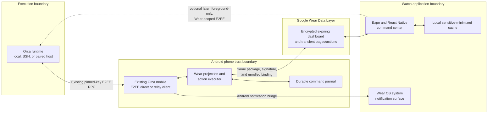
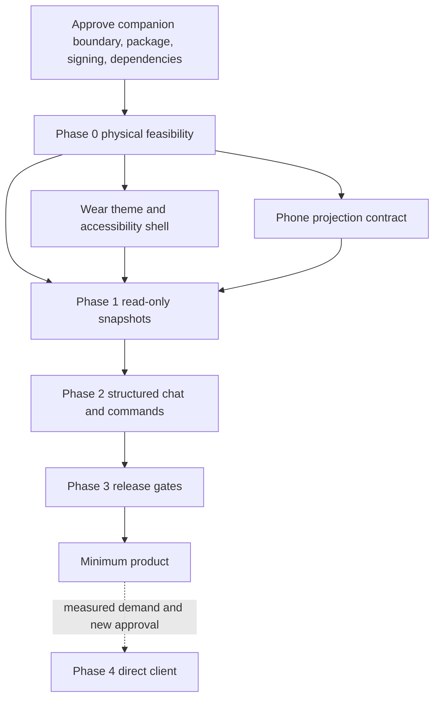

# Orca for Wear OS: command center plan

| Field              | Value                                                                                                                                             |
| ------------------ | ------------------------------------------------------------------------------------------------------------------------------------------------- |
| Status             | **Approved direction — implementation remains gated by the evidence register below**                                                              |
| Calibration        | **greenfield**                                                                                                                                    |
| Provisional target | The user's Samsung Galaxy Watch on Wear OS 6, plus required round-screen quality profiles; exact model/build is confirmed in Phase 0              |
| Minimum product    | Phone-assisted host pairing, account-usage visibility, agent status, structured message viewing/sending, and notification parity with Orca mobile |

## Decision summary

Build a dedicated Expo and React Native Wear OS application inside the existing `mobile/` workspace. Keep its Expo, React Native, React, TypeScript, routing, test, formatting, and lint stack aligned with Orca mobile through one lockfile and an automated version-parity check. Share platform-neutral TypeScript contracts, projections, design tokens, and state logic; build watch-specific screens rather than shrinking phone layouts.

Kotlin remains only at the Android boundary that JavaScript cannot own safely: Wear Data Layer listeners, Keystore-backed binding crypto, background service/bootstrap, inbox admission, and rotary integration if React Native cannot meet the physical-device gate. The Expo config plugin owns generated manifests. This is a deliberate maintainability trade-off against Google's Compose recommendation. Expo and React Native do not document Wear OS as a separate first-class target, so Phase 0 must prove packaging, startup, navigation, input, accessibility, memory, and battery behavior on the actual watch before product work continues.

For the first release, keep the Android phone as the only client paired to each Orca runtime and exchange a deliberately narrow, versioned watch model over the Wear OS Data Layer.

The watch must not receive the phone's Orca device token, arbitrary RPC access, or a background WebSocket. It receives compact state snapshots and can submit only fixed, validated actions. The phone translates those actions onto the existing mobile RPC paths.

This is the recommended minimum because it:

- reuses Orca mobile's proven direct/relay E2EE, reconnect, replay, and mixed-version behavior;
- avoids granting the watch the current `mobile` scope, whose allowlist includes far more than command-center functions;
- uses the system's existing phone-to-watch notification bridge instead of creating duplicates;
- avoids a permanent watch radio connection and its battery cost;
- remains reversible: minimum runtime changes are additive, capability-gated workspace-routed native-chat read/subscribe, receipt-backed send, and post-auth mobile capability negotiation; existing clients keep their current paths and E2EE authentication frames.

A direct watch-to-runtime client is a later, separately approved phase. It becomes eligible only after Orca has a server-owned Wear grant with a narrow allowlist, no-phone enrollment, Hermes/mobile crypto conformance, and a push strategy that does not depend on a background socket.

At source commit `a1f198be0d96c7152997a1fd178ad4f201fa7e67`, `mobile/package.json` pins Expo `^55.0.27`, React Native `^0.83.9`, React `^19.2.6`, TypeScript `6.0.3`, Vitest `^4.1.9`, oxlint `^1.71.0`, and oxfmt `^0.52.0`; `mobile/app.json` enables the New Architecture. Implementation must copy the current mobile pins at branch time and keep them synchronized, rather than treating these plan-time versions as permanent.

### Approval decisions

Product implementation in Phases 1-4 must not begin until these decisions are accepted. Phase 0B is a separately authorized, isolated feasibility spike; it may exercise candidate dependencies and signing but cannot ship product behavior. Only artifacts explicitly classified as promotable-on-pass may enter Phase 1 after the required evidence rows close and normal review passes.

1. **Companion-first boundary:** the phone remains the paired Orca client for the minimum release. The watch can show cached state offline, but live state and commands depend on the phone's Orca connection.
2. **Shared mobile stack:** use a dedicated Expo/React Native app under `mobile/wear/`, sharing the mobile workspace, dependency versions, TypeScript contracts, and design tokens. Do not port phone screen layouts or the terminal WebView. Keep Kotlin confined to the shared Expo Wear module and generated Android integration.
3. **Package and signing:** use `com.stably.orca.mobile` and ensure the installed phone and watch APKs have the same app-signing certificate. Internal builds may be APKs; Play delivery uses a Wear-enabled AAB on the dedicated Wear OS track. The Play upload key may differ from the app-signing key.
4. **New dependencies:** the Wear app starts with the exact Expo/React Native/React/TypeScript versions already pinned by mobile. Approve Google Play Services Wearable and any watch-only navigation, rotary, or native dependency only after version, license, provenance, New Architecture, API-floor, and 64-bit/native-binary review. A dependency is not approved merely because a React Native wrapper exists.
5. **Notification scope:** minimum parity means system-bridged phone notifications plus an in-app watch inbox. Phone-absent, killed-process push is not part of the minimum release.
6. **Hardware target:** confirm the exact watch model, Wear OS version, connectivity variant, and rotating-input behavior from Settings -> About before physical acceptance testing.
7. **Safe native-chat runtime change:** approve additive execution-host-routed native-chat read/subscribe plus receipt-reserved atomic send. The SSH portion includes a capability-gated relay handler, one-use primary-channel identity proof, connection-incarnation-scoped negotiation, and a stable cross-process send reservation/receipt store outside versioned relay installs. Existing reads cannot resolve SSH-host transcripts safely, and the existing React-owned mobile input lease/raw `terminal.send` cannot authorize a background watch send to the exact current agent.
8. **Android API floor:** require Wear OS 4/API 33 or newer on the watch and Android 12/API 31 or newer on the companion phone for the Wear feature. Android Keystore did not add ECDH key-agreement purpose until API 31, and there is no API 31 Wear OS release lane. Older phones may continue using Orca mobile but cannot enroll a watch. Do not add a weaker software-key compatibility path without separate approval.
9. **Windows SSH send boundary:** local Windows runtimes retain full command support. A Windows SSH relay advertises atomic send only if a no-directory-mutation receipt ledger passes forced crash/power-cut durability evidence; otherwise its conversations are read-only with an explicit unsupported/update-required state. Adding a native Windows durability dependency requires separate approval.

### Decision register

| Decision                                                                         | Owner                                | Evidence required before product code                                                             | State                             |
| -------------------------------------------------------------------------------- | ------------------------------------ | ------------------------------------------------------------------------------------------------- | --------------------------------- |
| Companion-first minimum, notification scope, and safe native-chat runtime change | Dhiman                               | Approval of decisions 1, 5, and 7                                                                 | Approved                          |
| Expo/React Native stack and dependency set                                       | Dhiman and Orca implementation owner | Approved decision 2; physical Expo-on-Wear feasibility plus exact shared/native dependency review | Approved direction; evidence open |
| Package, signing, version-code, and Play topology                                | Android release owner                | Installed-APK certificate fingerprints and Play signing/export evidence                           | Open                              |
| Watch enrollment, payload, retention, and disclosures                            | Orca security/privacy reviewer       | Threat-model and final-schema review                                                              | Open                              |
| Physical device/API support, Wear API 33 floor, and phone API 31 floor           | Dhiman and Orca implementation owner | Approval of decisions 6 and 8; on-device Settings/ADB and Google Play Services evidence           | Open                              |
| Windows SSH atomic-send capability                                               | Dhiman and Orca runtime reviewer     | Approval of decision 9; Windows crash/power-cut evidence or status-only fallback                  | Approved direction; evidence open |

Phase 0A gathers no-code/read-only evidence and records preliminary choices. Dhiman then explicitly authorizes or rejects the isolated Phase 0B spike. Phase 0B updates this register with the named assignee and final evidence links. No calendar deadline is invented; each row is a hard prerequisite for the phase that consumes it.

## Goals

- Pair the watch with Orca's Android companion and discover the phone's paired Orca hosts without rescanning every desktop code.
- Show per-host Claude and Codex usage with the same session/weekly/reset semantics and last-updated honesty as mobile.
- Catalog every paired host and show live/cached terminal-backed agent sessions that the mobile runtime projects across local, SSH, and paired-runtime hosts, including folder workspaces and Git worktrees.
- Open a selected terminal-backed agent's recent native-chat conversation and send a short typed or dictated message through the new atomic host method.
- Preserve Orca's mutation outcome vocabulary: `accepted`, `rejected`, or `unknown`; never silently retry an ambiguous send.
- Surface Orca notifications on the watch without duplicates and provide replay-backed recent events in the app.
- Remain glanceable, round-screen safe, rotary-operable, TalkBack-readable, and explicit about stale/unverifiable state.

## Non-goals for the minimum release

- Full terminal rendering or raw terminal input.
- Browser control, file editing, source-control actions, PR review, account switching, workspace creation/removal, or SSH setup.
- Internal `orchestration.*` mailbox access. User messages use the native-chat surface and its dedicated safe-send method.
- Structured `agent-session` tabs, which the runtime deliberately removes from mobile projections today. Add them only with their own capability-gated mobile product surface.
- Image/audio attachments, raw microphone streaming, or long-form transcript browsing.
- A direct runtime credential on the watch.
- Phone-absent real-time notifications, FCM/relay push infrastructure, complications, or Wear OS 7 preview-only surfaces.
- Manual edits under generated `mobile/android`; Expo prebuild would erase them.

## Current Orca architecture

### Existing reusable seams

| Need                              | Existing source of truth                                                                    | Planned watch projection                                                                                     |
| --------------------------------- | ------------------------------------------------------------------------------------------- | ------------------------------------------------------------------------------------------------------------ |
| Host connection and compatibility | `mobile/src/transport/host-logical-client.ts`, `status.get`, mobile direct/relay transport  | Phone publishes compatible/unavailable state; watch never handles runtime credentials in the minimum release |
| Account usage                     | `accounts.subscribe` and `accounts.list`; `mobile/src/components/account-usage-state.ts`    | Per-host provider usage, reset labels, and generated-at timestamp                                            |
| Agent inventory                   | `session.tabs.subscribeAll`, with `session.tabs.listAll` fallback                           | Compact host/workspace/agent rows; preserve authoritative vs incomplete inventory semantics                  |
| Conversation view                 | Existing local `nativeChat.*` plus new capability-gated workspace-routed read/subscribe     | Recent local/SSH messages; execution host owns transcript access; subscribe only while the view is open      |
| Message send                      | Existing ambiguity/lease/PTY primitives plus new `nativeChat.sendMessage` and receipt query | Fixed `sendAgentMessage` action returning accepted/rejected/unknown without raw `terminal.send` fallback     |
| Notifications                     | `notifications.subscribe`, `notifications.getMissedSince`, mobile watermark/dedupe logic    | System-bridged notification plus a bounded in-app event projection                                           |
| Remote semantics                  | `docs/reference/ssh-execution-boundary.md`                                                  | Host owns execution; disconnect means `unverifiable`, never inferred `exited`                                |
| Mixed versions                    | `src/shared/protocol-version.ts`, `docs/reference/remote-wire-compatibility.md`             | Versioned phone/watch contract and explicit capability fallback                                              |

The runtime currently has only `mobile` and `runtime` device scopes. `MOBILE_RPC_METHOD_ALLOWLIST` in `src/main/runtime/runtime-rpc.ts` includes account mutation, files, Git, browser control, settings, terminals, and workspace mutation. Hiding those controls in the watch UI would not remove their authority. This is why the minimum design keeps the runtime credential on the phone.

The user-facing message path is not the internal orchestration mailbox. Agent discovery comes from `session.tabs.subscribeAll`. Existing native-chat transcript resolution is local/WSL and cannot silently serve SSH workspaces, so the watch path adds execution-host-routed read/subscribe capability that accepts opaque workspace/session identity and fails closed when the SSH host is unreachable. Sending adds capability-gated `nativeChat.sendMessage` because mobile's current composer safety depends on a React-owned input lease and the host rejects a combined guarded `terminal.send` body-plus-submit. Local sends use the main runtime's existing settled-prompt writer and local durable receipt. For SSH, the relay first durably reserves the mutation; only a proved reservation lets the main runtime revalidate the exact published session and invoke its existing settled-prompt state machine through the remote PTY provider. The relay then records the outcome. Any ambiguous begin/write/complete boundary stays pending/`unknown` and is never resent. Old hosts or relays expose status but no unsafe chat fallback.

### Minimum architecture



### Pairing and command sequence

```mermaid
sequenceDiagram
  actor U as User
  participant W as Wear app
  participant D as Wear Data Layer
  participant P as Orca Android app
  participant R as Orca runtime

  U->>P: Pair host using existing Orca flow
  U->>W: Open Orca on approved watch
  W->>D: Enrollment hello with watch install ID and nonce
  D->>P: Candidate watch
  P-->>U: Confirm matching watch fingerprint
  P->>D: Node-targeted binding key after confirmation
  P->>R: Existing E2EE status and subscriptions
  P->>D: Publish bound, AEAD-encrypted dashboard
  D-->>W: Persisted encrypted dashboard
  W-->>U: Hosts, usage, and agent state

  U->>W: Send short agent message
  W->>D: Fixed action with requestId and expectedRevision
  D->>P: Best-effort command delivery
  P->>P: Validate action, target, revision, and journal
  P->>R: nativeChat.sendMessage with target epoch/version and mutation ID
  R-->>P: accepted/rejected receipt, or queryable pending state
  P->>D: Acknowledge exact outcome
  D-->>W: accepted, rejected, or unknown
  W-->>U: Show outcome; never auto-retry unknown
```

## Phone/watch contract

The Data Layer contract is not a tunnel for raw Orca RPC. It is a separate, smallest-useful surface owned by the mobile companion.

| Contract concern                                                                                          | Single owner                                                                             |
| --------------------------------------------------------------------------------------------------------- | ---------------------------------------------------------------------------------------- |
| Action/product schema, projections, canonicalization, and public TypeScript API                           | The language-neutral manifest and generated TypeScript in `wear-companion-contract`      |
| Generated phone/watch manifests and role-specific services/features                                       | The `expo-wear-data-layer` config plugin                                                 |
| Data Layer calls, Keystore crypto, service lifecycle, native inbox, and reject-before-JS action admission | Kotlin in `expo-wear-data-layer`, with admission code generated from the shared manifest |
| Phone execution, watch state, and React Native UI                                                         | TypeScript in the consuming Expo app; shared packages contain no app/runtime imports     |

### Companion binding

Before any snapshot or action, the phone and watch complete `wear.binding.v1`:

```text
wear.binding.v1 = {
  schemaVersion,
  bindingId,
  phoneInstallId,
  watchInstallId,
  phoneNodeId,
  watchNodeId,
  issuedAt
}
```

- The phone and watch each generate a stable random install ID and a fresh, non-exportable P-256 ECDH enrollment keypair in Android Keystore. Data Layer node IDs are transport observations, not durable authorization.
- The enrollment hello carries the one-time public key and nonce. The user confirms a short fingerprint derived from both install IDs, public keys, and nonces on both screens. The phone then creates a random binding ID and 256-bit binding key.
- After confirmation, the native modules derive a bootstrap key with ECDH plus HKDF-SHA-256, wrap the binding key with AES-GCM, and send it only to the selected node with `MessageClient`. Each side stores the binding key under a device-local non-exportable Android Keystore wrapping key, deletes the one-time ECDH key, and never exposes raw key material to JavaScript.
- Native modules protect every envelope with AES-256-GCM. The binding ID, schema version, path, publisher epoch, revision/request ID, and expiry are authenticated additional data; nonces are unique per binding/key. Data Item paths are namespaced as `/orca/wear/v1/{bindingId}/...`, but paths are routing—not confidentiality.
- Persistent Data Items contain ciphertext only and are readable only after successful bound-key decryption. Commands/read pages use node-targeted `MessageClient` and the same AEAD envelope.
- Node change, app reinstall, phone replacement, or binding removal requires explicit rebind. Removal publishes an AEAD-protected tombstone, deletes phone-owned Data Items after acknowledgement, and clears both sides' binding state.
- Multiple-phone and multiple-watch tests prove that snapshots and commands cannot cross bindings even though the apps share package/signing identity.

### Persistent dashboard envelope

```text
wear.dashboard.v1 = {
  schemaVersion,
  bindingId,
  publisherEpoch,
  revision,
  generatedAt,
  expiresAt,
  companionState,
  hostPage: { total, included, truncated, nextCursor },
  hosts: [{
    hostId,
    displayName,
    connectionState,
    inventoryAuthority,
    accountUsage,
    agentCounts: { total, working, needsAttention },
    lastActivityAt
  }]
}
```

Rules:

- IDs are opaque host-issued values. The watch never constructs paths or infers Git support.
- Dashboard content excludes device tokens, relay credentials, workspace/session IDs, workspace/agent names, notification content, file paths, raw terminal output, and transcripts.
- `inventoryAuthority` distinguishes an authoritative empty inventory from an incomplete/old-host result.
- The serialized ciphertext envelope is capped at 32 KiB, well below Data Layer's 100 KB hard limit. Hosts sort by connected/most-recent state with opaque ID tie-breakers. Every clipped collection reports `total`, `included`, `truncated`, and `nextCursor`; clipping is never presented as a complete inventory.
- Every screen shows the relevant generated-at time when state is not live.
- Loss of contact maps to `unverifiable`; it does not become `exited`, `done`, or any synonym.
- The phone overwrites one dashboard item per binding, deletes superseded/expired items, and includes a 24-hour expiry that the watch enforces even while offline. The watch persists only the decrypted sensitive-minimized dashboard in app-private no-backup storage. Agent pages, inbox pages, and chat content are never placed in a persistent Data Item, DataStore, or Tile.

### Transient detail envelope

```text
wear.detailPage.v1 = {
  schemaVersion,
  bindingId,
  requestId,
  publisherEpoch,
  revision,
  generatedAt,
  expiresAt,
  pageType,
  page: { total, included, nextCursor },
  items
}
```

`pageType` is initially `hostCatalog`, `hostAgents`, or `notificationInbox`. Host-agent items carry their exact opaque `workspaceId`, `workspaceKind`, `sessionTabId`, runtime `publicationEpoch`, and `snapshotVersion`; those fences are per workspace, never one pair per host. Responses are AEAD-protected, node-targeted `MessageClient` messages, capped at 32 KiB, held only in watch memory, and discarded on navigation, expiry, process death, binding change, or node loss. Needs-attention agents sort first, then live/most-recent activity, with opaque ID tie-breakers. Notification pages contain redacted session catch-up entries only.

### Action envelope

```text
wear.action.v1 = {
  schemaVersion,
  bindingId,
  requestId,
  expiresAt,
  action,
  target,
  publisherEpoch,
  expectedRevision,
  targetPublicationEpoch,
  targetSnapshotVersion,
  payload
}
```

The initial action enum is limited to:

- `readHostPage`: request another transient dashboard-compatible host page;
- `readHostAgents`: request one transient, paged agent list for a current host;
- `readNotificationsPage`: request one transient, redacted session-catch-up page;
- `openConversation`: request a recent structured-chat projection for one current session;
- `renewConversation`: extend the exact current conversation lease while its screen remains visible;
- `closeConversation`: stop that projection and clear transient content;
- `sendAgentMessage`: send one short text message to the exact current session;
- `refresh`: ask the phone to refresh its existing subscriptions.

No envelope may contain an arbitrary RPC method, and every action has a closed payload schema that rejects unknown fields. A language-neutral action manifest in `wear-companion-contract` is the sole authority for action discriminants, fields, limits, and canonicalization order; generation produces the TypeScript decoder and the narrow Kotlin admission validator used before JavaScript wakes. Every read request carries binding ID, publisher epoch, revision, collection/host identity, and opaque cursor; unavailable, stale, expired, and end-of-page are distinct retry-safe results. For mutation actions, the phone additionally validates the exact target workspace's runtime publication epoch and snapshot version. The journal key is `(bindingId, requestId)` and contains a canonical action hash, immutable target fences, state, and result—not message text. It rejects same-ID/different-input reuse, replays the same receipt for same-ID/same-input, and marks pending before host I/O. The host mutation ID is binding-namespaced. Local receipts live in the main runtime; SSH reservations/receipts live on the relay and are queried through the main runtime. Missing acknowledgement remains `unknown`, not a resend.

Admission limits are fixed contract constants, not user configuration: an encrypted action is at most 8 KiB, decoded `payload` is at most 4 KiB, every opaque ID/cursor is at most 256 UTF-8 bytes, and `sendAgentMessage` text is nonblank and at most 2 KiB UTF-8. One action executes per binding and one headless host-client acquisition executes process-wide. The native listener keeps at most eight pending entries per binding within the 64-entry global inbox, admits at most 30 read/lease actions per rolling minute with burst four, admits at most 10 sends per rolling minute with a two-second minimum gap, and admits one refresh per ten seconds. It authenticates, decrypts, checks schema/binding/expiry/size/rate/concurrency, and returns an encrypted `rejected` reason before waking JavaScript when a limit fails. Native coarse-window state prevents a JS restart from resetting admission. TypeScript, Kotlin, and runtime fixtures must prove byte-identical UTF-8 counting and boundary behavior; the runtime independently enforces the message ceiling.

The native action inbox uses an explicit crash-safe lifecycle: insert `pending`, atomically claim with a short claim deadline, let JS durably record the same hash/fences, then delete the ciphertext only after JS confirms journal handoff. A crash before the JS journal expires/requeues the claim only while the action itself remains valid; a crash after the journal write dedupes through that journal and deletes the native row without another host mutation. Native rejection is never inserted. Startup/service-entry GC deletes expired rows, successful handoff deletes claimed rows, and binding removal/uninstall clears the binding's rows and counters. These transitions are tested at every boundary so encrypted prompt text cannot linger or exhaust capacity.

Conversation capacity is also fixed: one active conversation lease per binding, four total in the phone process, and four per execution host or relay process. Opening another conversation for the same binding must cancel and receive teardown acknowledgement for the old lease before replacement; an unverified cancellation or a full process/host budget returns `rejected: busy` and creates no stream. Process death, node loss, and binding removal synchronously drop the local lease registry and trigger best-effort remote cancellation; execution-host expiry remains the final cleanup authority.

## Product and interaction design

### Navigation

1. **Dashboard:** companion state, paired hosts, active/attention agent count, and stale timestamp.
2. **Host:** account usage and agents for one host.
3. **Agent:** concise state and recent structured messages.
4. **Compose message:** system keyboard and system speech-to-text for a short message.
5. **Inbox:** redacted, session-scoped Orca events; selecting one opens the exact host/workspace when valid and selects an agent only when current inventory proves a unique match.

Offline mode shows the encrypted dashboard's host/usage/count summary only. Agent identities, inbox rows, and conversations require the enrolled phone node to answer a transient read; the UI says “Phone unavailable” rather than presenting retained sensitive detail as current.

The minimum release does not add a Tile. A cached quick-status Tile is the first optional glance surface after the app passes freshness and battery gates; it performs no network work and only deep-links into the app.

### Visual contract

- Use React Native primitives, Expo Router, and small Wear-specific components. Do not import phone screen components, mobile Material components, the terminal WebView, or shadcn components.
- Reuse `mobile/src/theme/mobile-theme.ts` directly for Orca's native palette, spacing, radii, and typography. Keep that file aligned with `docs/STYLEGUIDE.md` and the canonical CSS tokens in `src/renderer/src/assets/main.css`; do not create a watch token fork.
- Preserve Orca's quiet monochrome hierarchy. Color communicates state; it does not decorate.
- Use a dark-first black background, round-edge-safe layouts, visible scroll indication, hardware/software back, and swipe-to-dismiss only where the tested navigation implementation supports it correctly.
- Keep watch-only layout metrics beside the Wear components. They may adapt shared tokens to round screens but cannot invent colors, typography roles, or shadow tiers.

### Accessibility and device ergonomics

- Use React Native accessibility roles, labels, state descriptions, and semantic focus order without repeating visible labels; verify the resulting Android accessibility tree with TalkBack.
- Keep interactive targets at least 48 x 48 dp, respect system font scaling, keep essential text at least 12 sp, and keep nonessential text at least 10 sp.
- Make all essential scrolling and selection work with rotary input; validate the user's actual bezel/crown behavior.
- Test small-round 192 dp and large-round 227 dp profiles, every supported font scale, state restoration after process death, startup splash/icon/name quality, and the physical Samsung watch. The startup splash uses a 48 x 48 dp icon on black with no edge clipping.
- Use system speech recognition for dictation; do not capture or stream raw audio.
- Configure sensitive-preview redaction on the phone notification that Android bridges, then validate Samsung lock-state behavior. The React Native inbox follows the same redaction policy.

## Architecture alternatives

| Option                                        | Advantages                                                                                                                                           | Blocking costs and risks                                                                                                                                             | Decision                                               |
| --------------------------------------------- | ---------------------------------------------------------------------------------------------------------------------------------------------------- | -------------------------------------------------------------------------------------------------------------------------------------------------------------------- | ------------------------------------------------------ |
| Expo/React Native watch plus phone/Data Layer | Shares the maintained mobile language, dependency graph, contracts, projections, tokens, and tests; keeps narrow watch authority and phone transport | Expo has no documented first-class Wear target; native services/config remain; JS startup, memory, rotary, round navigation, background wake, and battery need proof | **Approved minimum**                                   |
| Kotlin/Compose watch plus phone/Data Layer    | Google's supported Wear UI path, mature Wear components, predictable platform behavior                                                               | Duplicates the TypeScript product layer and design-token mapping; increases two-stack maintenance                                                                    | **Fallback only if Phase 0 fails and Dhiman approves** |
| Direct Expo/React Native watch client         | Reuses TypeScript transport/crypto and supports independent foreground operation                                                                     | New Wear grant/allowlist, no-phone pairing, Hermes/runtime conformance, secure storage, mixed-version suite, and FCM-class push work                                 | **Conditional later phase**                            |
| Full phone UI or terminal port                | Feature breadth                                                                                                                                      | Violates glanceable interaction, cannot reuse the WebView terminal on Wear, and grants unnecessary authority                                                         | **Rejected**                                           |

The direct approach must not be introduced as a silent fallback. If the companion path fails its feasibility gates and phone-independent operation is required, stop and obtain approval for the direct phase's expanded security and dependency scope.

## Research findings

### Industry patterns

- Google recommends Compose for Wear OS and watch-specific components, with short, glanceable interactions rather than shrinking a phone app. This plan knowingly chooses the mobile Expo/React Native stack for shared maintenance and makes platform-quality evidence a release gate rather than claiming framework parity.
- Expo documents Android, Apple, and web platform integration plus custom native modules, but does not document Wear OS as a separate supported target. Expo's monorepo and standalone-module flows can share TypeScript and Kotlin modules across two apps; they do not prove that a Wear UI is acceptable.
- Data Layer is a multi-node phone/watch network. It requires matching package names and installed-app signatures, but those facts authenticate the app family rather than the user's selected companion. `DataClient` is persistent, limited to 100 KB per item, and eventually synchronized; `MessageClient` is connected-only and best-effort with no built-in retry.
- Phone notifications bridge to the watch by default. Independent phone and watch producers create duplicates unless bridging/dismissal ownership is explicitly coordinated.
- Watch Wi-Fi/LTE networking has very high battery impact. Long-lived background sockets are not an acceptable push strategy; deferred work belongs in WorkManager and independent push belongs in FCM-class infrastructure.
- Wear builds are separate targeted artifacts even when they share a Play listing and package identity with the phone app. Play accepts an AAB on the Wear OS track and generates/signs installed APKs; the upload key is not necessarily the app-signing key.
- Android Keystore supports non-exportable ECDH key agreement through `PURPOSE_AGREE_KEY` only from API 31. The minimum therefore requires API 31 on the companion phone and the first real watch release above that floor, Wear OS 4/API 33, instead of inventing a weaker compatibility branch.

### Ecosystem and tools

- UI and product logic: the mobile app's pinned Expo SDK, React Native, React, Expo Router, TypeScript, Vitest, oxlint, and oxfmt versions. `mobile/pnpm-workspace.yaml` explicitly includes `wear` and `packages/*`; `mobile/pnpm-lock.yaml` remains the single dependency lock for phone, watch, and shared packages. Phone and watch consume the shared packages through `workspace:*`.
- Phone/watch transport: Google Play Services Wearable Data Layer through one shared standalone Expo Android module that survives clean prebuild for both apps.
- Local state: React Native reads and writes the sensitive-minimized dashboard through the native module's app-private, no-backup, expiring store. Room is not added unless profiling proves a structured cache is required.
- Verification: Vitest and React Native renderer tests for shared/watch TypeScript, Kotlin unit/instrumentation tests for native boundaries, Wear emulators, the physical Samsung device, TalkBack, rotary input, Android Studio Power Profiler, Perfetto/Battery Historian, and Play closed-track pre-launch reports.
- Direct phase only: reuse the TypeScript E2EE framing and transport state machine behind React Native-compatible crypto/storage adapters. Hermes byte-level conformance, dependency license/SBOM/provenance, and secure-key handling remain blocking evidence; no new crypto library is approved by this plan.

### Risks and pitfalls

- Installed-APK signing mismatch can make Data Layer fail even when both apps install successfully; a GitHub-sideloaded phone and Play-installed watch are a specific risk.
- Package/signature and Data Layer node identity do not authorize one selected companion. An app-level enrolled binding is required before state or commands flow.
- Expo-generated Android code is disposable; both apps' integration must live in the shared Expo module and its config plugin.
- Sharing the language does not make phone UI watch-safe. All watch screens, list virtualization, navigation transitions, back behavior, rotary events, keyboard/dictation, startup, and memory ceilings require watch-specific implementation and physical evidence.
- Phone JS and sockets may be suspended. A native listener waking the process does not prove that Expo JS and Orca's React-owned clients are ready. The minimum command experience is viable only if Gate 0 proves a concrete cold-process/headless owner across foreground, background, screen-off, and Doze states. A force-stopped app must fail unavailable without queuing a later mutation.
- A `WearableListenerService` does not register a React Native Headless JS task by itself. The custom app entry, `AppRegistry.registerHeadlessTask`, native `HeadlessJsTaskService`, and manifest service must all survive clean Expo prebuild and cold-start testing.
- `MessageClient` is not a durable queue. Missing acknowledgements become `unknown`, not an automatic retry.
- A broad `mobile` credential on the watch would turn a small UI compromise into file, Git, browser, and terminal authority.
- Old hosts can publish incomplete session inventories. Absence is not closure without the authoritative-inventory capability.
- Direct and bridged notifications can duplicate. The minimum has exactly one notification producer: the phone.
- Sensitive prompt text can leak through logs, Data Items, lock-screen previews, backups, or crash reports unless explicitly excluded.
- Phone-owned Data Items can outlive watch uninstall and repopulate a reinstall; companion removal and rollback must delete them explicitly.
- A disconnected SSH execution host is unverifiable, not dead.
- SSH relay installs are content-versioned and old/new processes can overlap. Native-chat receipt state cannot live inside a versioned install or rely on one process's mutex; initial-channel identity and capabilities also cannot be inferred from process reachability.
- Wear OS 7 APIs and Samsung upgrade eligibility are preview/unknown lanes, not minimum dependencies.

### Community sentiment

Not assessed. Technical research was deliberately limited to repository evidence and primary platform/manufacturer sources, so no community claim is used to justify the architecture.

### Recommendations

1. Prove signing, Data Layer wake/freshness, notification ownership, and idle battery on the physical watch before building product UI.
2. Ship read-only status first, then bounded commands on the same narrow contract.
3. Keep the minimum runtime delta to post-auth mobile capability negotiation and the narrow execution-host-routed native-chat read/subscribe/send/receipt surface; do not add a presentation-specific aggregate RPC without payload/radio evidence.
4. Treat phone-independent direct operation and killed-process push as one security/product expansion, not incidental polish.
5. Measure payload/radio cost before adding `wear.summary` or a new runtime stream; the phone can cheaply project existing subscriptions.

### Sources and evidence strength

Admiralty codes use source reliability/content credibility: `A1` is authoritative and directly verified; `A2` is authoritative but preview or time-sensitive; `B2` is a first-party manufacturer/library source with product or provenance caveats.

- A1 — Orca source files and tests cited in this plan; direct repository evidence at commit `a1f198be0d96c7152997a1fd178ad4f201fa7e67`.
- A1 — [Compose for Wear OS](https://developer.android.com/training/wearables/compose), [Wear design principles](https://developer.android.com/training/wearables/principles), and [Wear accessibility](https://developer.android.com/training/wearables/accessibility).
- A1 — [Data Layer overview](https://developer.android.com/training/wearables/data/overview), [Data Items and the 100 KB limit](https://developer.android.com/training/wearables/data/data-items), [Data Layer client types](https://developer.android.com/training/wearables/data/client-types), and [Wear authentication](https://developer.android.com/training/wearables/apps/auth-wear).
- A1 — [Android Keystore ECDH example](https://developer.android.com/reference/android/security/keystore/KeyGenParameterSpec), [`PURPOSE_AGREE_KEY` API floor](https://developer.android.com/reference/android/security/keystore/KeyProperties#PURPOSE_AGREE_KEY), and [Wear OS 4/API 33 platform mapping](https://developer.android.com/training/wearables/versions/4/changes).
- A1 — [Wear notification bridging](https://developer.android.com/training/wearables/notifications/bridger), [network communication](https://developer.android.com/training/wearables/data/network-communication), and [power guidance](https://developer.android.com/training/wearables/apps/power).
- A1 — [React Native Headless JS on Android](https://reactnative.dev/docs/headless-js-android), including native task-service and JavaScript registration requirements.
- A1 — [Expo monorepo support](https://docs.expo.dev/guides/monorepos/), [Expo autolinking and duplicate verification](https://docs.expo.dev/modules/autolinking/), [standalone Expo modules](https://docs.expo.dev/modules/use-standalone-expo-module-in-your-project/), [Expo Modules API](https://docs.expo.dev/modules/get-started/), and [Expo config-plugin mods](https://docs.expo.dev/config-plugins/mods/). These support the shared-workspace/native-boundary design; they do not advertise Wear OS as a first-class Expo target.
- A1 — [React Native native-platform integration](https://reactnative.dev/docs/native-platform) for the Kotlin boundary exposed to shared TypeScript.
- A1 — [Wear packaging](https://developer.android.com/training/wearables/packaging), [Android App Bundles](https://developer.android.com/guide/app-bundle), [Android app signing](https://developer.android.com/studio/publish/app-signing), [Play target API policy](https://developer.android.com/google/play/requirements/target-sdk), and [Wear app quality](https://developer.android.com/docs/quality-guidelines/wear-app-quality).
- A1 — [Dedicated Play form-factor tracks](https://support.google.com/googleplay/android-developer/answer/13295490) and [Wear OS 64-bit requirement](https://developer.android.com/blog/posts/get-your-wear-os-apps-ready-for-the-64-bit-requirement).
- A2 — [Wear OS 7 behavior changes](https://developer.android.com/training/wearables/versions/7/changes); official preview guidance, not a release dependency.
- A2 — [Android developer verification](https://developer.android.com/developer-verification); authoritative, time-sensitive release policy.
- B2 — [Samsung Galaxy Watch8 specifications](https://news.samsung.com/global/samsung-galaxy-watch8-series-ultra-comfort-from-sleep-to-workout); manufacturer-primary, with model/market variation requiring on-device confirmation.

## Security and privacy model

### Trust boundaries

1. Orca runtime to Android phone: existing per-device token, pinned desktop key, direct/relay E2EE, and runtime scope enforcement.
2. Android phone application: owns host credentials, validates watch actions, projects least data, and journals mutations.
3. Wear Data Layer: same-package/same-signature phone/watch transport that may traverse Google's infrastructure.
4. Watch process and storage: displays sensitive agent content on a wearable and keeps only a bounded, sensitive-minimized, locally expiring cache.

### Threat controls

| Threat                                          | Required control                                                                                                                                                                    | Verification                                                                                          |
| ----------------------------------------------- | ----------------------------------------------------------------------------------------------------------------------------------------------------------------------------------- | ----------------------------------------------------------------------------------------------------- |
| Watch compromise gains broad runtime authority  | No runtime credential on watch; fixed action enum; no arbitrary RPC forwarding                                                                                                      | Static contract test rejects unknown action/method fields; secret scan of Data Layer payload fixtures |
| Replayed/duplicated send                        | Unique request ID, expected revision, durable pending-before-send journal, no automatic mutation retry                                                                              | Crash-before/after-send tests yield one send or `unknown`, never two sends                            |
| Stale target sends to the wrong agent           | Validate host/session/terminal mapping against current phone inventory and expected revision                                                                                        | Target-change/reconnect tests reject stale commands                                                   |
| Lost acknowledgement hides a possible mutation  | Preserve accepted/rejected/unknown and require user verification before manual resend                                                                                               | Network-cut tests at each write/ack boundary                                                          |
| Forged/wrong companion or watch                 | User-confirmed install binding, Keystore-held AES key, AEAD envelopes, namespaced ciphertext paths; node ID is transport evidence only                                              | Mismatched signature, wrong key/binding, multiple-node confidentiality, rebind, and removal tests     |
| Unproved or replaced SSH relay accepts chat     | One-use primary-channel proof or existing reconnect credential; capability state keyed to target and connection incarnation; reject `unproved`, missing, malformed, or stale state  | Initial/reconnect/unproved negatives and old/new relay replacement tests                              |
| Enrolled watch drains battery or floods actions | Native reject-before-JS byte/rate/concurrency limits; one process-wide headless acquisition; fixed conversation lease/stream caps; runtime message-size and receipt-capacity checks | Boundary, rolling-window, concurrent-binding/lease, restart, and sustained-flood tests                |
| Sensitive transcript persists                   | Crash-safe native inbox deletion; selected-conversation projection only; 20-message/32-KiB cap; phone-enforced lease expiry; no transcript in Data Item, DataStore, or Tile         | Inbox handoff/GC, drop-close, node-loss, restart, backup, reinstall, and lease-expiry inspection      |
| Lock-screen disclosure                          | Minimal/redacted notification preview and device-lock checks before transcript display                                                                                              | Locked-watch notification and conversation tests on Samsung device                                    |
| Secret/content logging                          | Structured redacted logs; no tokens, prompts, transcripts, or Data Item bodies in analytics/crash logs                                                                              | Log capture and automated secret/content assertions                                                   |
| Google transport/data-processing expansion      | Minimize payload, document Data Layer use in privacy/data-safety records, and do not add a new Orca backend                                                                         | Privacy review against final schemas and Play disclosures                                             |
| False remote-process verdict                    | Preserve `live` / `unverifiable` / `exited` exactly; no status inference from contact loss                                                                                          | SSH disconnect and relay-loss contract tests                                                          |

The minimum release adds no Orca cloud processor and sends no runtime credential through Google Data Layer. It does send bounded state and user-requested message content between the user's paired phone and watch; the final schema and retention behavior therefore require privacy review.

## Implementation phases

The minimum product is complete only after Phases 0-3. Phase 4 is optional and requires a new approval.

### Phase 0: decisions and authorized feasibility spike

Complexity: **medium**

Depends on: Phase 0A has no code/dependency authorization; Phase 0B requires explicit spike authorization after Phase 0A

#### Gate 0A — no-code/read-only decisions

1. Confirm the physical device model, Wear OS build/API, screen geometry, connectivity variant, rotary behavior, companion-phone API, and Google Play Services availability. The initial watch build contract is JDK 17, `minSdk 33`, `compileSdk 36`, `targetSdk 36`, required `android.hardware.type.watch`, and `com.google.android.wearable.standalone=false`; the companion feature requires phone API 31. Record any evidence-backed change in the decision register before product code.
2. Inspect the current downloadable Android APK certificate, Play/package ownership, and mobile build workflow. Freeze the spike to mobile's then-current Expo/React Native/React/TypeScript versions, select exact AGP/Kotlin/Google Play Services Wearable versions produced or required by that Expo SDK, and review licenses, provenance, New Architecture support, API/ABI floors, and Expo prebuild behavior. Record the proposed AAB/track, app-signing ownership, disjoint version-code range, dependency set, and explicit Phase 0B scope; obtain Dhiman's spike authorization.

#### Gate 0B — isolated, explicitly authorized spike

Gate 0B runs on an isolated feasibility branch and ships nothing. Artifacts are classified before work starts:

- **Throwaway:** spike bindings/keys/Data Items, signing artifacts, prototype screens, benchmark captures, and any shortcut used only to answer feasibility.
- **Promotable on pass:** mobile-workspace wiring, stack/autolinking gates, the generated contract pipeline, shared Expo module, process-level host owner, background lease, and journal scaffolding, but only when each meets normal source/test/review standards.

No promotable artifact enters the product branch until every Phase 0 decision-register row required by Phase 1 is closed. Promotion is a reviewed Phase 1 change, not evidence that the spike itself is production-ready.

1. Add `mobile/wear/` as a second Expo app and set `mobile/pnpm-workspace.yaml` members to `wear` and `packages/*`, sharing `mobile/pnpm-lock.yaml`. Phone and watch declare the shared Wear packages with `workspace:*`; installs run frozen from the mobile workspace root. Add an automated gate that rejects drift in Expo, React Native, React, TypeScript, Vitest, oxlint, and oxfmt versions between phone and watch. Run Expo Doctor and Expo autolinking verification from both app roots, then assert one resolved copy and peer context for React, React Native, Expo Modules Core, Expo Router, screens, gesture handler, Reanimated, Worklets, and the Wear native module. Duplicate native modules or differing module paths fail the gate.
2. Create one standalone `mobile/packages/expo-wear-data-layer/` module used by both Expo apps. Both app configs explicitly invoke its plugin as `['@orca/expo-wear-data-layer', { role: 'phone' }]` or `['@orca/expo-wear-data-layer', { role: 'watch' }]`; prebuild fails when the role is absent. The plugin owns role-specific manifest integration: only the phone gets `WearHeadlessActionService`, each artifact gets only its required filtered Data Layer listeners, and only the watch gets watch hardware and standalone metadata. Snapshot both generated manifests after clean prebuild. Prove same-package/same-installed-signature Data Layer round trips and both manifest contracts, then generate, build, and launch the candidate internal Wear APK/AAB; compare its installed certificate with the phone and Play-generated APK, and inspect every native dependency/ABI for 64-bit compliance. Finalize the signing, release, toolchain, dependency, and SBOM rows before Phase 1.
3. Implement and threat-test `wear.binding.v1`: one-time Keystore P-256 enrollment keys, public-key/nonce fingerprint confirmation on both screens, ECDH/HKDF bootstrap, node-targeted wrapped binding key, deletion of enrollment keys, AES-GCM envelopes with unique nonces/AAD, namespaced ciphertext paths, removal tombstone, rebind, node migration, and multiple-phone/watch confidentiality/isolation. A package signature or reachable node alone never authorizes data or commands.
4. Prove the command process owner, actual Headless JS startup, inbox lifecycle, and admission limits. Extract the host-client registry from React refs into one process-level owner used by both `RpcClientProvider` and headless entrypoints. Add a custom phone entry that registers the Wear task with `AppRegistry.registerHeadlessTask` before importing Expo Router, plus a native `HeadlessJsTaskService` declared by the shared module. Choose and test one explicit foreground-delivery contract: either allow the non-UI headless task in foreground or route foreground events directly to the same process owner. Add a deadline-bound, user-initiated background acquisition lease to the endpoint supervisor: reuse an existing UI socket, allow one explicit cold/background connection, then release/close it when no UI or action owner remains. The native listener authenticates and bounds an action before wake, then stores only authenticated ciphertext in the eight-per-binding/64-global inbox; JS atomically claims it, durably writes `(bindingId, requestId, canonicalHash, state)`, confirms handoff, and causes native deletion. Never drain a 30-second-expired action. Test task registration after clean prebuild, every insert/claim/journal/delete crash boundary, startup/expiry/binding-removal GC, size/rate/concurrency rejection, arrival while foreground, UI open/close races, cold start on the API 31 phone floor, background, screen-off, Doze, duplicate-socket prevention, lease release, full/corrupt inbox, and force-stop as unavailable/no queued mutation. If target-SDK behavior requires a foreground service or ongoing notification for this path, the minimum command gate fails.
5. Prove the React Native Wear shell on Wear API 33 before Phase 1, 192-dp and 227-dp round emulators, and the physical watch: cold/warm launch, Expo Router transitions, hardware/software back, swipe-to-dismiss where used, rotary scrolling/selection, system keyboard and dictation, TalkBack tree/focus, every supported font scale, process restoration, peak memory, and JS/UI frame behavior. A native rotary adapter is allowed only if this test demonstrates the need.
6. Measure Data Layer freshness/acknowledgement and notification bridge/dismissal/ongoing behavior, then capture idle/interactive power for both devices, including listener wakeups, publication rate, CPU, jobs, radio/network, screen-off work, React Native cold start, and swipe-dismiss. Performance and power evidence uses a minified release Hermes APK generated by clean prebuild, with no Metro or development client; retain a debuggable build only for functional diagnosis. Archive the build variant, JS engine, native dependency set, and bundle evidence with the budgets. Require zero unexpected idle work.

Expected new files:

- `mobile/wear/package.json`
- `mobile/wear/app.json`
- `mobile/wear/index.ts`
- `mobile/wear/tsconfig.json`
- `mobile/wear/metro.config.js`
- `mobile/wear/vitest.config.ts`
- `mobile/wear/app/_layout.tsx`
- `mobile/wear/app/index.tsx`
- `mobile/wear/src/binding/companion-binding-store.ts`
- `mobile/wear/src/theme/wear-layout-metrics.ts`
- `mobile/wear/assets/` Wear launcher/splash resources derived from existing Orca assets
- `mobile/packages/expo-wear-data-layer/package.json`
- `mobile/packages/expo-wear-data-layer/tsconfig.json`
- `mobile/packages/expo-wear-data-layer/expo-module.config.json`
- `mobile/packages/expo-wear-data-layer/app.plugin.js`
- `mobile/packages/expo-wear-data-layer/android/build.gradle`
- `mobile/packages/expo-wear-data-layer/android/src/main/AndroidManifest.xml`
- `mobile/packages/expo-wear-data-layer/android/src/main/java/expo/modules/orcawear/ExpoWearDataLayerModule.kt`
- `mobile/packages/expo-wear-data-layer/android/src/main/java/expo/modules/orcawear/WearDataLayerListenerService.kt`
- `mobile/packages/expo-wear-data-layer/android/src/main/java/expo/modules/orcawear/WearHeadlessActionService.kt`
- `mobile/packages/expo-wear-data-layer/android/src/main/java/expo/modules/orcawear/WearInboundActionStore.kt`
- `mobile/packages/expo-wear-data-layer/android/src/main/java/expo/modules/orcawear/WearBindingStore.kt`
- `mobile/packages/expo-wear-data-layer/src/index.ts`
- `mobile/packages/wear-companion-contract/package.json`
- `mobile/packages/wear-companion-contract/tsconfig.json`
- `mobile/packages/wear-companion-contract/schema/wear-action.v1.json`, the language-neutral discriminant/field/bound/canonical-order authority
- `mobile/packages/wear-companion-contract/scripts/generate-wear-action-contract.mjs`
- `mobile/packages/wear-companion-contract/src/index.ts`
- generated TypeScript decoder/constants and Kotlin admission-validator outputs, plus a check-mode generation gate
- golden unknown-field, UTF-8-boundary, canonicalization, and cross-language fixture tests
- `mobile/src/wear/wear-headless-action-task.ts`
- `mobile/index.ts`, registering the headless task before importing `expo-router/entry`
- `mobile/src/wear/wear-command-journal.ts`, initially exercised by a non-mutating `status.get` spike before Phase 2 enables writes
- `mobile/src/transport/host-client-process-owner.ts`
- `mobile/src/transport/background-host-action-lease.ts`
- `mobile/scripts/check-wear-stack-parity.mjs`

Existing files touched:

- `mobile/package.json`
- `mobile/app.json`
- `mobile/pnpm-workspace.yaml`
- `mobile/tsconfig.json`, excluding `wear/**` and `packages/**` from the phone compilation while each has its own project
- `mobile/src/transport/client-context.tsx`
- `mobile/src/transport/host-logical-client.ts`
- `mobile/src/transport/mobile-endpoint-supervisor.ts`
- `.github/workflows/mobile-android-release.yml` only if signing evidence shows the downloadable phone build must change to align installed app-signing identity

Exit gate:

- Phone, watch, Wear module, and contract package appear in one frozen mobile lockfile; the stack-parity, Expo Doctor, autolinking, single-native-resolution, and per-project typecheck/test gates pass. Clean prebuild/build succeeds from a clean checkout on Windows and Linux/macOS CI; both app configs run the role-explicit shared plugin; generated manifests match their snapshots and contain only the role-appropriate services/features; and the watch launcher starts with the required resources.
- Same-installed-signature physical phone/watch exchange and explicit companion binding succeed after clean prebuild; wrong/multiple nodes fail closed.
- A clean-prebuild cold process reaches the registered native service and Headless JS task, services a bounded command through the shared process owner without a second socket, and atomically deletes ciphertext after durable journal handoff. Action lease release closes unused background transport, while force-stop/missed deadlines produce unavailable/no mutation.
- The physical watch passes the React Native startup, navigation, back, rotary, input, TalkBack, font-scale, memory, frame, and process-restoration gates. If not, stop and return with evidence; do not grow a half-native UI without Dhiman approving the Kotlin/Compose fallback.
- No duplicate notification is observed.
- SDK/manifest, signing, release, dependency, 64-bit, privacy, and no-idle-work gates pass.
- If an explicit watch command cannot reliably reach an otherwise available phone companion, stop. Read-only may continue only as a labeled technical preview; satisfying the stated minimum requires either fixing the companion path, explicit user approval to change the requirement, or separate approval of Phase 4.

Rollback: delete every spike-owned Data Item and binding key on both devices; remove all spike-only app/package/workflow files; and revert every existing phone workspace, config, entrypoint, transport, process-owner, and release-workflow change listed above. No runtime credential or migration exists. A promotable artifact is retained only after the gate passes and it is accepted into Phase 1 by normal review.

### Phase 1: read-only companion command center

Complexity: **large**

Depends on: Phase 0

1. Finalize `wear.binding.v1`, persistent `wear.dashboard.v1`, transient `wear.detailPage.v1`, and fixed actions in the platform-neutral `wear-companion-contract`, which may import no React, Expo, Node, or desktop-runtime code. Keep TypeScript product decoders strict on required v1 fields and tolerant only of documented optional additions. Generate the native action discriminant/bounds validator from the same language-neutral action manifest; Kotlin owns authenticated-envelope and pre-JavaScript admission checks but does not duplicate dashboard or projection models.
2. Keep the existing direct and relay E2EE v2 authentication frames byte-exact. After authentication, read an optional `client-capabilities.set.v1` server capability from `status.get`; only when advertised, call additive `client.capabilities.set` before `session.tabs.subscribeAll`. The client declaration affects negotiated publication behavior, never authorization. Missing, malformed, method-not-found, reconnect, or old-runtime responses retain incomplete legacy inventory semantics. The runtime advertises `session-tabs.authoritative-inventory.v1` only after the publisher correctly handles snapshot/update/removal, runtime `publicationEpoch`/`snapshotVersion`, old-host absence, reconnect, and mixed versions.
3. Project the complete host catalog, `worktree.ps` through the existing `WorktreeCatalogSnapshotClient`, `accounts.subscribe`, and `session.tabs.subscribeAll`. Join only on opaque host/worktree IDs; preserve catalog unavailable/invalid separately from authoritative empty, folder/Git kind, execution-host identity, staleness, and SSH verdicts.
4. Reuse the Phase 0-proven process-level host client owner with the current three-host live budget, including the watch-selected host rather than adding a fourth socket. All catalog hosts remain visible; hosts outside the budget show cached/stale state and acquire a slot on selection. A `HostObservationCoordinator` owns one account and notification subscription per acquired host, fans normalized/deduped events to Home and Wear, and never schedules the phone notification twice. Own exactly one `subscribeAll` per acquired host and extend direct/relay cleanup to issue `session.tabs.unsubscribeAll`.
5. Publish only meaningful dashboard changes as one AEAD-encrypted, 24-hour-expiring Data Item per binding. Host-agent and notification pages are bound/epoch/revision/cursor-fenced, node-targeted transient replies. Every ciphertext envelope has a 32-KiB cap, deterministic ordering, completeness metadata, explicit unavailable/expired failures, and fixtures below Data Layer's 100-KB ceiling.
6. Build watch-specific React Native dashboard, host, usage, agent-list, offline, incompatible, no-companion, GMS-unavailable, and error states. Reuse shared mobile design tokens and platform-neutral account-usage formatting/state functions, not phone screen components. Persist only sensitive-minimized host labels, counts/status, usage, and timestamps through the native module's app-private store with `allowBackup=false`/data-extraction denial; do not persist workspace/agent names, notification bodies, or transcripts.
7. Project a redacted, session-scoped notification catch-up list from the phone's existing replay/dedupe path. It is not archival and navigates to an exact host/workspace only; select an agent only when current inventory proves one unique target. Ship mandatory phone enrollment management for fingerprint confirmation/cancellation, status, rebind, removal, and offline/lost-watch removal. Add schema/size/paging, post-auth capability negotiation, cleanup, multi-node, privacy, enrollment mismatch/cancel/removal, accessibility, state-restoration, process-death, and reconnect tests.

Expected new phone files:

- `mobile/src/wear/wear-data-contract.ts`
- `mobile/src/wear/wear-dashboard-projection.ts`
- `mobile/src/wear/wear-dashboard-publication.ts`
- `mobile/src/wear/wear-detail-page-projection.ts`
- `mobile/src/wear/wear-notification-projection.ts`
- `mobile/src/transport/mobile-runtime-capabilities.ts`
- `mobile/src/transport/host-observation-coordinator.ts`
- corresponding `*.test.ts` files

Expected new watch files:

- `mobile/wear/src/data/phone-dashboard-repository.ts`
- `mobile/wear/src/data/wear-dashboard-store.ts`
- `mobile/wear/src/data/wear-detail-page-repository.ts`
- `mobile/wear/src/components/wear-screen.tsx`
- `mobile/wear/app/inbox.tsx`
- `mobile/wear/app/hosts/[hostId].tsx`
- `mobile/wear/app/hosts/[hostId]/usage.tsx`
- `mobile/wear/app/hosts/[hostId]/agents.tsx`
- focused Vitest/React Native renderer tests beside each domain, including inbox paging, expiry, redaction, and exact-target deep links

The generated watch manifest and no-backup/data-extraction resources come from `expo-wear-data-layer`'s config plugin, not hand-edited `mobile/wear/android` files.

Existing files touched:

- `mobile/src/transport/client-context.tsx` and `mobile/src/transport/use-all-host-clients.ts` become UI consumers/adapters of `host-client-process-owner.ts`; the Wear coordinator and headless task acquire the process owner directly and must not depend on React hooks or create a second socket stack
- `mobile/src/transport/host-status-gates.ts` and `mobile/src/transport/host-logical-client.ts` for capability-gated post-auth negotiation on both direct and relay paths; E2EE v2 auth framing remains unchanged
- `mobile/src/transport/rpc-client-terminal-subscription.ts` for `session.tabs.unsubscribeAll` cleanup
- `mobile/src/worktree/worktree-catalog-snapshot-client.ts` for workspace labels/kind/execution-host identity
- `mobile/src/home/use-mobile-home-host-connections.ts` to consume the process-level observation coordinator instead of independently owning account/notification streams
- `mobile/src/notifications/mobile-notifications.ts` to expose already-normalized replay events without adding a second scheduler/subscription
- `mobile/app/settings.tsx` and `mobile/app/_layout.tsx` for the mandatory Watches entry/status route and enrollment/removal navigation

Additional new phone file:

- `mobile/app/watches.tsx` as the mandatory confirm/cancel/status/rebind/remove companion-management screen, including explicit pending removal when the watch is offline or lost

Expected runtime negotiation changes:

- `src/shared/protocol-version.ts` for the server-advertised `client-capabilities.set.v1` capability
- `src/main/runtime/rpc/methods/client-capabilities.ts` for the registered, mobile-allowlisted `client.capabilities.set` method
- `src/main/runtime/rpc/runtime-client-capabilities.ts`, reusing its bounded parser rather than defining a second accepted language
- `src/main/runtime/rpc/core.ts` for a narrow trusted connection-capability setter available only when the authenticated transport supplies it
- `src/main/runtime/rpc/mobile-socket-wiring.ts` and `src/main/runtime/runtime-rpc.ts` to bind the setter to the authenticated `connectionId` and update that socket's registry entry
- focused direct/relay, old-runtime, one-shot/idempotency, changed-value rejection, disconnect/reconnect clearing, publication, and byte-exact E2EE v2 auth tests

The first valid declaration owns the connection. Repeating the identical set is idempotent; a different second set is rejected. The registry update affects only subsequent requests/subscriptions on that authenticated connection and is cleared with the socket. Reconnect starts empty and renegotiates after `status.get`.

Exit gate:

- Account values match the same host snapshot rendered by mobile, including reset time and last update.
- Every paired host is cataloged; no more than three are live at once, and selection moves the budget without creating a parallel socket.
- Authoritative empty, incomplete old-host, stale, disconnected, revoked, folder workspace, and SSH-unverifiable cases render distinctly.
- Direct/relay post-auth capability negotiation, old-runtime auth compatibility, `subscribeAll` cleanup/replay, 32-KiB encrypted dashboard/transient-page boundaries, paging, Data Item expiry/deletion, reinstall, and multi-node ciphertext-confidentiality tests pass.
- Mismatched/cancelled enrollment, rebind, online removal, and offline/lost-watch pending removal pass on the physical phone/watch pair.
- No credential, file path, workspace/agent name in persistent cache, transcript, notification body, or raw terminal content appears in prohibited storage/log fixtures.
- TalkBack, rotary, font scaling, 192 dp, 227 dp, and physical-watch checks pass.

Rollback: explicit companion removal or a signed phone update publishes the binding tombstone, rejects further publication, deletes phone-owned Data Items after acknowledgement, and lets the watch clear its cache/binding. Until an offline watch receives the tombstone, its sensitive-minimized cache expires locally after 24 hours; Play withdrawal alone does not deactivate it.

### Phase 2: structured chat and bounded commands

Complexity: **large**

Depends on: Phase 1 and a passing Phase 0 action-delivery gate

1. Define additive `native-chat.execution-host.v1` and `native-chat.atomic-send.v1` capabilities plus workspace-routed read/subscribe/unsubscribe and SSH send-reserve/complete/query schemas. Extend the shared language-neutral Wear action manifest with the Phase 2 actions/results, then regenerate both TypeScript decoders and Kotlin admission code. Extend `relay.status` with optional native-chat capabilities, `primary-channel-proof.v1`, and a relay incarnation ID. Probe on every establish and reconnect, key state to SSH target plus multiplexer/connection incarnation, and clear it before teardown; missing, malformed, method-not-found, or stale responses fail closed to status-only. These optional additive wire changes do not bump the protocol version, an old main ignores the new status fields, and a new main sends no new method to an old relay.
2. Prove the initial SSH relay channel before native-chat admission without changing the pre-negotiation framing. A current relay returns a random, short-lived, one-use challenge in the optional status proof; over the same exclusive SSH stdio channel, a new main calls additive `relay.attestPrimary` only when advertised. The relay consumes the challenge and binds a `RelayClientSessionIdentity` to that connection incarnation. The challenge never appears in argv, environment, logs, or durable state. Reconnect continues using the existing endpoint credential. Native-chat handlers reject `unproved` identity; old relays remain usable for their existing methods but status-only for native chat. Then implement `nativeChat.sendMessage` in the main runtime against opaque tab/session identity, terminal binding, the exact target workspace's runtime `publicationEpoch`/`snapshotVersion`, and a host mutation ID derived from `(bindingId, watchRequestId)`. Local/WSL sends validate and write under one local receipt operation. For SSH, main first asks the proved, capability-advertising relay to atomically persist a pending reservation bound to that identity, canonical hash, remote PTY identity, and exact fences. Only a proved reservation response permits main to revalidate the same provider session as live, sendable, input-unlocked, and at a settled prompt, then call its existing `sendTerminalAgentPrompt` state machine through the current remote PTY provider. A missing/ambiguous reservation response performs no write and returns `unknown`.
3. Extract/reuse Orca's canonical hashing, receipt-state-machine, and durable-file-write behavior. The main runtime uses an isolated SQLite receipt table for local/WSL. SSH relay state lives at a stable schema-versioned root conceptually `~/.orca-remote/native-chat-send-receipts/v1/`, resolved with `path.join(homedir(), ...)`, outside every `relay-<content-version>` install and its garbage collector. Use cross-process atomic per-mutation creation and monotonic terminal records—never a shared JSON rewrite or only an in-process mutex—so overlapping old/new relay processes cannot both reserve one ID. Per-binding admission and global pruning/quota run under cross-process exclusive leases with owner/incarnation metadata, bounded expiry, and atomic stale-lock quarantine; inability to prove the lease fails closed. On POSIX, durable publication requires temp-file fsync, atomic publication, and containing-directory fsync. Node cannot directory-fsync on Windows, so a Windows relay must instead prove a fixed-capacity, pre-created ledger whose mutation path uses checksummed/generation-tagged in-place or append records plus file `fsync`/`FlushFileBuffers`, with no create/rename/delete dependency after capability activation. Forced child-process and VM/power-cut recovery must show that no acknowledged reservation disappears or becomes resendable; until it does, the relay omits `native-chat.atomic-send.v1`. Corrupt/partial rows quarantine and fail closed on every platform. After the existing main writer definitively settles, main asks relay to complete accepted/rejected; if the write or completion boundary is ambiguous, relay remains pending/`unknown`. Same ID/hash returns the stored state without another write; changed input is rejected. After 24 hours, an unresolved pending row becomes a terminal `unknown` tombstone rather than becoming resendable; retain terminal receipts/tombstones for 30 days. Cap unresolved rows at 16 per binding and retained terminal rows at 2,000 total on each store so Wear cannot exhaust the orchestration ledger or relay disk; full/corrupt persistence fails closed. The phone journal mirrors the hash/fences, persists pending before host I/O, and resolves lost phone/runtime or runtime/relay acknowledgements through `nativeChat.getSendReceipt`, which routes SSH queries to the current proved relay and never resends.
4. Implement `openConversation`/`renewConversation`/`closeConversation` with the workspace-routed native-chat read/subscribe surface and a phone-owned lease: random lease ID, 120-second expiry, 30-second renewal while visible, idempotent teardown on close, expiry, binding removal, node disconnect, phone process death, SSH loss, or host reconnect. Enforce one lease per binding, four total phone leases, and four streams per execution-host/relay process; replacement requires proved teardown or fails busy. Add a capability-gated relay-side native-chat handler registered by `RelayRuntimeServices`; route the main runtime through the owning SSH multiplexer/provider. The relay owns transcript resolution and an acknowledged, sequenced stream with explicit cancellation, bounded credit/backpressure, one stream per lease, and disposal on reconnect/transport loss. Failure never falls back to local paths. Return at most 20 messages and 32 KiB over transient acknowledged messages; never Data Items/DataStore. A missed read may be requested again because it is non-mutating.
5. Add React Native conversation/composer routes with the system keyboard, system speech-to-text, explicit unavailable/update-required/rejected/unknown states, and no optimistic “sent” claim before an accepted receipt. Disable sending when current state is not proven sendable.
6. Fence all actions with binding, phone publisher epoch, snapshot revision, runtime publication epoch, snapshot version, and current target identity. Subscription frames may replay; unary mutations never auto-replay. A written-without-ack mutation stays unknown until receipt reconciliation.
7. Test exact-session changes, stale/colliding revisions, same-ID same/different payload, size/rate/concurrency/lease-cap boundaries and sustained floods, double taps, reservation-without-write, write-without-complete, receipt replay/pruning/full-ledger behavior, concurrent old/new relay same-ID/admission/prune races and stale-lock recovery, receipt survival across relay upgrade/install GC, POSIX file/directory crash cuts, Windows fixed-ledger child-process and VM/power cuts plus capability omission on failure, initial/expired/replayed primary proof, credentialed reconnect, unproved rejection, capability clearing/reprobe on every connection incarnation, new-main/old-relay and old-main/new-relay transitions, phone/main/relay process death at every boundary, direct/relay migration, stream replacement/cancellation/backpressure, revocation, old hosts, dropped close/renewal, node loss, watch death, and transient-content cleanup.

Expected new phone files:

- `mobile/src/wear/wear-command-executor.ts`
- `mobile/src/wear/wear-conversation-projection.ts`
- `mobile/src/wear/wear-conversation-lease.ts`
- `mobile/src/wear/wear-companion-coordinator.ts`
- `mobile/src/transport/headless-host-action-client.ts`, using the shared process owner and bounded background lease without creating a persistent or duplicate socket
- focused `*.test.ts` files

Expected new watch files:

- `mobile/wear/src/commands/wear-command-repository.ts`
- `mobile/wear/src/conversation/wear-conversation-store.ts`
- `mobile/wear/app/hosts/[hostId]/agents/[agentId].tsx`
- `mobile/wear/app/hosts/[hostId]/agents/[agentId]/compose.tsx`
- focused Vitest/React Native renderer tests

Existing files reused before modification:

- `mobile/src/wear/wear-command-journal.ts`, promoting the Phase 0 handoff proof to the full hash/receipt contract
- `mobile/src/session/use-mobile-native-chat-session.ts`
- `mobile/src/transport/host-logical-client.ts`
- `mobile/src/transport/rpc-delivery-ambiguity.ts`
- `src/shared/runtime-terminal-contracts.ts`

Expected runtime contract/method changes:

- `src/shared/protocol-version.ts`
- `src/shared/native-chat-send-contracts.ts`
- `src/shared/native-chat-execution-host-contracts.ts`
- `src/shared/relay-primary-channel-auth.ts` for the one-use launch proof and identity contract
- `src/main/runtime/rpc/methods/native-chat.ts`
- `src/main/runtime/native-chat/native-chat-execution-host-reader.ts`, routing local reads to the existing resolver and SSH reads to the owning provider with no cross-host fallback
- `src/main/runtime/native-chat/native-chat-send-coordinator.ts`, retaining the existing main-runtime settled-prompt state machine and wrapping SSH writes in relay reserve/complete/query
- `src/main/runtime/runtime-rpc.ts`
- `src/main/runtime/rpc/orchestration-mutation-executor.ts`, extracting/generalizing the durable receipt mechanism instead of cloning it
- `src/main/runtime/native-chat/native-chat-send-receipt-store.ts`
- `src/relay/native-chat-handler.ts` and focused stream/authorization tests
- `src/relay/native-chat-send-receipt-store.ts` and `src/relay/native-chat-send-receipt-paths.ts` for cross-process begin/complete/query at the stable state root, plus a fixed-capacity Windows ledger strategy only if its gate passes
- `src/relay/relay-runtime-services.ts` for handler registration and lifecycle disposal
- `src/relay/relay-primary-channel.ts` and `src/relay/dispatcher.ts` for primary launch identity and unproved rejection
- `src/relay/relay-daemon.ts` for optional native-chat capability/incarnation advertisement
- `src/main/ssh/ssh-relay-session.ts` for launch proof, establish/reconnect probing, incarnation-scoped state, teardown clearing, and method dispatch
- `src/main/durable-file-write.ts`, reused or narrowly extracted for POSIX file-and-directory durability; Windows uses file flush without claiming directory fsync equivalence
- the runtime SQLite schema/migration files required for the isolated receipt table
- focused native-chat send, primary/reconnect authorization, incarnation capability, receipt durability/concurrency/upgrade-GC, capacity, restart, relay/SSH integration, backpressure/cancellation, and mixed-version tests

These existing files should change only if extracting a transport-neutral function avoids parallel behavior; React hooks must not be forced into the non-React publisher.

Exit gate:

- Message order and stable IDs survive reconnect and replay; transcript content disappears on close, lease expiry, dropped close, process death, and restart.
- SSH transcript reads/subscriptions execute on the owning host, and SSH contact loss is `unverifiable` with no local filesystem fallback.
- Initial and reconnect relay channels have proved per-incarnation identity before native-chat use; `unproved` is rejected, capabilities are reprobed per incarnation, and no cached capability survives teardown/replacement.
- Exactly one settled prompt write occurs for repeated delivery of one binding/request ID across local and SSH execution. For SSH, no write starts without a proved durable relay reservation; any reservation/write/completion ambiguity stays unknown. Cross-binding same IDs do not collide, changed-input reuse is rejected, main/relay restart and receipt lookup reconcile without resending, concurrent relay versions cannot double-reserve, and receipts survive relay upgrade/install GC without growing storage unbounded.
- POSIX receipt crash cuts pass file-and-directory durability. Windows SSH atomic send is advertised only after fixed-ledger child-process and power-cut evidence passes; otherwise the same host remains read-only for native chat with no raw fallback. Local Windows send is unaffected.
- Every host/write/receipt boundary produces an evidence-backed accepted, rejected, or unknown result.
- The watch cannot invoke an RPC outside the fixed action enum or send to a stale/foreign target.
- Old hosts or relays never fall back to unsafe raw sending.

Rollback: a signed phone update stops advertising the action capability, deletes pending bound actions, and leaves installed watches on the Phase 1 read-only surface. Play-track withdrawal alone is not a control for already installed apps.

### Phase 3: verification, release, and operational readiness

Complexity: **large**

Depends on: Phases 0-2

1. Add Wear stack-parity, typecheck, oxlint, oxfmt, Vitest/React Native renderer, clean-prebuild, Android unit/instrumentation, and bundle lanes without weakening existing max-lines rules. Pin the Phase 0-approved Google Play Services Wearable and native toolchain versions through the shared Expo module and generated build, then verify dependency provenance/SBOM/licenses.
2. Build internal APKs and a Play Wear-enabled AAB from `mobile/wear/` with a disjoint version-code range, `minSdk 33`, `compileSdk/targetSdk 36`, required `android.hardware.type.watch`, `standalone=false`, `allowBackup=false`/data-extraction denial, matching application ID/app-signing certificate, and no universal phone/watch APK. Inspect the AAB/APKs and every native `.so` for the September 2026 64-bit requirement.
3. Run the lowest companion lane on an API 31 phone, and the watch emulator matrix across Wear OS 4/API 33 and Wear OS 6, 192-dp and 227-dp round profiles, every supported font scale, startup/state restoration, process death/force-stop, network/node transitions, no/outdated Google Play Services, and old/new phone/host versions. Verify that a pre-31 companion stays on ordinary Orca mobile and gets an explicit unsupported-for-Wear state rather than any software-key fallback.
4. Run physical Samsung acceptance across Bluetooth-proxied, Wi-Fi, and LTE where available; include screen-off/Doze, rotary, TalkBack focus order, lock/redaction, startup icon/name, notification bridge/dismissal, intentionally absent ongoing notifications, direct/relay phone-host paths, SSH, and folder workspaces.
5. Compare Android Studio Power Profiler, Perfetto, and Battery Historian evidence for both watch and phone with Phase 0. Block release on agreed-budget regression or any unexpected idle listener/job/radio/React Native work; verify no background watch socket or Tile network work exists.
6. Register/verify package ownership and the Wear OS form factor in Play Console, use dedicated Wear testing/production tracks, upload the AAB and Wear-specific icon/screenshots/listing, opt into Wear review, and block release until review/pre-launch quality, app-signing, installed cross-channel certificate, Data Layer, privacy/data-safety, supported-market/GMS, developer-verification, and rollback evidence passes.

Expected new workflow files:

- `.github/workflows/wear-android-ci.yml`
- `.github/workflows/wear-android-release.yml`

Required existing test families to extend or cross-check:

- `mobile/src/transport/rpc-client-delivery-ambiguity.test.ts`
- `mobile/src/transport/rpc-client-connect-wait-replay.test.ts`
- `mobile/src/transport/stable-logical-rpc-client.test.ts`
- `mobile/src/notifications/mobile-notifications.test.ts`
- `mobile/src/notifications/notification-watermark-seed-race.test.ts`
- `src/main/runtime/session-tabs-inventory-publication.test.ts`

Exit gate:

- All automated lanes pass with no waiver, including phone/watch JavaScript-stack parity and clean Expo regeneration.
- Physical-device, battery, accessibility, signing, notification, mixed-version, SSH, and folder-workspace evidence passes.
- An installed build can be deactivated by the rehearsed signed-phone-update/binding-removal path; Play withdrawal is verified only as prevention of new installs.

Rollback: withdraw the Wear track to prevent new installs and ship a signed phone update that stops capability publication, publishes a binding-revocation tombstone, rejects commands, deletes phone-owned Data Items after acknowledgement, and clears the phone binding. Companion removal performs the same flow. The watch clears local cache/binding on tombstone; an offline lost watch cannot be remotely wiped by this architecture, so device lock, no-backup rules, sensitive-minimized cache, and local cache expiry remain required. Existing phone/runtime pairings are unaffected.

### Phase 4: optional direct foreground client

Complexity: **extra large**

Depends on: measured demand for phone-independent operation and separate approval

1. Design a server-owned Wear grant and authorization check. The recommended additive model is a registry-owned optional `clientSurface: 'wear'` marker on a separately minted `mobile`-transport credential, with `WEAR_RPC_METHOD_ALLOWLIST` enforced before the broader mobile allowlist. The initial list is limited to `status.get`, account list/subscribe, `worktree.ps`, all-session list/subscribe, native-chat read/subscribe/atomic-send/receipt, notification replay/subscribe, and transport-internal relay maintenance. It excludes raw `terminal.send` and every account/Git/file/browser/settings/workspace mutation. Prove every authorization entry point uses the server-owned marker; a client capability is never authorization.
2. Add capability-gated `pairing.createWearGrant` for an already authenticated phone. It mints a separate registry entry/token with `clientSurface: 'wear'`, pinned host key, optional relay invite, unused-grant expiry, and independent revocation; the phone transfers that opaque offer through the enrolled binding and never copies its own token. Add a no-phone short-code/URL enrollment path and flip `standalone=true` only after core setup works without the phone.
3. Extract and reuse only the required TypeScript E2EE framing, status compatibility, direct/relay foreground connection, subscription replay, and ambiguity behavior behind React Native-compatible transport, crypto, randomness, clock, and secure-storage adapters. Prove Hermes/Node byte-level conformance against the existing mobile fixtures. Do not fork the protocol implementation or move private key material through the Data Layer.
4. Reuse `accounts.subscribe`, `worktree.ps`, `session.tabs.subscribeAll`, the approved `nativeChat.*` surface, and `notifications.*` first. Add a watch aggregate RPC only if measured payload/radio cost fails an agreed budget.
5. Connect directly only during foreground interaction or explicit refresh. Before targeting Wear OS 7/API 37, implement and test Android 17 `ACCESS_LOCAL_NETWORK` runtime permission for LAN hosts. Make an explicit Network Security Config decision for Orca's `ws://` direct endpoint while preserving application-layer E2EE; never enable broad cleartext traffic accidentally. Independent background alerts require a separately threat-modeled FCM/relay push design; no permanent socket.
6. Add cross-version host/watch, relay, framing, capability, revocation, concurrent path, and rollback tests before advertising direct capability.

Likely existing runtime files affected:

- `src/shared/protocol-version.ts`
- `src/shared/mobile-relay-pairing-offer.ts`
- `src/main/runtime/device-registry.ts`
- `src/main/runtime/runtime-rpc.ts`
- `src/main/runtime/rpc/methods/pairing.ts`
- `src/main/runtime/runtime-rpc-request-authorization.test.ts`
- `src/main/runtime/runtime-rpc-pairing-offer.test.ts`
- `src/main/runtime/runtime-rpc-relay-pairing.test.ts`
- `src/main/runtime/relay/mobile-relay-e2ee.integration.test.ts`
- cross-version wire tests under `tests/e2e/cross-version-wire/`

Exit gate:

- A lost watch can be revoked independently without touching the phone.
- The watch's server-enforced RPC authority contains only approved command-center methods.
- Old runtimes remain on the companion path with an explicit update-required state for direct mode.
- Direct/relay handoff replays subscriptions before cutover; unary mutations are never automatically replayed, and written-without-ack remains unknown until durable receipt reconciliation.
- Foreground network and idle battery evidence passes; independent push remains off until its own gate passes.

Rollback: stop advertising the direct capability, revoke Wear grants, and return watches to the companion path. Additive optional fields must leave mixed-version phone and desktop clients unchanged.

## Dependency and critical path



After Phase 0, the Wear UI shell and phone projection contract can proceed in parallel. In Phase 2, conversation rendering and command-journal work can proceed in parallel after the action schema is fixed. Release integration waits for both.

## Verification matrix

| Requirement          | Primary evidence                                                                                                                        | Failure behavior                                                                          |
| -------------------- | --------------------------------------------------------------------------------------------------------------------------------------- | ----------------------------------------------------------------------------------------- |
| Pair/discover hosts  | User-confirmed binding, installed-cert, multi-node, rebind/removal, and host-catalog tests                                              | No companion/update-required state; never request runtime token                           |
| Account usage parity | Fixture comparison against `accounts.subscribe`/mobile renderer semantics                                                               | Show last-known timestamp or unavailable, never zero as a guess                           |
| Agent command center | Host catalog/worktree join, three-host budget, session inventory, direct/relay cleanup, SSH/folder/Git/old-host tests                   | Preserve cached/incomplete/unverifiable state                                             |
| View messages        | Native-chat local/SSH order/replay plus 20-message/32-KiB lease, relay backpressure/cancel, dropped-close, node/process-death cleanup   | Stale view with timestamp; no fabricated continuity                                       |
| Send messages        | Atomic local send or SSH relay-reserve/main-write/relay-complete, target fences, receipts, POSIX/Windows crash cuts, duplicate-ID tests | Accepted/rejected/unknown; unproved platform/old host/relay is read-only; no raw fallback |
| Notifications        | Physical system bridge/dismissal/lock/ongoing/duplicate tests plus session catch-up projection                                          | Phone remains sole producer; inbox is non-archival and says so                            |
| Security/privacy     | Binding/signing negatives, closed-schema/byte/rate/lease/flood rejection, inbox handoff/GC, payload/log/storage/backup/uninstall checks | Fail closed; reject before JS wake and expire/delete sensitive projection                 |
| Accessibility        | TalkBack focus, rotary, all font scales, 48-dp targets, text floors, startup/state restoration, 192/227 dp                              | Release blocked                                                                           |
| Battery              | Watch and phone Power Profiler/Perfetto/Battery Historian against budget and zero-idle-work gate                                        | Release blocked                                                                           |
| Mixed versions       | Old/new watch schema, byte-exact old authentication, post-auth capability negotiation, old runtime inventory/send behavior              | Read-only or explicit update-required                                                     |
| Release/rollback     | Installed-cert APK/AAB, dedicated Wear track, review, binding tombstone, signed-phone-update rehearsal                                  | Prevent new installs and deactivate existing bindings                                     |

Verification language is evidence-based: a gate is either proved by source/static analysis, tested automatically, tested on the physical device, or explicitly unverified. No self-assigned confidence score and no waived release gate.

## Release and rollback strategy

1. Internal physical-device APKs with matching installed app-signing certificates and an approved binding.
2. Play internal/closed Wear track with the Android companion and Wear-enabled AAB under the same package/listing identity; verify Play-generated installed certificates, not merely upload keys.
3. Read-only preview first; advertise command capability only when Phase 2 and the host's `native-chat.atomic-send.v1` evidence pass.
4. Observe crashes, ANRs, watch/phone power, listener wakeups, payload size, Data Layer delivery, command unknown/receipt reconciliation, and duplicate notifications without logging user content.
5. Roll back existing installs with the rehearsed signed phone update or explicit companion removal/tombstone; withdraw the Wear track to stop new installs. No watch-runtime credential exists to migrate or revoke in the minimum architecture.

## Definition of done

The minimum product is done only when:

- a user-confirmed phone/watch binding with matching installed app-signing certificates catalogs every currently paired Orca host without cross-node leakage;
- account usage matches the mobile source snapshot and reports freshness;
- terminal-backed agents on the selected/current three live hosts render with truthful state across local, SSH, paired-runtime, Git-worktree, and folder-workspace contexts; other catalog hosts are explicitly cached/stale until selected;
- a selected recent native-chat conversation can be viewed under a bounded lease and, on every execution path advertising the proved capability, a short message can be sent through the atomic host method with accepted/rejected/unknown plus receipt reconciliation; an unproved Windows SSH relay is explicitly read-only under approved decision 9, while local Windows remains send-capable;
- notifications arrive once on the Wear OS system surface through Android bridging and a redacted, non-archival session catch-up appears in the app;
- offline, revoked, incompatible, stale, and unverifiable states are distinct;
- no runtime credential or arbitrary RPC surface exists on the watch;
- security, privacy, accessibility, watch/phone battery, mixed-version, AAB/Play, and installed-app rollback gates pass on the physical Samsung watch;
- every changed file and dependency traces to these requirements, with no compatibility shim, speculative abstraction, or unrelated documentation.

Phase 4 is not part of this definition of done.
